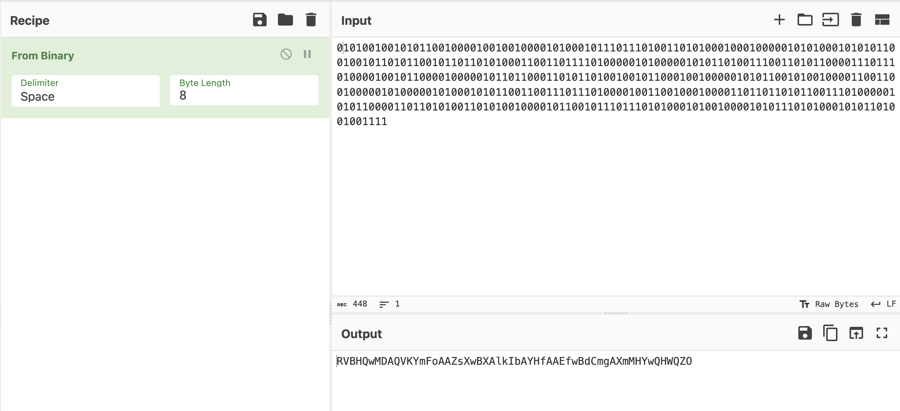
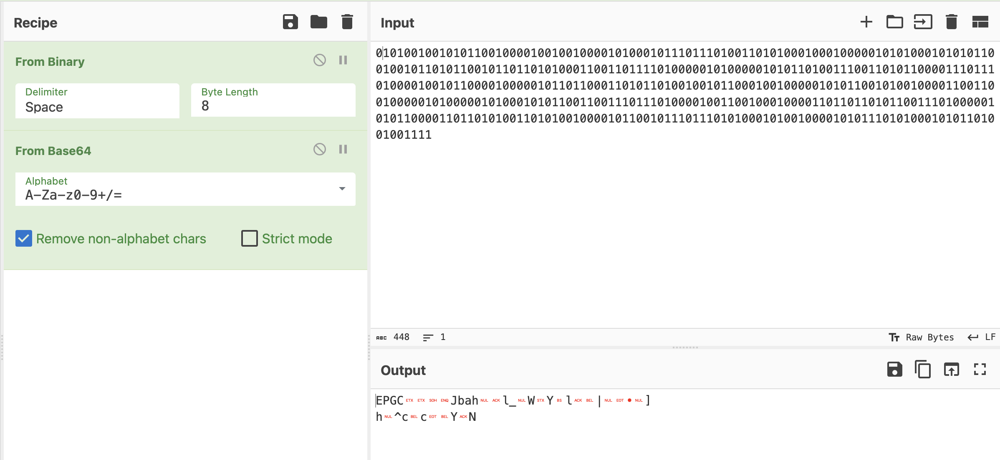

# Write-ups for TCTT2022/Crypto/01

## Flag pattern

`TCTT2022{xxxxxxxxxxxxxxxxxxxxxxxxxxxxxxxx}`

## Solution

1. Let scan this qr code.


And this is the result.

```
1337:101001001010110010000100100100001010001011101110100110101000100010000010101000101010110010010110101100101101101010001100110111101000001010000010101101001110011010110000111011101000010010110000100000101101100011010110100100101100010010000010101100101001000011001100100000101000001010001010110011001110111010000100110010001000011011011010110011101000001010110000110110101001101010010000101100101110111010100010100100001010111010100010101101001001111
```

2. I split it into 2 parts.

`1337` and `101001001010110010000100100100001010001011101110100110101000100010000010101000101010110010010110101100101101101010001100110111101000001010000010101101001110011010110000111011101000010010110000100000101101100011010110100100101100010010000010101100101001000011001100100000101000001010001010110011001110111010000100110010001000011011011010110011101000001010110000110110101001101010010000101100101110111010100010100100001010111010100010101101001001111`

3. Then let look at the second part.

`101001001010110010000100100100001010001011101110100110101000100010000010101000101010110010010110101100101101101010001100110111101000001010000010101101001110011010110000111011101000010010110000100000101101100011010110100100101100010010000010101100101001000011001100100000101000001010001010110011001110111010000100110010001000011011011010110011101000001010110000110110101001101010010000101100101110111010100010100100001010111010100010101101001001111`

It has 447 character, which is weird, so I added a 0 to the first letter to make it 8 bits convertable.

`0101001001010110010000100100100001010001011101110100110101000100010000010101000101010110010010110101100101101101010001100110111101000001010000010101101001110011010110000111011101000010010110000100000101101100011010110100100101100010010000010101100101001000011001100100000101000001010001010110011001110111010000100110010001000011011011010110011101000001010110000110110101001101010010000101100101110111010100010100100001010111010100010101101001001111`

4. Now we can convert it from binary to ascii.



5. The result it seem to BASE64, so let convert it.



6. Now, this is time for the first part `1337`. We xor it with the result from the second part.


7. The result is `tctt2022{QR_15_h1d1n9_50M37H1n9_1mP0R74n7}`
