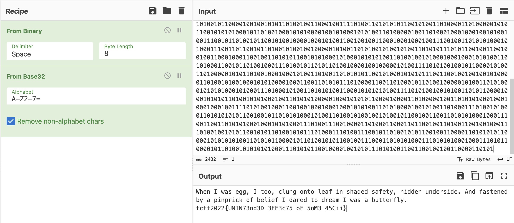

# Write-ups for TCTT2022/Forensic/01

## Flag pattern

`TCTT2022{xxxxxxxxxxxxxxxxxxxxxxxxxxxxxxxx}`

## Challenge Files

[forensic-challenge01](./forensic-challenge01.zip)

## Solution

1. The content in [challenge.txt](./write-ups/challenge.txt) is look like [username worldlist](https://github.com/danielmiessler/SecLists/blob/master/Usernames/Names/names.txt) but the difference is space and endline.

2. So I replace the username with blank string `''` and replace `\t` with `0`, `\n` with `1` by writing a [python script](./write-ups/main.py)

```python
import re

# Open the file for reading
with open("challenge.txt", "r") as file:
    # Read the content of the file into input_text
    input_text = file.read()

print(input_text)

# Replace '\t' with 0
input_text = input_text.replace('\t', '0')

# Replace '\n' with 1
input_text = input_text.replace('\n', '1')

# Replace all characters that are not '0' or '1' with an empty string
input_text = re.sub(r'[^01]', '', input_text)

print(input_text)
```

What we got is

```
01001011001101010101010101000111010010110011001101010010010000010100101001000101010100010100100001001111010110010100110001010100010001010100001001010011010101110100111101011010010110100100110101000101010000100100010101010011010000010011010101000100010100000100111000110100010101110100001101000001010110010011001101001101010011110101011001011000010001110100111101001001010001000101000001001110010110100011001001000111001101100100100101000100010011010100110101010110010100010101011101001101010010010100010001001010010011100101100101010001010010000100011100110010010001000100001001001101010100100101001101010111010010010100100101000100010101000100110101000110010101000100011101001011001101010100010001011010010001100101000101010001010001110101000100110010010011000100010101001101010100100101001101010111001101000100100101000100010101100100111001011010010100110100011101001011001101000101010001010100010011100100011001010011010001110100101101001100010100100100000101001001010001100101100001000111010010010100100101000100010001110100110101000110010110100101100001001001010110100100110001001111010011010101011001010011010000110100000101011001010101000101101001000101010000100101000101010011010000010011010001000100010010100100111001011010010110010100100001000101001100100100110001000100010011100100110101010001010001110011011001011010010100100100000101001101010010100101001101010111010110010011001001001100010001100100110101011001010100010100010101010011010010010100010001000101010011010100011001011010010001110100101101011010010000100100000101001111010100100101100001010011010000010101101001000100010100110100110101010110010100010101011100110010010010010100001101001010010001010100001000110011010101110100001100110100010110100100000101001101010001010101000101000111010001010011010101001100010101010100111101010010010100110101100001000101010110100101010001001101010100000100010101011000010000110100000100110101010001000100010001001111010100100011001001000100010001010100110101000010010100110100011101001010001101010101011001001011010101000101001101001010010010100101100100110011010101000100011100110011010101000100010101000111010011100100001101000110001101100100110100110010010001110100100101011001010110100101011101000111010011100101101001010110010011000011010101011000010101010100110101011000010110100101011001001110001101010100011101010100010001110101100001011010010101010100011101010110010000100101011101010011001100100100110000110101
```

3. We convert the binary to ascii.


3. This is `BASE32`, so let's convert it



The result is

```
When I was egg, I too, clung onto leaf in shaded safety, hidden underside. And fastened by a pinprick of belief I dared to dream I was a butterfly. tctt2022{UNIN73nd3D_3FF3c75_oF_5oM3_45Cii}
```

4. So the flag is `tctt2022{UNIN73nd3D_3FF3c75_oF_5oM3_45Cii}`
