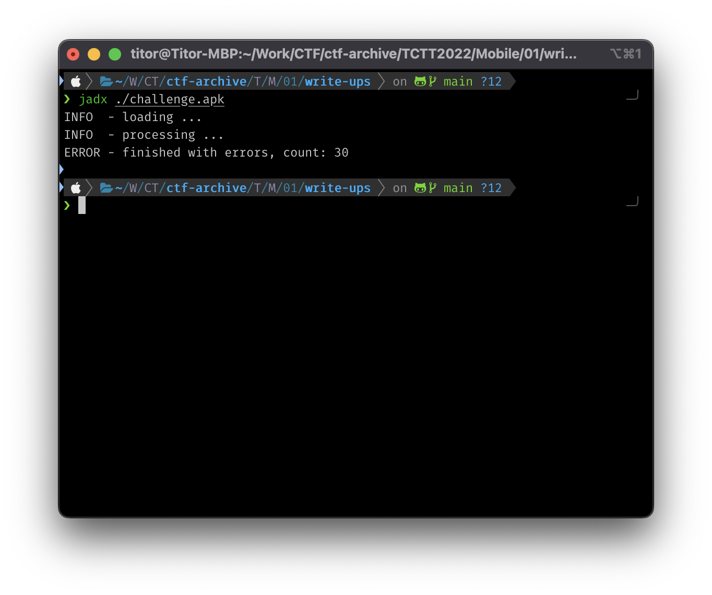
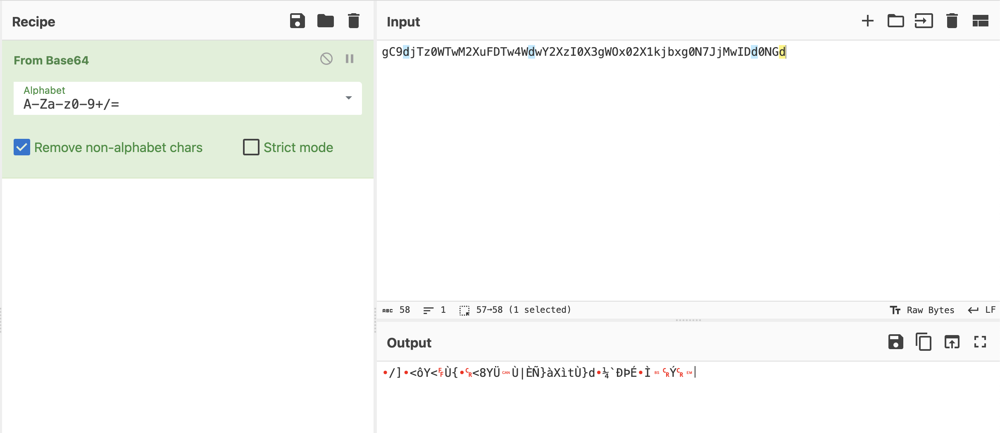
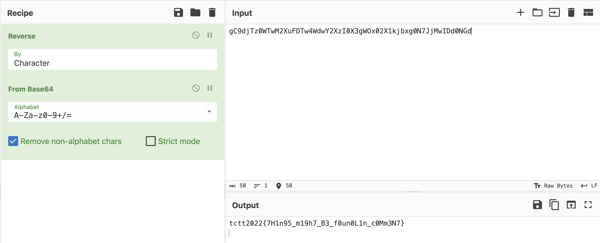

# Write-ups for TCTT2022/Mobile/01

## Flag pattern

`TCTT2022{xxxxxxxxxxxxxxxxxxxxxxxxxxxxxxxx}`

## Challenge Files

[mobile-challenge01](./mobile-challenge01.zip)

## Solution

1. Let decompile the apk file. I prefer to use `jadx`

```bash
jadx ./challenge.apk
```



2. Let look at the [MainActivity.java](./write-ups/challenge/sources/com/example/myapplication/MainActivity.java) file in `sources/com/example/myapplication/`.

```java
package com.example.myapplication;

import android.os.Bundle;
import android.util.Log;
import android.view.Menu;
import android.view.MenuItem;
import android.view.View;
import androidx.appcompat.app.AppCompatActivity;
import androidx.navigation.NavController;
import androidx.navigation.Navigation;
import androidx.navigation.ui.AppBarConfiguration;
import androidx.navigation.ui.NavigationUI;
import com.example.myapplication.databinding.ActivityMainBinding;
import com.google.android.material.snackbar.Snackbar;
/* loaded from: classes.dex */
public class MainActivity extends AppCompatActivity {
    private AppBarConfiguration appBarConfiguration;
    private ActivityMainBinding binding;
    private String secret = "==========gC9djTz0WTwM2XuFDTw4WdwY2XzI0X3gWOx02X1kjbxg0N7JjMwIDd0NGd==========";

    public String deobfuscate(String str) {
        return "TODO";
    }

    /* JADX INFO: Access modifiers changed from: protected */
    @Override // androidx.fragment.app.FragmentActivity, androidx.activity.ComponentActivity, androidx.core.app.ComponentActivity, android.app.Activity
    public void onCreate(Bundle bundle) {
        super.onCreate(bundle);
        ActivityMainBinding inflate = ActivityMainBinding.inflate(getLayoutInflater());
        this.binding = inflate;
        setContentView(inflate.getRoot());
        setSupportActionBar(this.binding.toolbar);
        NavController findNavController = Navigation.findNavController(this, R.id.nav_host_fragment_content_main);
        AppBarConfiguration build = new AppBarConfiguration.Builder(findNavController.getGraph()).build();
        this.appBarConfiguration = build;
        NavigationUI.setupActionBarWithNavController(this, findNavController, build);
        Log.i("[*]", deobfuscate(this.secret));
        this.binding.fab.setOnClickListener(new View.OnClickListener() { // from class: com.example.myapplication.MainActivity.1
            @Override // android.view.View.OnClickListener
            public void onClick(View view) {
                Snackbar.make(view, "Replace with your own action", 0).setAction("Action", (View.OnClickListener) null).show();
            }
        });
    }

    @Override // android.app.Activity
    public boolean onCreateOptionsMenu(Menu menu) {
        getMenuInflater().inflate(R.menu.menu_main, menu);
        return true;
    }

    @Override // android.app.Activity
    public boolean onOptionsItemSelected(MenuItem menuItem) {
        if (menuItem.getItemId() == R.id.action_settings) {
            return true;
        }
        return super.onOptionsItemSelected(menuItem);
    }

    @Override // androidx.appcompat.app.AppCompatActivity
    public boolean onSupportNavigateUp() {
        return NavigationUI.navigateUp(Navigation.findNavController(this, R.id.nav_host_fragment_content_main), this.appBarConfiguration) || super.onSupportNavigateUp();
    }
}
```

The interesting part is the `secret` variable which is `==========gC9djTz0WTwM2XuFDTw4WdwY2XzI0X3gWOx02X1kjbxg0N7JjMwIDd0NGd==========`

3. After remove `=` from the `secret` variable, we can see that it looks like a base64 string.

```
gC9djTz0WTwM2XuFDTw4WdwY2XzI0X3gWOx02X1kjbxg0N7JjMwIDd0NGd
```

But if we decode with `BASE64` only, it will return a weird string.



4. So we need to reverse the string first, then decode again.



5. And the result is `tctt2022{7H1n95_m19h7_B3_f0un0L1n_c0Mm3N7}`
