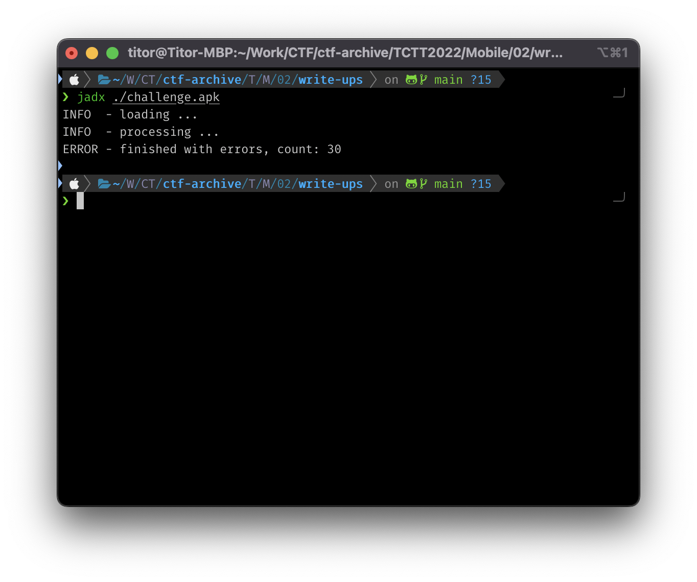

# Write-ups for TCTT2022/Mobile/02

## Flag pattern

`TCTT2022{xxxxxxxxxxxxxxxxxxxxxxxxxxxxxxxx}`

## Challenge Files

[mobile-challenge02](./mobile-challenge02.zip)

## Solution

1. Let decompile the apk file. I prefer to use `jadx`

```bash
jadx ./challenge.apk
```



2. Let look at line 47 in the [strings.xml](./write-ups/challenge/resources/res/values/strings.xml) file in `resources/res/values/`.

```xml
    .
    .
    .
    <string name="first_fragment_label">First Fragment</string>
    <string name="hello_first_fragment">tctt2022{REDACTED}</string>
    <string name="hello_second_fragment">Hello World!\n\n . .t. .c. .t. .t. .2. .0. .2. .2. .\n{. .K. .4. .n. ._. .4. .N. .Y. .o. .N. .e. ._. .f. .1. .n. .d. ._. .O. .u. .R. ._. .H. .1. .d. .D. .E. .n. ._. .W. .O. .r. .l. .d. .}</string>
    <string name="hide_bottom_view_on_scroll_behavior">com.google.android.material.behavior.HideBottomViewOnScrollBehavior</string>
    <string name="icon_content_description">Dialog Icon</string>
    .
    .
    .
```

The interesting part is

```xml
<string name="hello_second_fragment">Hello World!\n\n . .t. .c. .t. .t. .2. .0. .2. .2. .\n{. .K. .4. .n. ._. .4. .N. .Y. .o. .N. .e. ._. .f. .1. .n. .d. ._. .O. .u. .R. ._. .H. .1. .d. .D. .E. .n. ._. .W. .O. .r. .l. .d. .}</string>
```

3. After remove `Hello World!\n\n `, `. .` and other trash stuff, the result is `tctt2022{K4n_4NYoNe_f1nd_OuR_H1dDEn_WOrld}`
