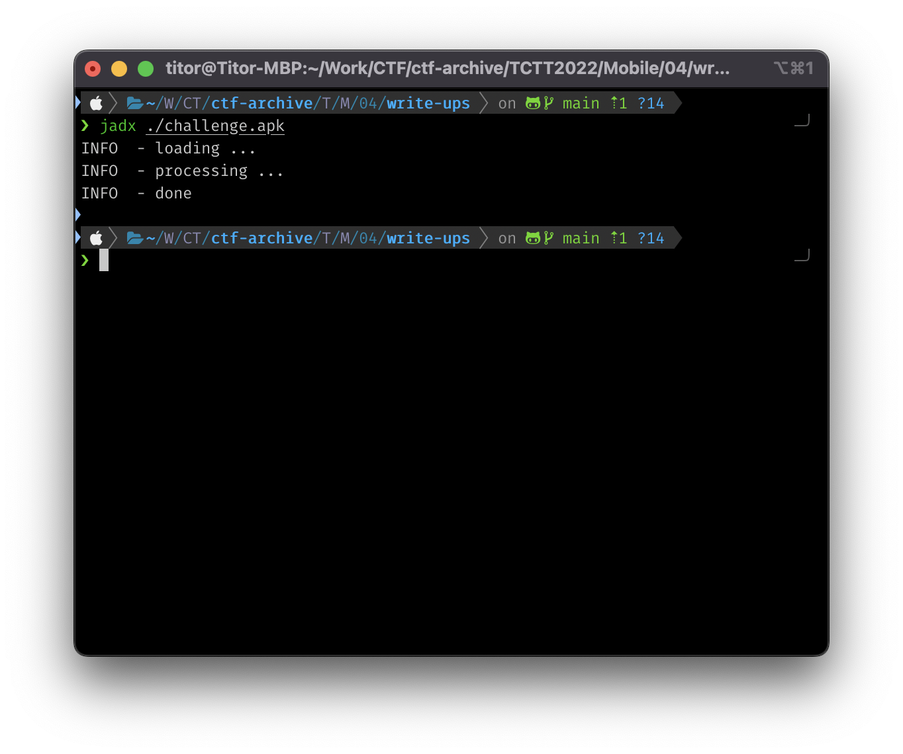
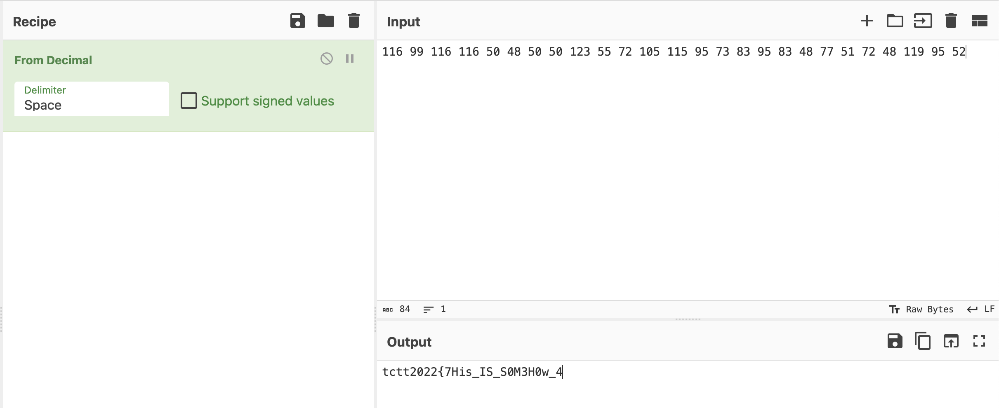
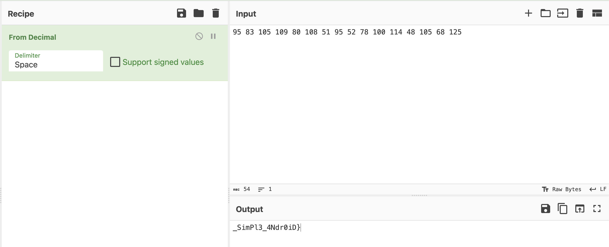

# Write-ups for TCTT2022/Mobile/04

## Flag pattern

`TCTT2022{xxxxxxxxxxxxxxxxxxxxxxxxxxxxxxxx}`

## Challenge Files

[mobile-challenge04](./mobile-challenge04.zip)

## Solution

1. Let decompile the apk file. I prefer to use `jadx`

```bash
jadx ./challenge.apk
```



2. We can see the interesting function in [SettingsActivity.java](./write-ups/challenge/sources/com/example/myapplication/SettingsActivity.java).

```java
public void onCreate(Bundle bundle) {
    super.onCreate(bundle);
    setContentView(R.layout.settings_activity);
    if (bundle == null) {
        getSupportFragmentManager().beginTransaction().replace(R.id.settings, new SettingsFragment()).commit();
    }
    ActionBar supportActionBar = getSupportActionBar();
    if (supportActionBar != null) {
        supportActionBar.setDisplayHomeAsUpEnabled(true);
    }
    BigInteger valueOf = BigInteger.valueOf(116L);
    BigInteger valueOf2 = BigInteger.valueOf(99L);
    BigInteger valueOf3 = BigInteger.valueOf(116L);
    BigInteger valueOf4 = BigInteger.valueOf(116L);
    BigInteger valueOf5 = BigInteger.valueOf(50L);
    BigInteger valueOf6 = BigInteger.valueOf(48L);
    BigInteger valueOf7 = BigInteger.valueOf(50L);
    BigInteger valueOf8 = BigInteger.valueOf(50L);
    BigInteger valueOf9 = BigInteger.valueOf(123L);
    BigInteger valueOf10 = BigInteger.valueOf(55L);
    BigInteger valueOf11 = BigInteger.valueOf(72L);
    BigInteger valueOf12 = BigInteger.valueOf(105L);
    BigInteger valueOf13 = BigInteger.valueOf(115L);
    BigInteger valueOf14 = BigInteger.valueOf(95L);
    BigInteger valueOf15 = BigInteger.valueOf(73L);
    BigInteger valueOf16 = BigInteger.valueOf(83L);
    BigInteger valueOf17 = BigInteger.valueOf(95L);
    BigInteger valueOf18 = BigInteger.valueOf(83L);
    BigInteger valueOf19 = BigInteger.valueOf(48L);
    BigInteger valueOf20 = BigInteger.valueOf(77L);
    BigInteger valueOf21 = BigInteger.valueOf(51L);
    BigInteger valueOf22 = BigInteger.valueOf(72L);
    BigInteger valueOf23 = BigInteger.valueOf(48L);
    BigInteger valueOf24 = BigInteger.valueOf(119L);
    BigInteger valueOf25 = BigInteger.valueOf(95L);
    BigInteger multiply = valueOf.multiply(valueOf2).multiply(valueOf3).multiply(valueOf4).multiply(valueOf5).multiply(valueOf6).multiply(valueOf7).multiply(valueOf8).multiply(valueOf9).multiply(valueOf10).multiply(valueOf11).multiply(valueOf12).multiply(valueOf13).multiply(valueOf14).multiply(valueOf15).multiply(valueOf16).multiply(valueOf17).multiply(valueOf18).multiply(valueOf19).multiply(valueOf20).multiply(valueOf21).multiply(valueOf22).multiply(valueOf23).multiply(valueOf24).multiply(valueOf25).multiply(BigInteger.valueOf(52L));
    BigInteger subtract = multiply.subtract(new BigInteger("9478156768108809020312608277716464950855189431875"));
    System.out.println("sec = " + multiply + "\n");
    System.out.println("ret = " + subtract + "\n");
    System.out.println("where is its secret?\n");
}
```

4. First, let's consider numbers that are multiplied together.

```
116 99 116 116 50 48 50 50 123 55 72 105 115 95 73 83 95 83 48 77 51 72 48 119 95
```

After converting the numbers to ASCII, we got `tctt2022{7His_IS_S0M3H0w_`

Also we need to add `52` in the conversion.

```
116 99 116 116 50 48 50 50 123 55 72 105 115 95 73 83 95 83 48 77 51 72 48 119 95 52
```



So we got `tctt2022{7His_IS_S0M3H0w_4`

5. And the result after executing this function is:

```
sec = 9478156769067119531292716797269245952000000000000

ret = 958310510980108519552781001144810568125

where is its secret?
```

6. We can see that the `ret` is equal `958310510980108519552781001144810568125`, so we split it to make it convertible to ASCII.

```
95 83 105 109 80 108 51 95 52 78 100 114 48 105 68 125
```



After converting the numbers to ASCII, we got `_SimPl3_4Ndr0iD}`

7. Combine 2 part together, the result is `tctt2022{7His_IS_S0M3H0w_4_SimPl3_4Ndr0iD}`
