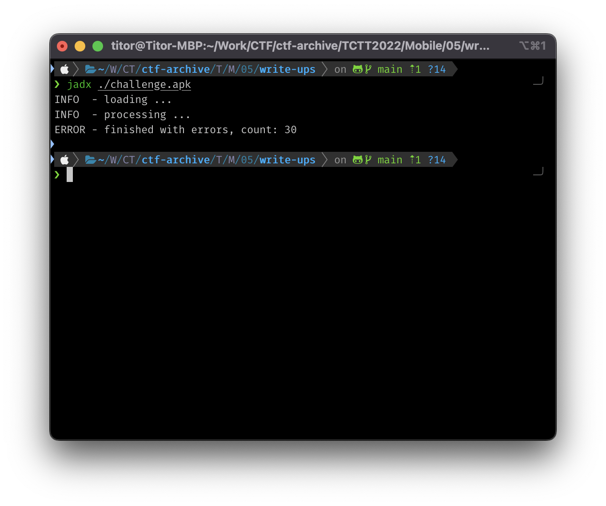
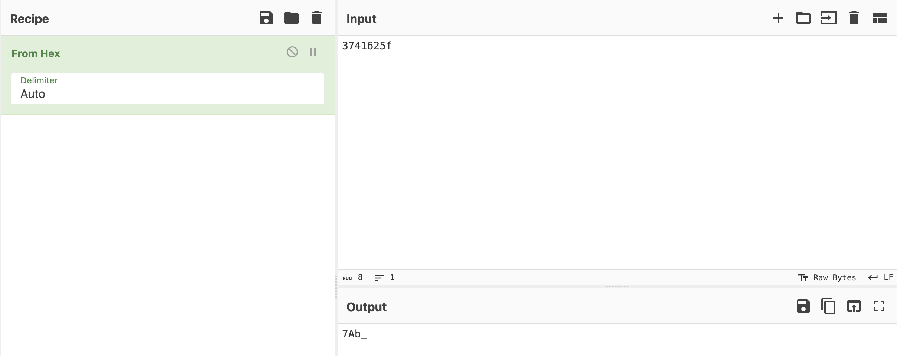
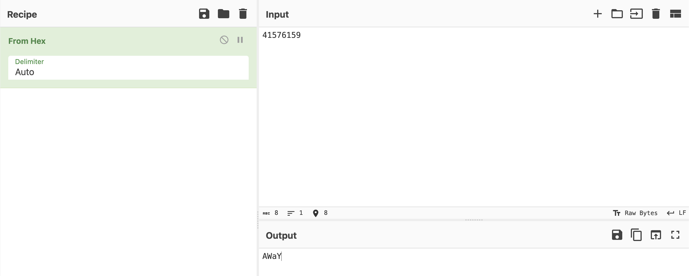
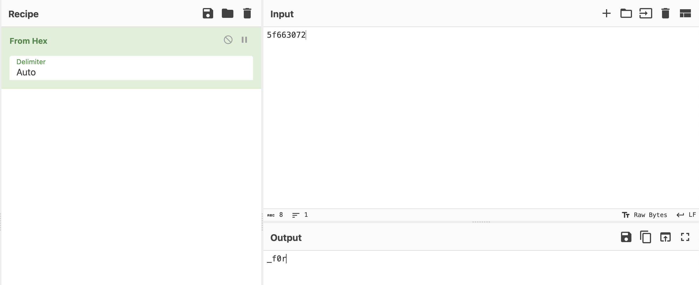
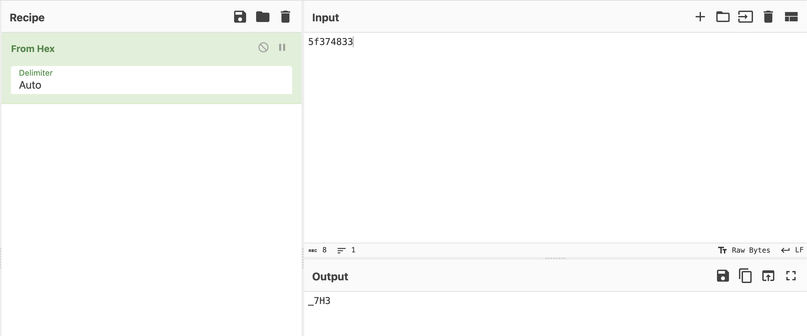
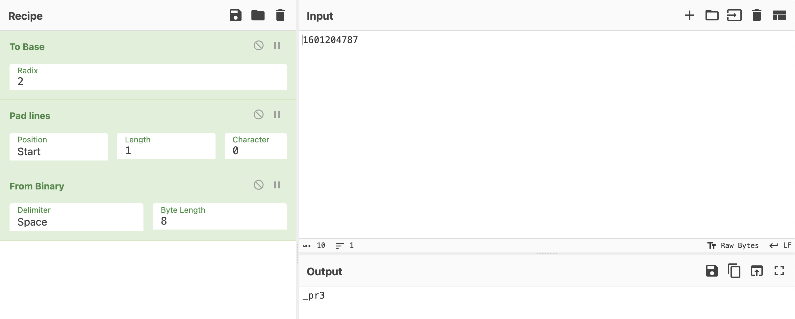
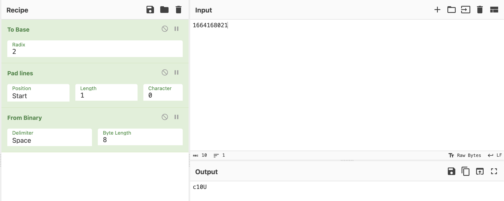

# Write-ups for TCTT2022/Mobile/05

## Flag pattern

`TCTT2022{xxxxxxxxxxxxxxxxxxxxxxxxxxxxxxxx}`

## Challenge Files

[mobile-challenge05](./mobile-challenge05.zip)

## Solution

1. Let decompile the apk file. I prefer to use `jadx`

```bash
jadx ./challenge.apk
```



2. The interesting part is in the [PageViewModel.java](./write-ups/challenge/sources/com/example/myapplication/ui/main/PageViewModel.java) file in `sources/com/example/myapplication/ui/main/`.

```java
package com.example.myapplication.ui.main;

import androidx.arch.core.util.Function;
import androidx.lifecycle.LiveData;
import androidx.lifecycle.MutableLiveData;
import androidx.lifecycle.Transformations;
import androidx.lifecycle.ViewModel;
import com.example.myapplication.R;
/* loaded from: classes.dex */
public class PageViewModel extends ViewModel {
    private MutableLiveData<Integer> mIndex;
    private LiveData<String> mText;

    public PageViewModel() {
        MutableLiveData<Integer> mutableLiveData = new MutableLiveData<>();
        this.mIndex = mutableLiveData;
        this.mText = Transformations.map(mutableLiveData, new Function<Integer, String>() { // from class: com.example.myapplication.ui.main.PageViewModel.1
            @Override // androidx.arch.core.util.Function
            public String apply(Integer num) {
                switch (num.intValue() - 1) {
                    case 0:
                        return "...t...c...t...t...2...0...2...2...{".replace(".", "");
                    case 1:
                        return "3741625f";
                    case 2:
                        return "41576159";
                    case 3:
                        return "5f663072";
                    case 4:
                        return "5f374833";
                    case 5:
                        return String.valueOf((int) R.string.int_5);
                    case 6:
                        return String.valueOf((int) R.string.int_6);
                    case 7:
                        return String.valueOf((int) R.string.int_7);
                    case 8:
                        return String.valueOf((int) R.string.int_8);
                    case 9:
                        return "}";
                    default:
                        return "Hello world from section: " + (num.intValue() - 1);
                }
            }
        });
    }

    public void setIndex(int i) {
        this.mIndex.setValue(Integer.valueOf(i));
    }

    public LiveData<String> getText() {
        return this.mText;
    }
}
```

4. Try to decode each part.

- Case 0

  Input: `...t...c...t...t...2...0...2...2...{`

  We remove `.` from the string.

  Result: `tctt2022{`

- Case 1

  Input: `3741625f`

  We can see that the string is in hex format. So we can decode it to ascii.

  

  Result: `7Ab_`

- Case 2

  Input: `41576159`

  We can see that the string is in hex format. So we can decode it to ascii.

  

  Result: `AWaY`

- Case 3

  Input: `5f663072`

  We can see that the string is in hex format. So we can decode it to ascii.

  

  Result: `_f0r`

- Case 4

  Input: `5f374833`

  We can see that the string is in hex format. So we can decode it to ascii.

  

  Result: `_7H3`

- Case 5

  You can find the actual value of `R.string.int_5`in `resources/res/values/strings.xml`.

  Input: `1601204787`

  We convert it to base2 and add 0 padding from beginning of string to make it convertable to ascii.

  `1601204787` -> `1011111011100000111001000110011`

  `1011111011100000111001000110011` -> `01011111011100000111001000110011`

  `01011111011100000111001000110011` -> `_pr3`

  

  Result: `_pr3`

- Case 6

  You can find the actual value of `R.string.int_6`in `resources/res/values/strings.xml`.

  Input: `1664168021`

  We use the same method as case 5 above.

  

  Result: `c10U`

- Case 7

  You can find the actual value of `R.string.int_7`in `resources/res/values/strings.xml`.

  Input: `0895431987`

  We use the same method as case 5 above.

  

  Result: `5_53`

- Case 8

  You can find the actual value of `R.string.int_8`in `resources/res/values/strings.xml`.

  Input: `1668428599`

  We use the same method as case 5 above.

  

  Result: `cr37`

- Case 9

  Only return `}`

5. Combine all the results together, and the result is `tctt2022{7Ab_AWaY_f0r_7H3_pr3_c10U5_53cr37}`
