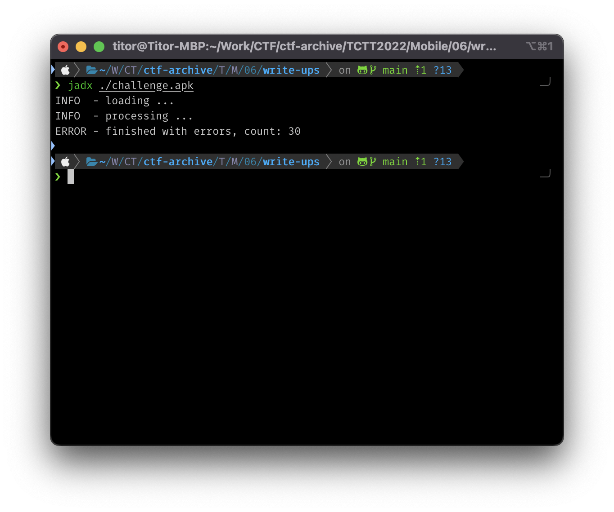
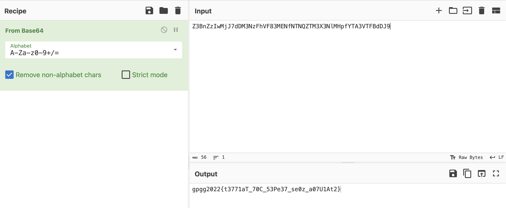
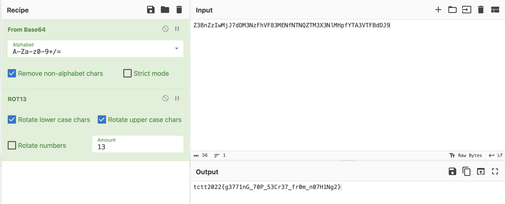

# Write-ups for TCTT2022/Mobile/06

## Flag pattern

`TCTT2022{xxxxxxxxxxxxxxxxxxxxxxxxxxxxxxxx}`

## Challenge Files

[mobile-challenge06](./mobile-challenge06.zip)

## Solution

1. Let decompile the apk file. I prefer to use `jadx`

```bash
jadx ./challenge.apk
```



2. After looking at [ScrollingActivity.java](./write-ups/challenge/sources/com/example/myapplication/ScrollingActivity.java)

```java
package com.example.myapplication;

import android.os.Bundle;
import android.view.Menu;
import android.view.MenuItem;
import android.view.View;
import androidx.appcompat.app.AppCompatActivity;
import com.example.myapplication.databinding.ActivityScrollingBinding;
import com.google.android.material.snackbar.Snackbar;
import java.util.ArrayList;
import java.util.regex.Matcher;
import java.util.regex.Pattern;
/* loaded from: classes.dex */
public class ScrollingActivity extends AppCompatActivity {
    private ActivityScrollingBinding binding;

    public static void getNothings(String str) {
        Matcher matcher = Pattern.compile("\\.(.?)\\.").matcher(str);
        ArrayList<String> arrayList = new ArrayList();
        while (matcher.find()) {
            arrayList.add(matcher.group(0));
        }
        System.out.println("TODO");
        for (String str2 : arrayList) {
        }
    }

    /* JADX INFO: Access modifiers changed from: protected */
    @Override // androidx.fragment.app.FragmentActivity, androidx.activity.ComponentActivity, androidx.core.app.ComponentActivity, android.app.Activity
    public void onCreate(Bundle bundle) {
        super.onCreate(bundle);
        ActivityScrollingBinding inflate = ActivityScrollingBinding.inflate(getLayoutInflater());
        this.binding = inflate;
        setContentView(inflate.getRoot());
        setSupportActionBar(this.binding.toolbar);
        this.binding.toolbarLayout.setTitle(getTitle());
        this.binding.fab.setOnClickListener(new View.OnClickListener() { // from class: com.example.myapplication.ScrollingActivity.1
            @Override // android.view.View.OnClickListener
            public void onClick(View view) {
                Snackbar.make(view, "Replace with your own action", 0).setAction("Action", (View.OnClickListener) null).show();
                ScrollingActivity.getNothings(String.valueOf((int) R.string.large_text));
                System.out.println("Is this correct!");
            }
        });
    }

    @Override // android.app.Activity
    public boolean onCreateOptionsMenu(Menu menu) {
        getMenuInflater().inflate(R.menu.menu_scrolling, menu);
        return true;
    }

    @Override // android.app.Activity
    public boolean onOptionsItemSelected(MenuItem menuItem) {
        if (menuItem.getItemId() == R.id.action_settings) {
            return true;
        }
        return super.onOptionsItemSelected(menuItem);
    }
}
```

The interesting part is

```java
public static void getNothings(String str) {
    Matcher matcher = Pattern.compile("\\.(.?)\\.").matcher(str);
    ArrayList<String> arrayList = new ArrayList();
    while (matcher.find()) {
        arrayList.add(matcher.group(0));
    }
    System.out.println("TODO");
    for (String str2 : arrayList) {
    }
}
```

And

```java
public void onCreate(Bundle bundle) {
    super.onCreate(bundle);
    ActivityScrollingBinding inflate = ActivityScrollingBinding.inflate(getLayoutInflater());
    this.binding = inflate;
    setContentView(inflate.getRoot());
    setSupportActionBar(this.binding.toolbar);
    this.binding.toolbarLayout.setTitle(getTitle());
    this.binding.fab.setOnClickListener(new View.OnClickListener() { // from class: com.example.myapplication.ScrollingActivity.1
        @Override // android.view.View.OnClickListener
        public void onClick(View view) {
            Snackbar.make(view, "Replace with your own action", 0).setAction("Action", (View.OnClickListener) null).show();
            ScrollingActivity.getNothings(String.valueOf((int) R.string.large_text));
            System.out.println("Is this correct!");
        }
    });
}
```

3. So, we need to take a look for `R.string.large_text` in [string.xml](./write-ups/challenge/resources/res/values/strings.xml) files.

```
CHAPTER I\n\nDown the Rabbit-Hole\n\nAlice was beginning to get very tired of sitting by her sister on the bank, and of having nothing to do: once or twice .Z.she had peeped into the book her sister was reading, but it had no pictures or conversations in i.3.t, `and what is the use of a book,\' thought Alice `without pictures or conversation?\'\n\nSo she was considering in her own mind (as well as she could, for the hot day made her feel very sleepy and stupid), whether the pleasure of making a daisy-chain would be worth the trouble of getting up and .B.picking the daisies, when suddenly a White Rabbit with pink eyes ran close by her.\n\nThere was nothing so very remarkable in that; nor did Alice think it so very much out of the way to hear the Ra.n.bbit say to itself, `Oh dear! Oh dear! I .Z.shall be late!\' (when she thought it over afterwards, it occurred to her that she ought to have wondered at this, but at the time it all seemed quite natural); but when the Rabbit actually took a watch out of its waistcoat-pocket, and looked at it, and then hurried on, Alice started to her feet, for it flashed across her mind that.z. she had never before seen a rabbit with either a waistcoat-pocket, or a watch to take out of it, and burning with curiosity, she ran across the field after it, and fortunately was just in time to see it pop down a large rabbit-hole under the hedge.\n\nWhite Rabbit checking watch\n\nIn another moment down went Alice after it, never once considering how in the world she was to get out again.\n\nThe rabbit-hole went straight on like a tunnel for some way, and then dipped suddenly down, so suddenly .I.that Alice had not a moment to think about stopping herself before she found herself falling down a very deep well.\n\nEither the well was very deep, or she fell very slowly, for she had plenty of time as she went down to look about her and to wonder what was going to happen next. First, she tried to look down and make out what she was coming to, but it was too dark to see anything; then she looked at the sides of the well, and noticed that they were filled with cupboards and book-shelves; here and there she saw maps and pictures hung upon pegs. She took down a jar from one of the shelves as she passed; it was labelled `ORANGE MARMALADE\', but to her great disappointment it was empty: she did not like to drop the jar for fear of killing somebody.w., s.M.o managed to put it into one of the cupboards as she fell past it.\n\n`Well!\' thought Alice to herself, `after such a fall as this, I shall think nothing of tumbling down stairs! How brave they\'ll all think me at home! Why, I wouldn\'t say anything about it, even if I fell off the top of the house!\' (Which was very .j.likely true.)\n\nDown, down, down. Would the fall never come to an end! `I wonder how .J.many miles I\'ve fallen by this time?\' she said aloud. `I must be getting somewhere near the centre of the earth. Let me see: that would be four thousand mi.7.les down, I think--\' (for, you see, Alice had learnt several things of this sort in her lessons in the schoolroom, and though this.d. was not a very good opportunity for showing off her.D. knowledge, as there was no one to listen to her, still it was good practice to say it over) `--yes, that\'s about the right distance--but then I wonder what Latitude or Longitude I\'ve got to?\' (Alice had no idea what Latitude was, or Longitude either, but thought th.M.e.3.y were nice grand words to say.)\n\nPresently she began again. `I wonder if I shall fall right through the earth! How funny it\'ll seem to come out among the people that walk with their heads downward! The Antipathies, I think--\' (she was rather glad there was no one listening, this time, as it didn\'t sound at all the right word) `--but I shall have to ask them what the name of the country is, you know. Please, Ma.N.\'am, is this New Zealand or Australia?\' (and she tried to curtsey as she spoke--fancy curtseying as you\'re falling through the air! Do you think you could manage it?) `And what an ignorant little .z.girl she\'ll think me for asking! No, it\'ll never do to ask: perhaps I shall see it written up somewhere.\'\n\nDown, down, down. There was nothing else to do, so Alice soon began talking again. `Dinah\'ll miss me very much to-night, I should think!\' (Dinah was the cat.) `I hope they\'ll remember her saucer of milk at tea-time. Dinah my dear! I wish you were down here with me! There are no mice in the air, I\'m afraid, but you might catch a bat, and that\'s very like a mouse, you know. But do cats eat bats, I wonder?\' And here Alice began to get rather sleepy, and went on saying to herself, in a dreamy sort of way, `Do cats eat bats? Do cats eat bats?\' and sometimes, `Do bats eat cats?\' for, you see, as she couldn\'t answer either question, it didn\'t much matter which way she put.F. it. She felt that she was dozing off, and had just begun to dream that she was walking hand in hand with Dinah, and saying to her very earnestly, `Now, Dinah, tell me the truth: did you ever eat a bat?\' when suddenly, thump! thump! down she came upon a heap of sticks and dry leaves, and the fall was over.\n\nAlice was not a bit hurt, and she jumped up on to h.h.er feet in a moment: she looked up, but it was all dark overhead; before her was anoth.V.er lon.F.g passage, and the White Rabbit was still in sight, hurrying.8. down it. Ther.3.e was not a moment to be lost: away went Alice like the wind, and was just in time to hear it say, as it .M.turned a corner, `Oh my ears and whiskers, how late it\'s getting!\' She was close behind it when she turned .E.the corner, but the Rabbit was no longer to be seen: she found herself in a long, low hall, which was lit up by a row of lamps hanging from the roof.\n\nThere were doors all round the hall, but they were all locked; and when Alice had been all the way down one side and up the other, tryin.N.g every door, she .f.walked sadly down the middle, wondering how she was ever to get out again.\n\nSuddenly she came upon a little three-legged table, all made of solid glass; there was nothing on it except a tiny golden key, and Alice\'s first thought was that it might belong to one of the doors.N. of the hall; but, alas! eith.T.er the locks were too large, or the key was too small, but at any rate it would not open any .N.of them. However, on the second time round, she came upon a low curtain she had not noticed before, and behind it was a little door about fifteen inches high: she tried the little golden key in the lock, and to her great delight it fitted!\n\nAlice finding tiny door behind curtain\n\nAlice opened the door and found that it led into a small passage, not much larger than a rat-hole: she knelt down and looked along the passage into the loveliest garden you ever saw. How she longed to get.Q. out of that dark hall, and wander about among those beds of.Z. bright flowers and those cool fountains, but she could not even get her head though the doorway; `and even if my head would go through,\' thought poor Alice, `it would be of very little use without my shoulders. Oh, how I wish I could shut up like a telescope! I think I could, if I only know how to begin.\' For, you see, so ma.T.ny out-of-the-way things had happened lately, that Alice had begun to think that very few things indeed were really impossib.M.le.\n\nThere seemed to be no use in waiting by the little door, so she went back to the table, half hoping she might find another key on it, or at any rate a book of rules for shutt.3.ing people up like telescopes: this time she found a little bottle on it, (`which certainly was not here before,\' said Alice,) and round the neck of the bottle was a paper label, with the words `DRINK ME\' beautifully printed on it in large letters.\n\nAlice taking Drink Me bottle\n\nIt wa.X.s .3.all very well to say `Drink me,\' but the wise litt.N.le Alice was not going to do that in a hurry. `No, I\'ll look first,\' she said, `and see whether it\'s marked poison or not\'; for she had read several nice little histories about children who had got burnt, and eaten up by wild beasts and other unpleasant things, all because they would not re.l.member the simple rules their friends had taught them: such as, that a red-hot poker will burn you if you hold it too long; and tha.M.t if you cut your finger very deeply with a knife, it usually bleeds; and she had never forgotten that, if you drink much from a bottle marked `poison,\' it is almost certain to disagree with you, sooner or later.\n\nHowever, this bottle was not marked `poison,\' so Alice ventured to taste it, and finding it very nice, (it had, in fact, a sort of mixed flavour of cherry-tart, custard, pine-ap.H.ple, roast turkey, toffee, and hot buttered toast,) she very soon finished it off.\n\n *       *       *       *       *       *       *\n\n     *       *       *       *       *       *\n\n *  .p.     *       *       *       *       *       *\n\n`What a curious feeling!\' said Alice; `I must be shutti.f.ng up like a telescope.\'\n\nAnd so it was indeed: she was now only ten inches high, and her face brightened up at the thought that she was now the right size fo.Y.r going through the little door into that lovely garden. First, however, she waited for a few minutes to see if she was going to shrink any further: she felt a little nervous about this; `for it might end, you know,\' said Alice to herself, `in my going out altogether, like a candle. I wonder what I should be like then?\' And she tried to fancy what the flame of a candle is like after the candle is blown out, for she could not remember ever having seen such a thing.\n\nAfter a while, finding that nothing .T.more happened, she de.A.cided on going into the garden at once; but, alas for poor Alice! when she got to the door, she found she had forgotten the little golden key, and when she went back to the table for it, she found she could not possibly reach it: she could see it quite plainly th.3.rough the glass, and she tried her best to climb up one of the legs of the table, but it was too slipper.V.y; and when she had tired herself out with trying, the poor little thing sat down and cried.\n\n`Come, there\'s no use in crying like that!\' said Alice to herself, rather sharply; `I advise you to leave off this minute!\' She generally gave h.T.erself very good advice, (though she very seldom followed it), and sometimes she scol.F.ded herself so severely as to bring tears into her eyes; and once she remembered trying to box her own ears for having chea.B.ted herself in a game of croquet she was playing against herself, for this curious child was very fond of pretending to be two people. `But it\'s no use now,\' thought poor Alice, `to pretend to be two people! Why, there\'s hardly enough of me left to make one respectable person!\'\n\nSoon her eye fell on a little glass box that was lying under the table: she opened it, and found in it a very small cake, on which the words `EA.d.T ME\' were beautifully marked in currants. `We.D.ll, I\'ll eat it,\' said Alice, `and if it makes me gro.J.w larger, I can reach the key; and if it makes me grow smaller, I can creep under the door; so either way I\'ll get into the garden, and I don\'t care which happens!\'\n\nShe ate a little bit, and said anxiously to herself, `Which w.9.ay? Which way?\', holding her hand on the top of her head to feel which way it was growing, and she was quite surprised to find that she remained the same size: to be sure, this generally happens when one eats cake, but Alice had got so much into the way of expecting nothing but out-of-the-way things to happen, that it seemed quite dull and stupid for life to go on in the common way.\n\nSo she set to work, and very soon finished off the cake.\n\n *       *       *       *       *       *       *\n\n     *       *       *       *       *       *\n\n *       *       *       *       *       *       *\n\n
```

4. From what we got in `getNothings` function, we're certain that a regex must be used to extract text that looks like .x. inserted into the main text. So let's modify the function a little bit to print out the result.

```java
public static void getNothings(String str) {
    Matcher matcher = Pattern.compile("\\.(.?)\\.").matcher(str);
    ArrayList<String> arrayList = new ArrayList();
    while (matcher.find()) {
        arrayList.add(matcher.group(0));
    }
    // System.out.println("TODO");
    for (String str2 : arrayList) {
        System.out.print(str2.charAt(1));
    }
}
```

5. The result from the above is `Z3BnZzIwMjJ7dDM3NzFhVF83MENfNTNQZTM3X3NlMHpfYTA3VTFBdDJ9`.

It look like `BASE64`, so let's decode it.



It looks like flag pattern now, so let's use ceaser to decode it.



6. The final result is `tctt2022{g3771nG_70P_53Cr37_fr0m_n07H1Ng2}`
