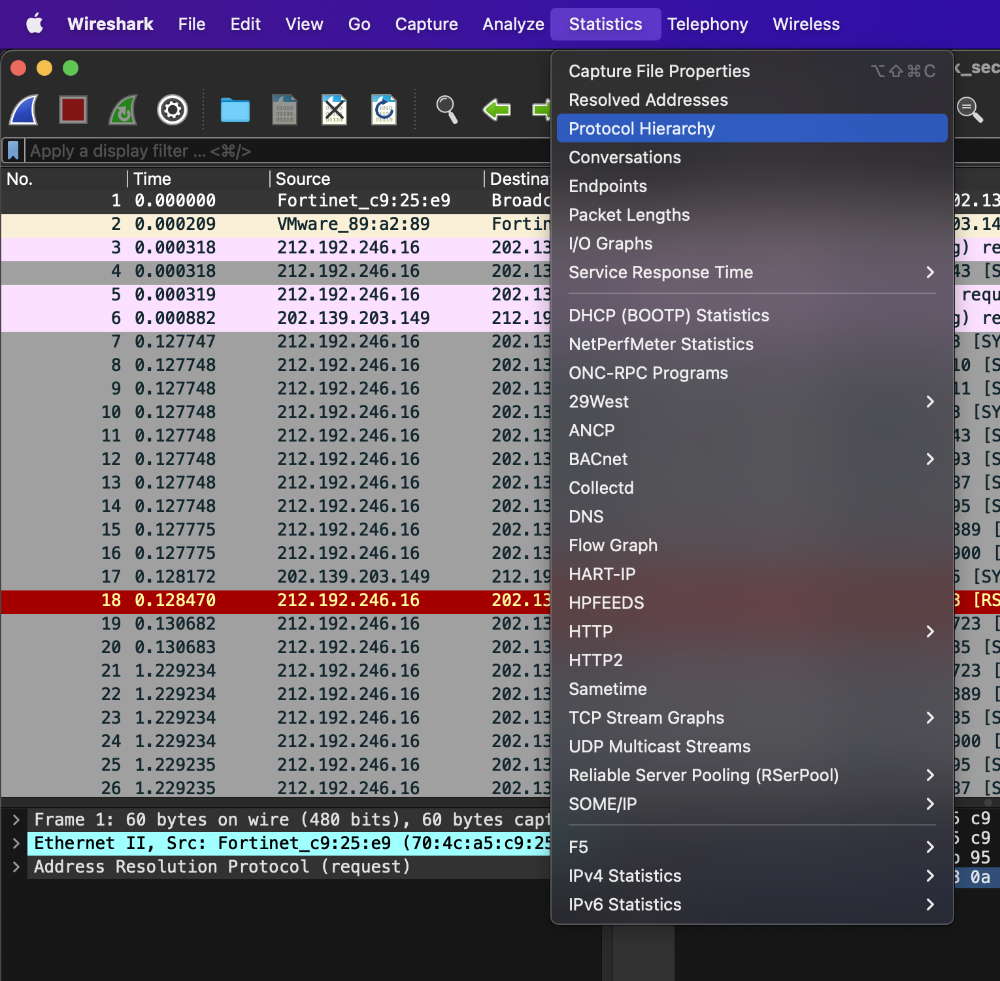

# Write-ups for TCTT2022/Network/01

## Flag pattern

`TCTT2022{xxxxxxxxxxxxxxxxxxxxxxxxxxxxxxxx}`

## Challenge Files

[network-challenge01](./network-challenge01.zip)

## Solution

1. First, Let open the pcap file with wireshark and analyze it with `Statistics > Protocol Hierarchy`.




2. It look like there is a lot of FTP request, so export the FTP data with `File > Export Objects > FTP-DATA`.


3. We found [secret.zip](./write-ups/secret.zip), so let save it.


4. Trying to unzip it, but it need a password.


5. Let crack it with fcrackzip and rockyou wordlist with this command.

```bash
fcrackzip -u -D -p <PATH-TO-WORDLIST> <PATH-TO-ZIP-FILE>
```


As you can see, the password is `password`.

6. We use previous password to unzip the zip file and we got [secret](./write-ups/secret).


7. We `cat` that file, and the result is `tctt2022{Steal_Data_via_FTP}`
