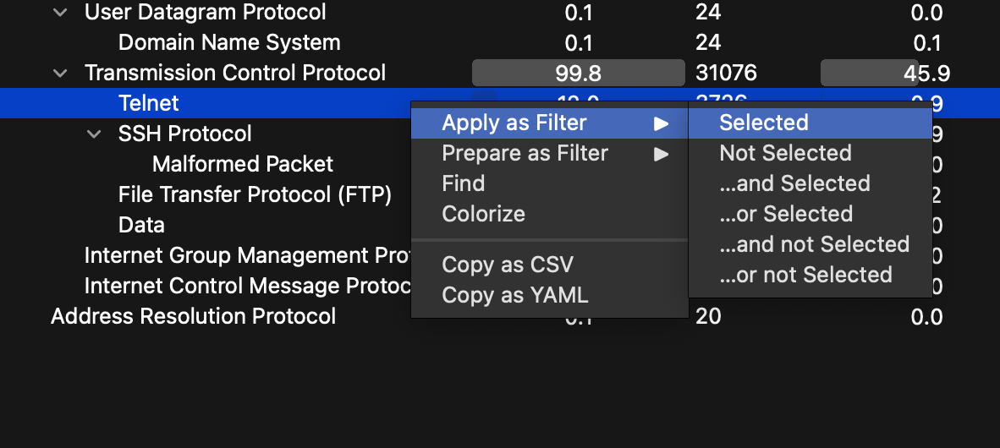

# Write-ups for TCTT2022/Network/02

## Flag pattern

`TCTT2022{xxxxxxxxxxxxxxxxxxxxxxxxxxxxxxxx}`

## Challenge Files

[network-challenge02](./network-challenge02.zip)

## Solution

1. First, Let open the pcap file with wireshark and analyze it with `Statistics > Protocol Hierarchy`.


2. It look like there is a lot of Telnet request, so filter it with `Right Click > Apply as Filter > Selected`.



3. We sort the results by length.


4. Then, we follow the TCP stream of the longest one.


5. And that is the TCP stream no.20128, which looks like SSH connection.


6. We can see that, they are doing something with secret.zip


7. Let go to the next stream and you can see that the stream is starting with `PK` which is the signature of zip file.


8. If you want to save the zip file, you can do it by changing the stream to raw data and save it as zip file.


9. We got [secret.zip](./write-ups/secret.zip) file but it has password.


10. Let crack it with fcrackzip and rockyou wordlist with this command.

```bash
fcrackzip -u -D -p <PATH-TO-WORDLIST> <PATH-TO-ZIP-FILE>
```


As you can see, the password is `P@ssw0rd`.

11. We use previous password to unzip the zip file and we got [secret](./write-ups/secret).


12. We `cat` that file, and the result is `tctt2022{Welcome_R00t_T3ln3t}`
