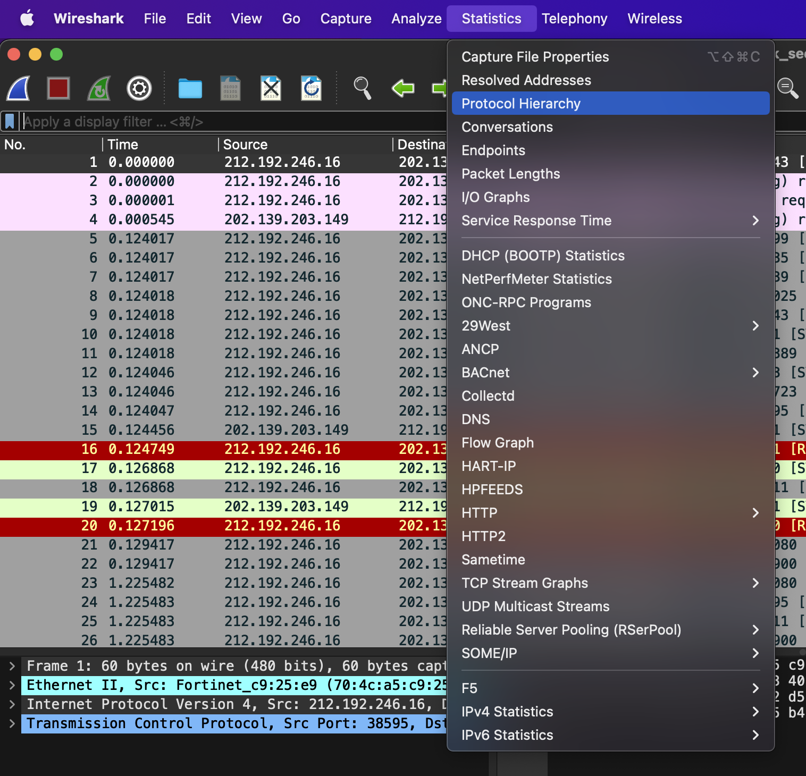
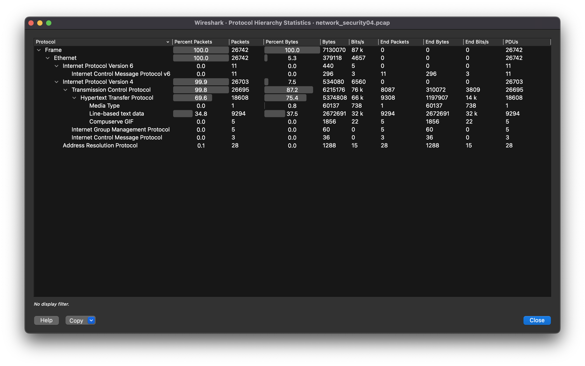
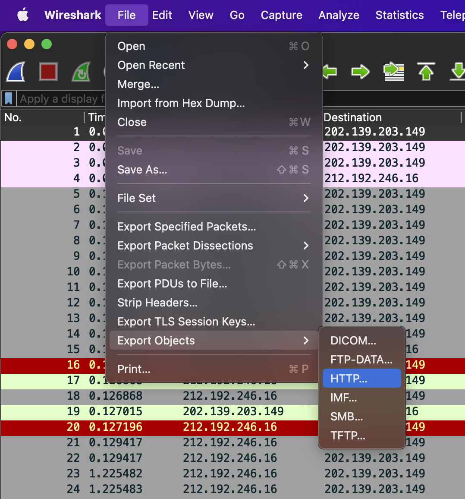
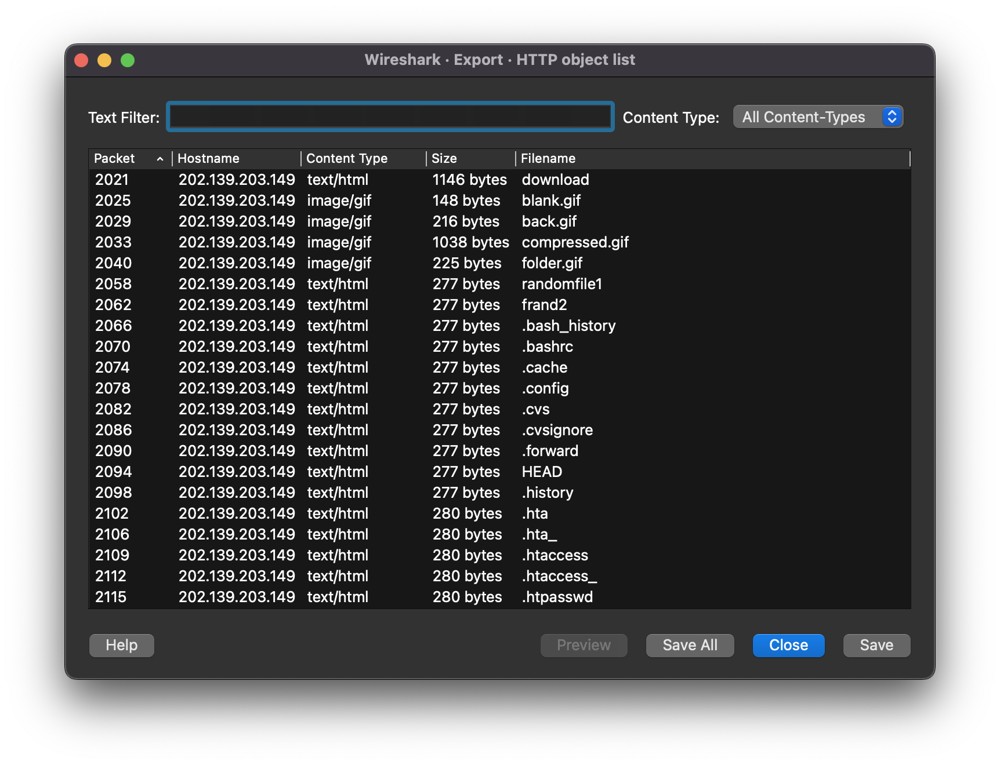
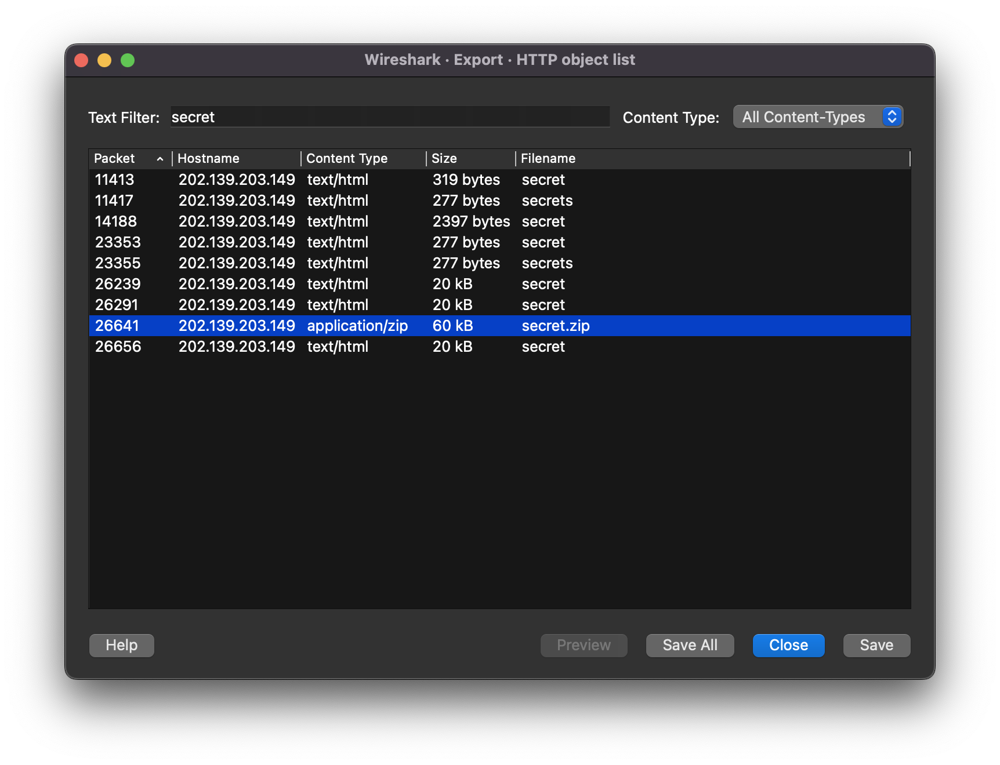
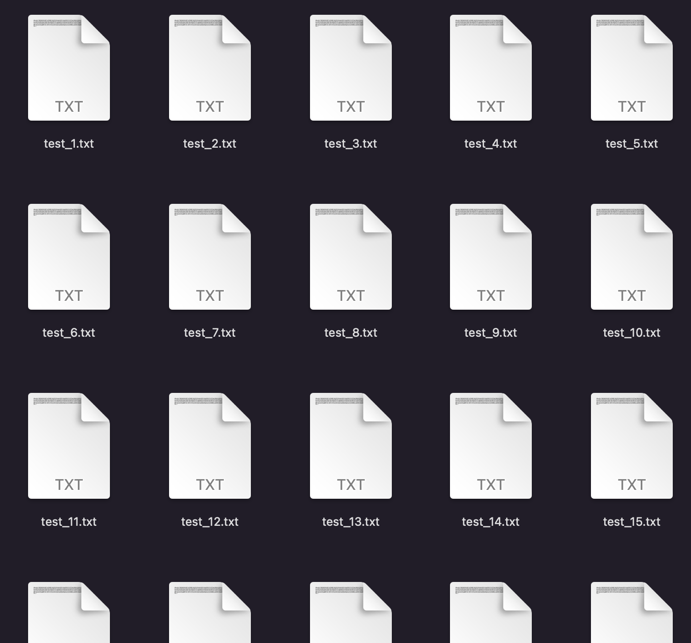
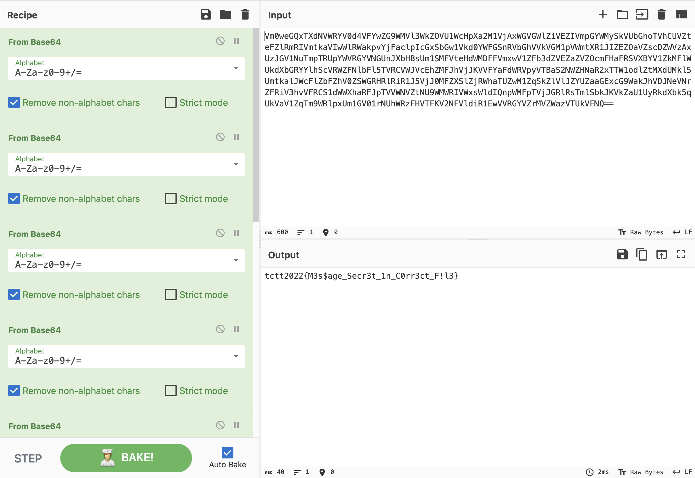

# Write-ups for TCTT2022/Network/04

## Flag pattern

`TCTT2022{xxxxxxxxxxxxxxxxxxxxxxxxxxxxxxxx}`

## Challenge Files

[network-challenge04](./network-challenge04.zip)

## Solution

1. First, Let open the pcap file with wireshark and analyze it with `Statistics > Protocol Hierarchy`.





2. It look like there is a lot of HTTP request, so export the HTTP data with `File > Export Objects > HTTP`.





3. Filter for secret, and we found [secret.zip](./write-ups/secret.zip) with 60kB, so let save it.



4. After unzipping, we got 100 text files.



And the are almost the same, which is `Vm0weGQxTXdNVWRYV0d4VFYwZG9WMVl3WkZOVU1WcHpXa2M1VjAxWGVGWlZiVEZIVmpGYWMySkVUbGhoTVhCUVZteFZlRmRIVmtkaVIwWlRWakpvYjFaclpIcGxSbGw1Vkd0YWFGSnRVbGhVVkVGM1pVWmtXR1JIZEZOaVZscDZWVzAxUzJGV1NuTmpTRUpYWVRGYVNGUnJXbHBsUm6SMFVteHdWMDFFVmxwV1ZFb3dZVEZaZVZOcmFHaFRSVXBYV1ZkMFlWUkdXbGRYYlhScVRWZFNlbFl5TVRCVWJVcEhZMFJhVjJKVVFYaFdWRVpyVTBaS2NWZHNaR2xTTW1odlZtMXdUMkl4UmtkalJWcFlZbFZhV0ZSWGRHRlRiR1J5VjJ0MFZXSlZjRWhaTUZwM1ZqSkZlVlJZYUZaaGExcG4WakJhVDJNeVNrZFRiV3hvVFRCS1dWWXhaRFJpTVVWNVZtNU5WMWRIVWxsWldIQnpWMFpTVjJGRlRsTmlSbkJKVkZaU1UyRkdXbk4qUkVaV1ZqTm9WRlpxUm1GV51rNUhWRzFHVTFKV5NFVldiR1EwVVRGYVZrMVZWazVTUkVFNQ==`

5. We need to find the diffent one. Let use md5sum to all file in folder with this command

```bash
md5sum *
```

And the result is

```
08f48921f67c64a39f94741d5fc24575  test_1.txt
08f48921f67c64a39f94741d5fc24575  test_10.txt
08f48921f67c64a39f94741d5fc24575  test_100.txt
08f48921f67c64a39f94741d5fc24575  test_11.txt
08f48921f67c64a39f94741d5fc24575  test_12.txt
08f48921f67c64a39f94741d5fc24575  test_13.txt
08f48921f67c64a39f94741d5fc24575  test_14.txt
08f48921f67c64a39f94741d5fc24575  test_15.txt
08f48921f67c64a39f94741d5fc24575  test_16.txt
08f48921f67c64a39f94741d5fc24575  test_17.txt
08f48921f67c64a39f94741d5fc24575  test_18.txt
08f48921f67c64a39f94741d5fc24575  test_19.txt
08f48921f67c64a39f94741d5fc24575  test_2.txt
08f48921f67c64a39f94741d5fc24575  test_20.txt
08f48921f67c64a39f94741d5fc24575  test_21.txt
08f48921f67c64a39f94741d5fc24575  test_22.txt
08f48921f67c64a39f94741d5fc24575  test_23.txt
08f48921f67c64a39f94741d5fc24575  test_24.txt
08f48921f67c64a39f94741d5fc24575  test_25.txt
08f48921f67c64a39f94741d5fc24575  test_26.txt
08f48921f67c64a39f94741d5fc24575  test_27.txt
08f48921f67c64a39f94741d5fc24575  test_28.txt
08f48921f67c64a39f94741d5fc24575  test_29.txt
08f48921f67c64a39f94741d5fc24575  test_3.txt
08f48921f67c64a39f94741d5fc24575  test_30.txt
08f48921f67c64a39f94741d5fc24575  test_31.txt
08f48921f67c64a39f94741d5fc24575  test_32.txt
08f48921f67c64a39f94741d5fc24575  test_33.txt
08f48921f67c64a39f94741d5fc24575  test_34.txt
08f48921f67c64a39f94741d5fc24575  test_35.txt
08f48921f67c64a39f94741d5fc24575  test_36.txt
08f48921f67c64a39f94741d5fc24575  test_37.txt
08f48921f67c64a39f94741d5fc24575  test_38.txt
08f48921f67c64a39f94741d5fc24575  test_39.txt
08f48921f67c64a39f94741d5fc24575  test_4.txt
08f48921f67c64a39f94741d5fc24575  test_40.txt
08f48921f67c64a39f94741d5fc24575  test_41.txt
08f48921f67c64a39f94741d5fc24575  test_42.txt
08f48921f67c64a39f94741d5fc24575  test_43.txt
08f48921f67c64a39f94741d5fc24575  test_44.txt
08f48921f67c64a39f94741d5fc24575  test_45.txt
08f48921f67c64a39f94741d5fc24575  test_46.txt
08f48921f67c64a39f94741d5fc24575  test_47.txt
08f48921f67c64a39f94741d5fc24575  test_48.txt
08f48921f67c64a39f94741d5fc24575  test_49.txt
08f48921f67c64a39f94741d5fc24575  test_5.txt
08f48921f67c64a39f94741d5fc24575  test_50.txt
08f48921f67c64a39f94741d5fc24575  test_51.txt
08f48921f67c64a39f94741d5fc24575  test_52.txt
08f48921f67c64a39f94741d5fc24575  test_53.txt
08f48921f67c64a39f94741d5fc24575  test_54.txt
08f48921f67c64a39f94741d5fc24575  test_55.txt
08f48921f67c64a39f94741d5fc24575  test_56.txt
08f48921f67c64a39f94741d5fc24575  test_57.txt
08f48921f67c64a39f94741d5fc24575  test_58.txt
08f48921f67c64a39f94741d5fc24575  test_59.txt
08f48921f67c64a39f94741d5fc24575  test_6.txt
08f48921f67c64a39f94741d5fc24575  test_60.txt
08f48921f67c64a39f94741d5fc24575  test_61.txt
08f48921f67c64a39f94741d5fc24575  test_62.txt
08f48921f67c64a39f94741d5fc24575  test_63.txt
08f48921f67c64a39f94741d5fc24575  test_64.txt
08f48921f67c64a39f94741d5fc24575  test_65.txt
08f48921f67c64a39f94741d5fc24575  test_66.txt
08f48921f67c64a39f94741d5fc24575  test_67.txt
08f48921f67c64a39f94741d5fc24575  test_68.txt
26154c2e07738065bf8c9e3e8435d46d  test_69.txt
08f48921f67c64a39f94741d5fc24575  test_7.txt
08f48921f67c64a39f94741d5fc24575  test_70.txt
08f48921f67c64a39f94741d5fc24575  test_71.txt
08f48921f67c64a39f94741d5fc24575  test_72.txt
08f48921f67c64a39f94741d5fc24575  test_73.txt
08f48921f67c64a39f94741d5fc24575  test_74.txt
08f48921f67c64a39f94741d5fc24575  test_75.txt
08f48921f67c64a39f94741d5fc24575  test_76.txt
08f48921f67c64a39f94741d5fc24575  test_77.txt
08f48921f67c64a39f94741d5fc24575  test_78.txt
08f48921f67c64a39f94741d5fc24575  test_79.txt
08f48921f67c64a39f94741d5fc24575  test_8.txt
08f48921f67c64a39f94741d5fc24575  test_80.txt
08f48921f67c64a39f94741d5fc24575  test_81.txt
08f48921f67c64a39f94741d5fc24575  test_82.txt
08f48921f67c64a39f94741d5fc24575  test_83.txt
08f48921f67c64a39f94741d5fc24575  test_84.txt
08f48921f67c64a39f94741d5fc24575  test_85.txt
08f48921f67c64a39f94741d5fc24575  test_86.txt
08f48921f67c64a39f94741d5fc24575  test_87.txt
08f48921f67c64a39f94741d5fc24575  test_88.txt
08f48921f67c64a39f94741d5fc24575  test_89.txt
08f48921f67c64a39f94741d5fc24575  test_9.txt
08f48921f67c64a39f94741d5fc24575  test_90.txt
08f48921f67c64a39f94741d5fc24575  test_91.txt
08f48921f67c64a39f94741d5fc24575  test_92.txt
08f48921f67c64a39f94741d5fc24575  test_93.txt
08f48921f67c64a39f94741d5fc24575  test_94.txt
08f48921f67c64a39f94741d5fc24575  test_95.txt
08f48921f67c64a39f94741d5fc24575  test_96.txt
08f48921f67c64a39f94741d5fc24575  test_97.txt
08f48921f67c64a39f94741d5fc24575  test_98.txt
08f48921f67c64a39f94741d5fc24575  test_99.txt
```

So, test_69.txt contains different data.

```
26154c2e07738065bf8c9e3e8435d46d  test_69.txt
```

Also, you can only find this by sorting the file by **size**.

6. Let `cat` the file and we got

```
Vm0weGQxTXdNVWRYV0d4VFYwZG9WMVl3WkZOVU1WcHpXa2M1VjAxWGVGWlZiVEZIVmpGYWMySkVUbGhoTVhCUVZteFZlRmRIVmtkaVIwWlRWakpvYjFaclpIcGxSbGw1Vkd0YWFGSnRVbGhVVkVGM1pVWmtXR1JIZEZOaVZscDZWVzAxUzJGV1NuTmpTRUpYWVRGYVNGUnJXbHBsUm1SMFVteHdWMDFFVmxwV1ZFb3dZVEZaZVZOcmFHaFRSVXBYV1ZkMFlWUkdXbGRYYlhScVRWZFNlbFl5TVRCVWJVcEhZMFJhVjJKVVFYaFdWRVpyVTBaS2NWZHNaR2xTTW1odlZtMXdUMkl5UmtkalJWcFlZbFZhV0ZSWGRHRlRiR1J5VjJ0MFZXSlZjRWhaTUZwM1ZqSkZlVlJZYUZaaGExcG9WakJhVDJNeVNrZFRiV3hvVFRCS1dWWXhaRFJpTVVWNVZtNU9WMWRIVWxsWldIQnpWMFpTVjJGRlRsTmlSbkJKVkZaU1UyRkdXbk5qUkVaV1ZqTm9WRlpxUm1GV01rNUhWRzFHVTFKV2NFVldiR1EwVVRGYVZrMVZWazVTUkVFNQ==
```

7. After decode with `BASE64` for 9 times



and the result is `tctt2022{M3s$age_Secr3t_1n_C0rr3ct_F!l3}`

<!--

3. We sort the results by length.


4. Then, we follow the TCP stream of the longest one.


5. And that is the TCP stream no.20128, which looks like SSH connection.


6. We can see that, they are doing something with secret.zip


7. Let go to the next stream and you can see that the stream is starting with `PK` which is the signature of zip file.


8. If you want to save the zip file, you can do it by changing the stream to raw data and save it as zip file.


9. We got [secret.zip](./write-ups/secret.zip) file but it has password.


10. Let crack it with fcrackzip and rockyou wordlist with this command.

```bash
fcrackzip -u -D -p <PATH-TO-WORDLIST> <PATH-TO-ZIP-FILE>
````


As you can see, the password is `P@ssw0rd`.

11. We use previous password to unzip the zip file and we got [secret](./write-ups/secret).


12. We `cat` that file, and the result is `tctt2022{Welcome_R00t_T3ln3t}` -->
