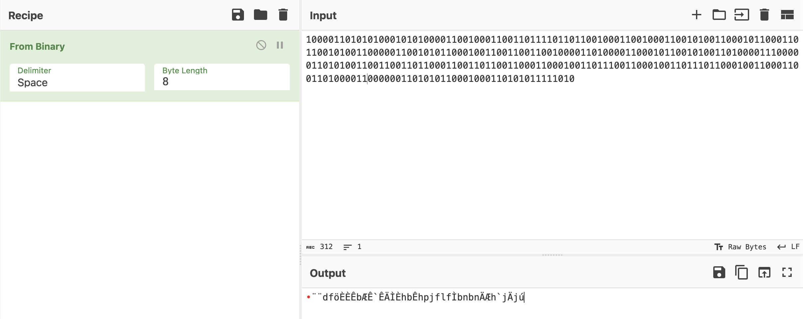
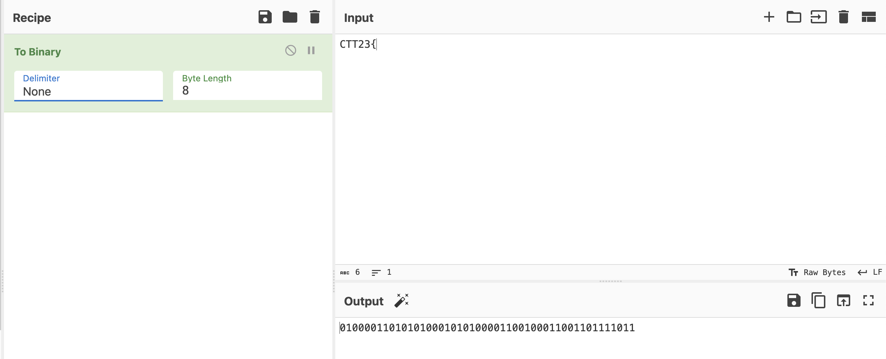
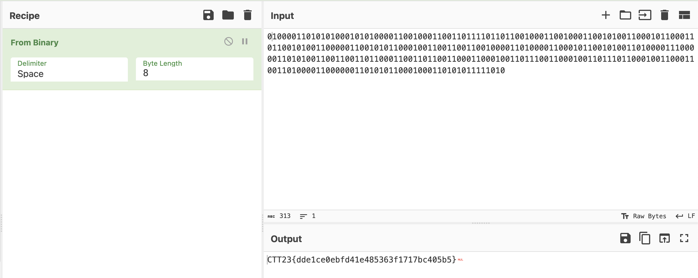

# Write-ups for TCTT2023/Crypto/01

## Flag pattern

`CTT23{xxxxxxxxxxxxxxxxxxxxxxxxxxxxxxxx}`

## Challenge Files

[ZeroRight.zip](./ZeroRight.zip)

## Solution

1. The [text](./write-ups/ZeroRight.txt) appears to be binary, so try to decode it to ASCII.

```
100001101010100010101000011001000110011011110110110010001100100011001010011000101100011011001010011000001100101011000100110011001100100001101000011000101100101001101000011100000110101001100110011011000110011011001100011000100110111001100010011011101100010011000110011010000110000001101010110001000110101011111010
```



But it didn't seem right.

2. So I tried taking the flag pattern that we know and converting it into binary.



And its appearance looks exactly like the text we had before, the only difference is that it has a leading 0.

```
010000110101010001010100001100100011001101111011
```

and

```
 10000110101010001010100001100100011001101111011...
```

3. So let's add one 0 to the front of our text and then change from binary to ascii.



4. And we got the flag `CTT23{dde1ce0ebfd41e485363f1717bc405b5}`
