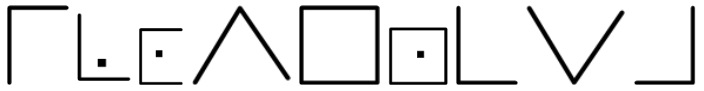
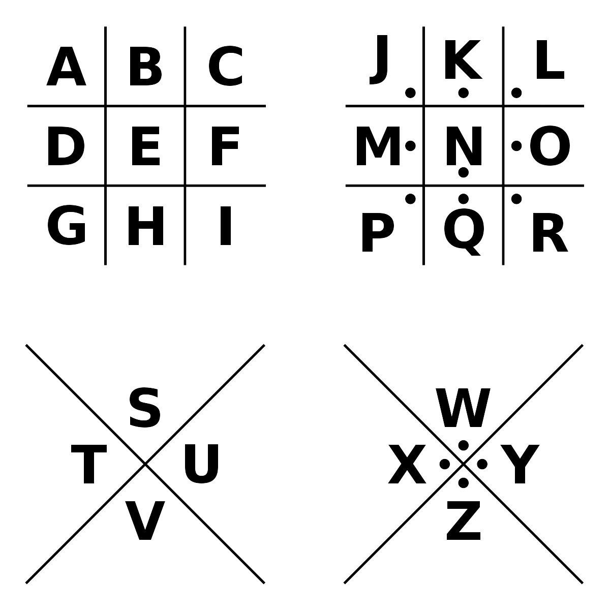
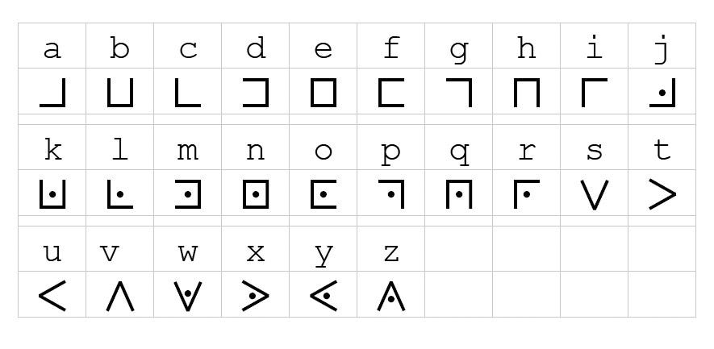
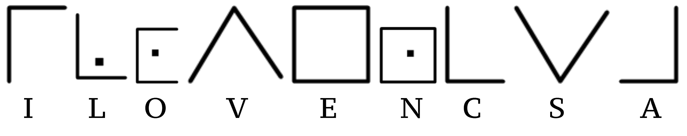

# Write-ups for TCTT2023/Crypto/02

## Flag pattern

`CTT23{xxxxxxxxxxxxxxxxxxxxxxxxxxxxxxxx}`

## Challenge Files

[Lineman.zip](./Lineman.zip)

## Solution

1. From our knowledge, This is [image](./write-ups/Lineman.png) is **Pigpen cipher**.

2. We can use this table to read the plaintext.

3. And the result is `ILOVENCSA`

4. We combine it with the flag pattern, which results in `CTT23{ILOVENCSA}`
