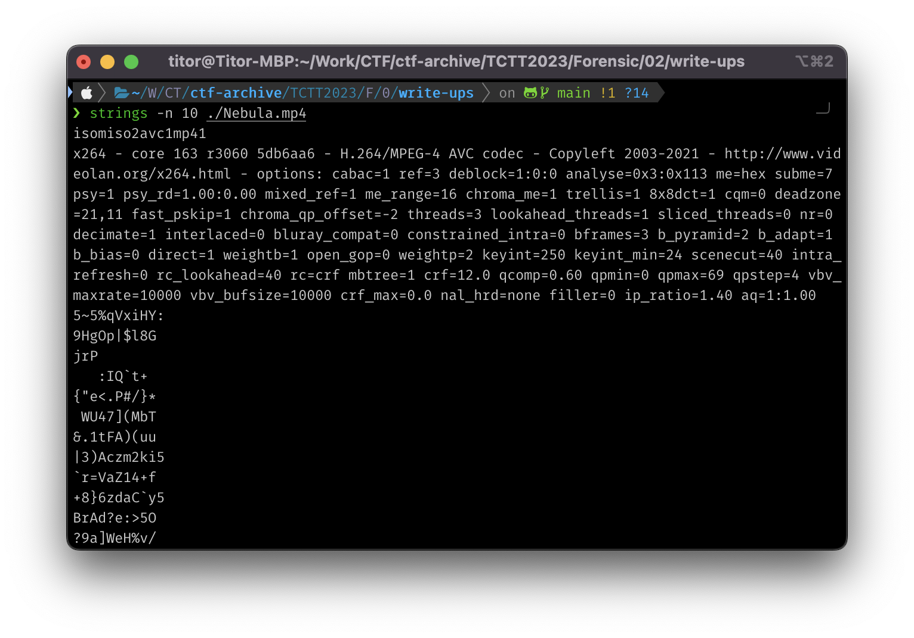

# Write-ups for TCTT2023/Forensic/02

## Flag pattern

`CTT23{xxxxxxxxxxxxxxxxxxxxxxxxxxxxxxxx}`

## Challenge Files

[Nebula.zip](./Nebula.zip)

## Solution

1. I use `strings` command to view all string in the file.

```bash
strings -n 10 ./Nebula.mp4
```



```
isomiso2avc1mp41
x264 - core 163 r3060 5db6aa6 - H.264/MPEG-4 AVC codec - Copyleft 2003-2021 - http://www.videolan.org/x264.html - options: cabac=1 ref=3 deblock=1:0:0 analyse=0x3:0x113 me=hex subme=7 psy=1 psy_rd=1.00:0.00 mixed_ref=1 me_range=16 chroma_me=1 trellis=1 8x8dct=1 cqm=0 deadzone=21,11 fast_pskip=1 chroma_qp_offset=-2 threads=3 lookahead_threads=1 sliced_threads=0 nr=0 decimate=1 interlaced=0 bluray_compat=0 constrained_intra=0 bframes=3 b_pyramid=2 b_adapt=1 b_bias=0 direct=1 weightb=1 open_gop=0 weightp=2 keyint=250 keyint_min=24 scenecut=40 intra_refresh=0 rc_lookahead=40 rc=crf mbtree=1 crf=12.0 qcomp=0.60 qpmin=0 qpmax=69 qpstep=4 vbv_maxrate=10000 vbv_bufsize=10000 crf_max=0.0 nal_hrd=none filler=0 ip_ratio=1.40 aq=1:1.00
5~5%qVxiHY:
9HgOp|$l8G
jrP
   :IQ`t+
{"e<.P#/}*
 WU47](MbT


.
.
.


m+(=\!QgBk
VideoHandler
Apple Sound Media Handler
Lavf58.76.100CTT23{26b61d1b7eb921b13e26e6825339c278}
```

2. The result is `CTT23{26b61d1b7eb921b13e26e6825339c278}`
