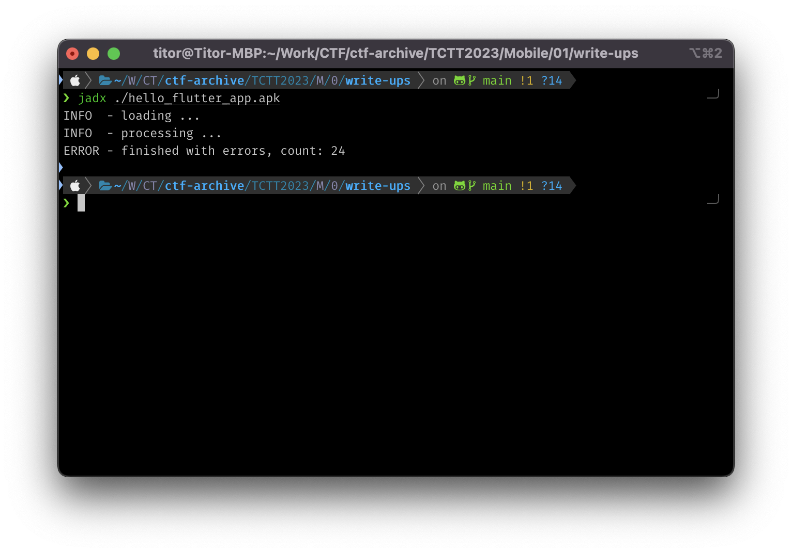
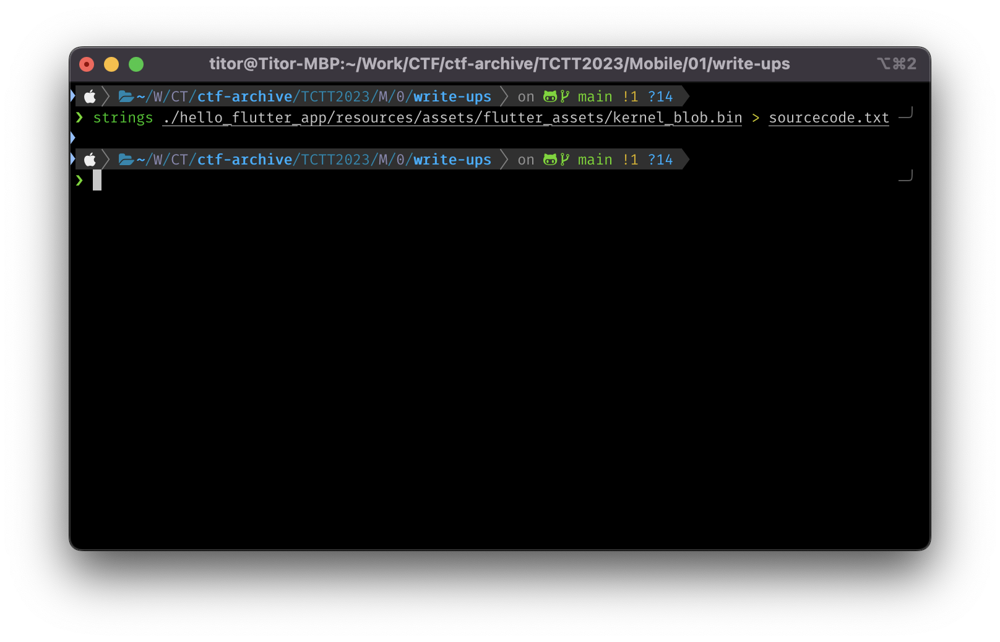

# Write-ups for TCTT2023/Mobile/01

## Flag pattern

`CTT23{xxxxxxxxxxxxxxxxxxxxxxxxxxxxxxxx}`

## Challenge Files

[hello_flutter_app.apk.zip](./hello_flutter_app.apk.zip)

## Solution

1. Let decompile the apk file. I prefer to use `jadx`.

```
jadx ./hello_flutter_app.apk
```



2. From [MainActivity.java](./write-ups/hello_flutter_app/sources/com/mc/hello_tctt2023/MainActivity.java), we can see that the app is built with Flutter in debug mode.

```java
package com.mc.hello_tctt2023;

import io.flutter.embedding.android.FlutterActivity;
import kotlin.Metadata;
/* compiled from: MainActivity.kt */
@Metadata(d1 = {"\u0000\f\n\u0002\u0018\u0002\n\u0002\u0018\u0002\n\u0002\b\u0002\u0018\u00002\u00020\u0001B\u0005¢\u0006\u0002\u0010\u0002¨\u0006\u0003"}, d2 = {"Lcom/mc/hello_tctt2023/MainActivity;", "Lio/flutter/embedding/android/FlutterActivity;", "()V", "app_debug"}, k = 1, mv = {1, 7, 1}, xi = 48)
/* loaded from: classes.dex */
public final class MainActivity extends FlutterActivity {
}
```

3. Since the app is in debug mode, we can read the source code in [kernel_blob.bin](./write-ups/hello_flutter_app/resources/assets/flutter_assets/kernel_blob.bin) at `resources/assets/flutter_assets/`.

```
strings resources/assets/flutter_assets/kernel_blob.bin > sourcecode.txt
```



4. At the end of the [source code](./write-ups/sourcecode.txt), we can find the flag.

```dart
@override
Widget build(BuildContext context) {
  // String plainText = "C T T 2 3 { l 3 t _ s t @ r t _ w 1 t h _ t h 3 _ m @ n 1 f 3 s t }";
  mflag = "Don't need to run the app to find the flag";
  log("[!] mflag: " + mflag);
  return Scaffold(
    appBar: AppBar(
      backgroundColor: Theme.of(context).colorScheme.inversePrimary,
      title: Text(widget.title),
    ),
    body: Center(
      child: Column(
        mainAxisAlignment: MainAxisAlignment.center,
        children: <Widget>[
          Text(
            '$mflag',
          )
        ],
      ),
    ),
  );
}
```

5. After removing the spaces, we can get the flag : `CTT23{l3t_st@rt_w1th_th3_m@n1f3st}`.
