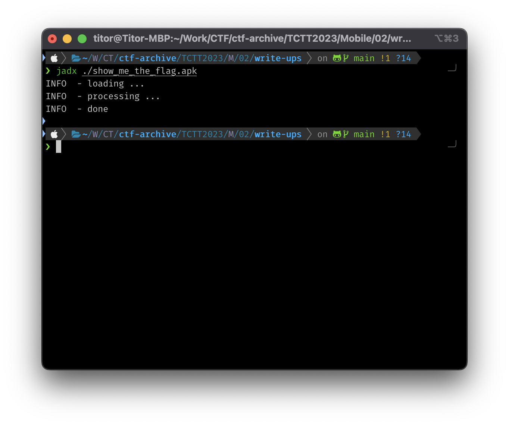
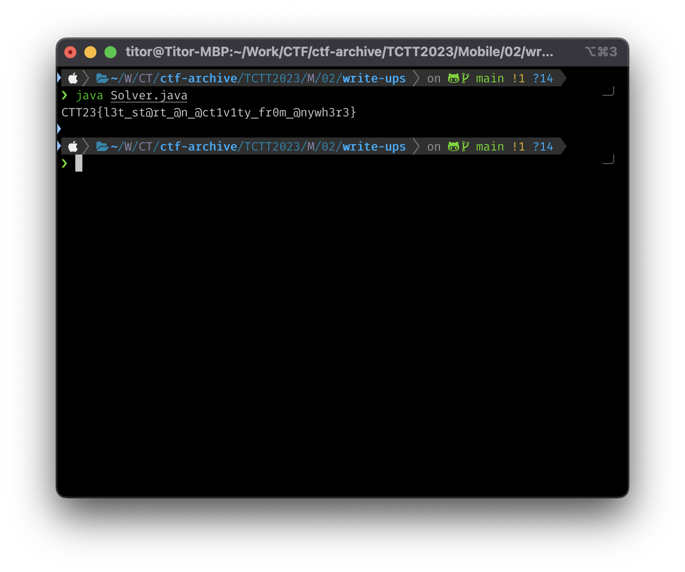

# Write-ups for TCTT2023/Mobile/02

## Flag pattern

`CTT23{xxxxxxxxxxxxxxxxxxxxxxxxxxxxxxxx}`

## Challenge Files

[show_me_the_flag.zip](./show_me_the_flag.zip)

## Solution

1. Let decompile the apk file. I prefer to use `jadx`.

```
jadx ./show_me_the_flag.apk
```



2. From [FlagActivity.java](./write-ups/show_me_the_flag/sources/com/mc/securepin/FlagActivity.java) in `sources/com/mc/securepin/`.

```java
package com.mc.securepin;

import android.os.Bundle;
import android.support.v7.app.AppCompatActivity;
import android.util.Log;
import android.widget.TextView;
import android.widget.Toast;
import java.util.ArrayList;
/* loaded from: classes.dex */
public class FlagActivity extends AppCompatActivity {
    /* JADX INFO: Access modifiers changed from: protected */
    @Override // android.support.v7.app.AppCompatActivity, android.support.v4.app.FragmentActivity, android.support.v4.app.SupportActivity, android.app.Activity
    public void onCreate(Bundle bundle) {
        super.onCreate(bundle);
        setContentView(R.layout.activity_flag);
        TextView textView = (TextView) findViewById(R.id.textView);
        Bundle extras = getIntent().getExtras();
        if (extras == null || !extras.getString("PIN").equals("showmetheflag")) {
            return;
        }
        String flag = getFlag(getString(R.string.build_number), getString(R.string.app_string));
        Log.d("[Kapi]", "[!] Plain: " + flag);
        Toast.makeText(getApplication(), "Check device logs", 1).show();
        textView.setText(flag);
    }

    public static String getFlag(String str, String str2) {
        int parseInt;
        int i;
        String sb = new StringBuilder(" abcdefghijklmnopqrstuvwxyz0123456789!@#$%^&*()-_=+`{[}]:;'\"<,>.?/|ABCDEFGHIJKLMNOPQRSTUVWXYZ").reverse().toString();
        String substring = str.substring(0, 1);
        try {
            Integer.parseInt(str.substring(1, 2));
            parseInt = Integer.parseInt(substring + str.substring(1, 2));
            i = 1;
        } catch (Exception unused) {
            parseInt = Integer.parseInt(substring);
            i = 0;
        }
        double pow = Math.pow(parseInt, 2.0d) - 1.0d;
        String substring2 = str.substring(i + 2, i + 3);
        int i2 = i + 1;
        String substring3 = str.substring(i2 + 2, i2 + 4);
        int parseInt2 = Integer.parseInt(substring3);
        int i3 = i2 + 6;
        String substring4 = str.substring(i2 + 5, i3);
        int i4 = i2 + 7;
        try {
            substring4 = substring4 + str.substring(i3, i4);
            Integer.parseInt(substring4);
        } catch (Exception unused2) {
        }
        int i5 = i2 + 8;
        try {
            substring4 = substring4 + str.substring(i4, i5);
            Integer.parseInt(substring4);
        } catch (Exception unused3) {
        }
        try {
            substring4 = substring4 + str.substring(i5, i2 + 9);
            Integer.parseInt(substring4);
        } catch (Exception unused4) {
        }
        int parseInt3 = Integer.parseInt(substring4);
        if (parseInt3 <= pow) {
            String str3 = parseInt + "(" + substring2 + substring3 + ")" + parseInt3;
        }
        ArrayList arrayList = new ArrayList();
        for (int i6 = 0; i6 < pow + 1.0d; i6++) {
            arrayList.add(Integer.valueOf(i6));
        }
        String str4 = str2;
        int i7 = parseInt3;
        int i8 = 0;
        while (i8 < str2.length()) {
            int i9 = i8 + 0;
            i8++;
            String substring5 = str2.substring(i9, i8);
            if (substring2.equals("-")) {
                i7 %= 93;
                int indexOf = (" abcdefghijklmnopqrstuvwxyz0123456789!@#$%^&*()-_=+`{[}]:;'\"<,>.?/|ABCDEFGHIJKLMNOPQRSTUVWXYZ".indexOf(substring5) + i7) % 93;
                str4 = str4 + " abcdefghijklmnopqrstuvwxyz0123456789!@#$%^&*()-_=+`{[}]:;'\"<,>.?/|ABCDEFGHIJKLMNOPQRSTUVWXYZ".substring(indexOf, indexOf + 1);
            } else if (substring2.equals("+")) {
                i7 %= 93;
                int indexOf2 = (sb.indexOf(substring5) + i7) % 93;
                str4 = str4 + sb.substring(indexOf2, indexOf2 + 1);
            }
            i7 += parseInt + parseInt2;
        }
        return str4.substring(str2.length(), str4.length());
    }
}
```

We can see that the `getFlag` function use 2 arguments to generate the flag, which are `R.string.build_number` and `R.string.app_string`

3. We can find `R.string.build_number` and `R.string.app_string` in [string.xml](./write-ups/show_me_the_flag/resources/res/values/strings.xml) in `resources/res/values/`.

```xml
<?xml version="1.0" encoding="utf-8"?>
<resources>
    <string name="abc_action_bar_home_description">Navigate home</string>
    <string name="abc_action_bar_home_description_format">%1$s, %2$s</string>
    <string name="abc_action_bar_home_subtitle_description_format">%1$s, %2$s, %3$s</string>
    <string name="abc_action_bar_up_description">Navigate up</string>
    <string name="abc_action_menu_overflow_description">More options</string>
    <string name="abc_action_mode_done">Done</string>
    <string name="abc_activity_chooser_view_see_all">See all</string>
    <string name="abc_activitychooserview_choose_application">Choose an app</string>
    <string name="abc_capital_off">OFF</string>
    <string name="abc_capital_on">ON</string>
    <string name="abc_font_family_body_1_material">sans-serif</string>
    <string name="abc_font_family_body_2_material">sans-serif-medium</string>
    <string name="abc_font_family_button_material">sans-serif-medium</string>
    <string name="abc_font_family_caption_material">sans-serif</string>
    <string name="abc_font_family_display_1_material">sans-serif</string>
    <string name="abc_font_family_display_2_material">sans-serif</string>
    <string name="abc_font_family_display_3_material">sans-serif</string>
    <string name="abc_font_family_display_4_material">sans-serif-light</string>
    <string name="abc_font_family_headline_material">sans-serif</string>
    <string name="abc_font_family_menu_material">sans-serif</string>
    <string name="abc_font_family_subhead_material">sans-serif</string>
    <string name="abc_font_family_title_material">sans-serif-medium</string>
    <string name="abc_search_hint">Search…</string>
    <string name="abc_searchview_description_clear">Clear query</string>
    <string name="abc_searchview_description_query">Search query</string>
    <string name="abc_searchview_description_search">Search</string>
    <string name="abc_searchview_description_submit">Submit query</string>
    <string name="abc_searchview_description_voice">Voice search</string>
    <string name="abc_shareactionprovider_share_with">Share with</string>
    <string name="abc_shareactionprovider_share_with_application">Share with %s</string>
    <string name="abc_toolbar_collapse_description">Collapse</string>
    <string name="app_name">McSecurePIN</string>
    <string name="app_string">E4A)Q_*e4bi)gw,5\'D-GH7Lo;S6ZT%ToTs4Ls$e2K*</string>
    <string name="appbar_scrolling_view_behavior">android.support.design.widget.AppBarLayout$ScrollingViewBehavior</string>
    <string name="bottom_sheet_behavior">android.support.design.widget.BottomSheetBehavior</string>
    <string name="build_number">20(+16)2</string>
    <string name="character_counter_pattern">%1$d / %2$d</string>
    <string name="lock_input_again">Re-enter new passcode</string>
    <string name="lock_input_not_match">Passcodes do not match.</string>
    <string name="password_toggle_content_description">Toggle password visibility</string>
    <string name="path_password_eye">M12,4.5C7,4.5 2.73,7.61 1,12c1.73,4.39 6,7.5 11,7.5s9.27,-3.11 11,-7.5c-1.73,-4.39 -6,-7.5 -11,-7.5zM12,17c-2.76,0 -5,-2.24 -5,-5s2.24,-5 5,-5 5,2.24 5,5 -2.24,5 -5,5zM12,9c-1.66,0 -3,1.34 -3,3s1.34,3 3,3 3,-1.34 3,-3 -1.34,-3 -3,-3z</string>
    <string name="path_password_eye_mask_strike_through">M2,4.27 L19.73,22 L22.27,19.46 L4.54,1.73 L4.54,1 L23,1 L23,23 L1,23 L1,4.27 Z</string>
    <string name="path_password_eye_mask_visible">M2,4.27 L2,4.27 L4.54,1.73 L4.54,1.73 L4.54,1 L23,1 L23,23 L1,23 L1,4.27 Z</string>
    <string name="path_password_strike_through">M3.27,4.27 L19.74,20.74</string>
    <string name="please_enter_passcode">Enter a passcode of 4-6 digits</string>
    <string name="search_menu_title">Search</string>
    <string name="status_bar_notification_info_overflow">999+</string>
</resources>
```

So

```
R.string.build_number = 20(+16)2
R.string.app_string = E4A)Q_*e4bi)gw,5\'D-GH7Lo;S6ZT%ToTs4Ls$e2K*
```

4. Let write a new [Solver java class](./write-ups/Solver.java) to display the flag.

```java
package write-ups;

import java.util.ArrayList;

class Solver {
    public static void main(String[] args) {
        String str = "20(+16)2";
        String str2 = "E4A)Q_*e4bi)gw,5\'D-GH7Lo;S6ZT%ToTs4Ls$e2K*";

        int parseInt;
        int i;
        String sb = new StringBuilder(" abcdefghijklmnopqrstuvwxyz0123456789!@#$%^&*()-_=+`{[}]:;'\"<,>.?/|ABCDEFGHIJKLMNOPQRSTUVWXYZ").reverse().toString();
        String substring = str.substring(0, 1);
        try {
            Integer.parseInt(str.substring(1, 2));
            parseInt = Integer.parseInt(substring + str.substring(1, 2));
            i = 1;
        } catch (Exception unused) {
            parseInt = Integer.parseInt(substring);
            i = 0;
        }
        double pow = Math.pow(parseInt, 2.0d) - 1.0d;
        String substring2 = str.substring(i + 2, i + 3);
        int i2 = i + 1;
        String substring3 = str.substring(i2 + 2, i2 + 4);
        int parseInt2 = Integer.parseInt(substring3);
        int i3 = i2 + 6;
        String substring4 = str.substring(i2 + 5, i3);
        int i4 = i2 + 7;
        try {
            substring4 = substring4 + str.substring(i3, i4);
            Integer.parseInt(substring4);
        } catch (Exception unused2) {
        }
        int i5 = i2 + 8;
        try {
            substring4 = substring4 + str.substring(i4, i5);
            Integer.parseInt(substring4);
        } catch (Exception unused3) {
        }
        try {
            substring4 = substring4 + str.substring(i5, i2 + 9);
            Integer.parseInt(substring4);
        } catch (Exception unused4) {
        }
        int parseInt3 = Integer.parseInt(substring4);
        if (parseInt3 <= pow) {
            String str3 = parseInt + "(" + substring2 + substring3 + ")" + parseInt3;
        }
        ArrayList arrayList = new ArrayList();
        for (int i6 = 0; i6 < pow + 1.0d; i6++) {
            arrayList.add(Integer.valueOf(i6));
        }
        String str4 = str2;
        int i7 = parseInt3;
        int i8 = 0;
        while (i8 < str2.length()) {
            int i9 = i8 + 0;
            i8++;
            String substring5 = str2.substring(i9, i8);
            if (substring2.equals("-")) {
                i7 %= 93;
                int indexOf = (" abcdefghijklmnopqrstuvwxyz0123456789!@#$%^&*()-_=+`{[}]:;'\"<,>.?/|ABCDEFGHIJKLMNOPQRSTUVWXYZ".indexOf(substring5) + i7) % 93;
                str4 = str4 + " abcdefghijklmnopqrstuvwxyz0123456789!@#$%^&*()-_=+`{[}]:;'\"<,>.?/|ABCDEFGHIJKLMNOPQRSTUVWXYZ".substring(indexOf, indexOf + 1);
            } else if (substring2.equals("+")) {
                i7 %= 93;
                int indexOf2 = (sb.indexOf(substring5) + i7) % 93;
                str4 = str4 + sb.substring(indexOf2, indexOf2 + 1);
            }
            i7 += parseInt + parseInt2;
        }

        System.out.println(str4.substring(str2.length(), str4.length()));
    }
}
```



5. The result is `CTT23{l3t_st@rt_@n_@ct1v1ty_fr0m_@nywh3r3}`
