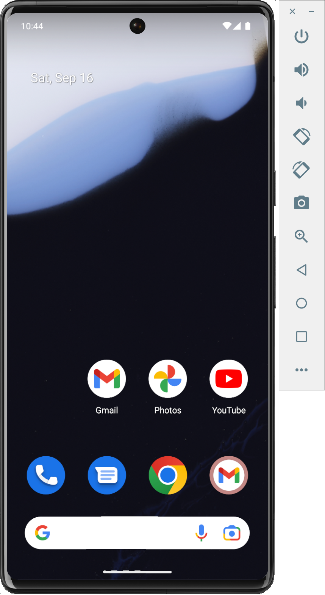
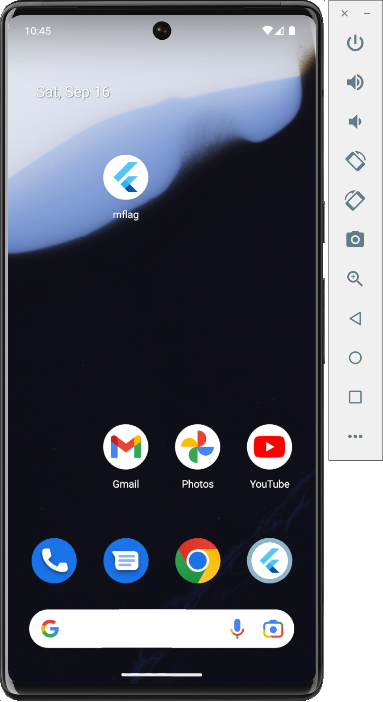
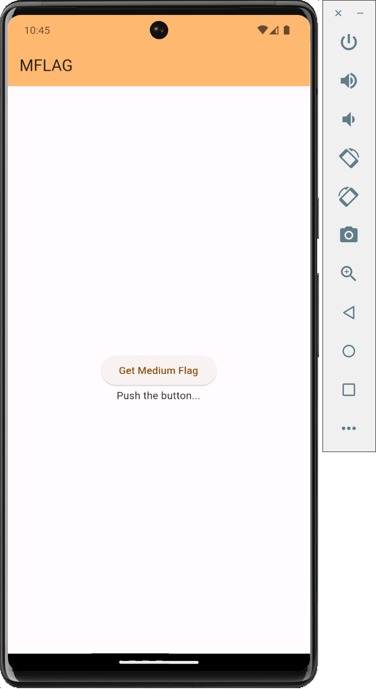
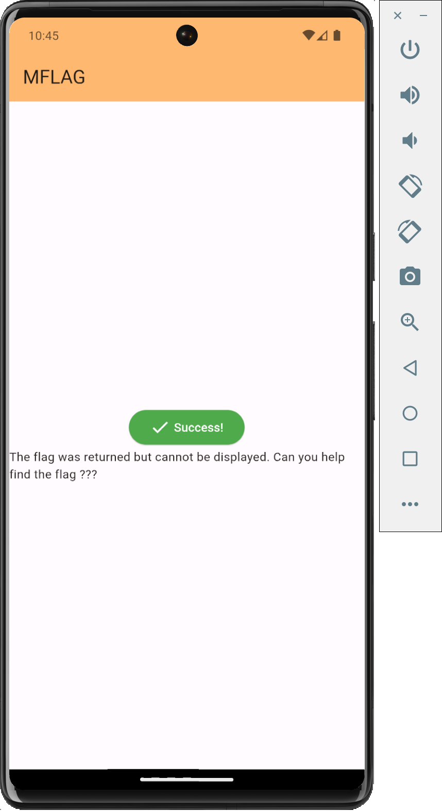
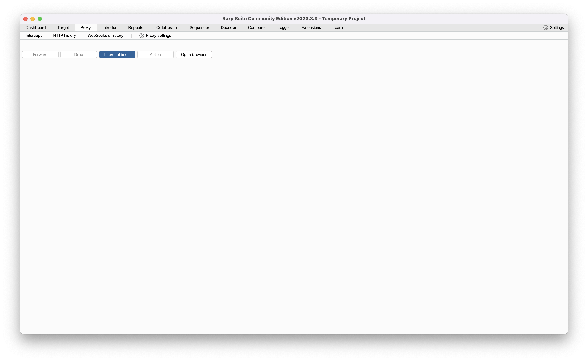
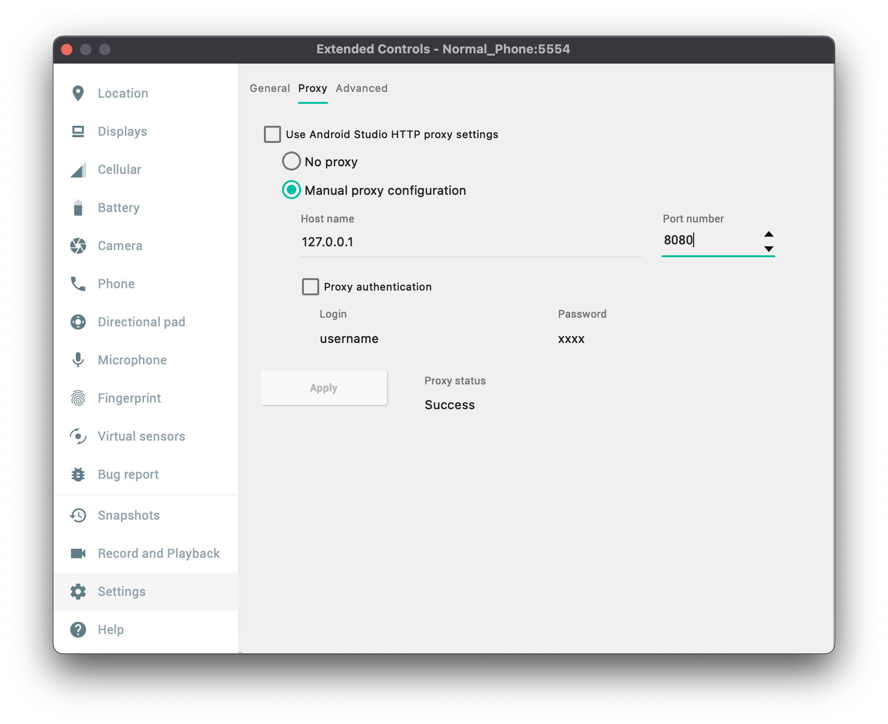
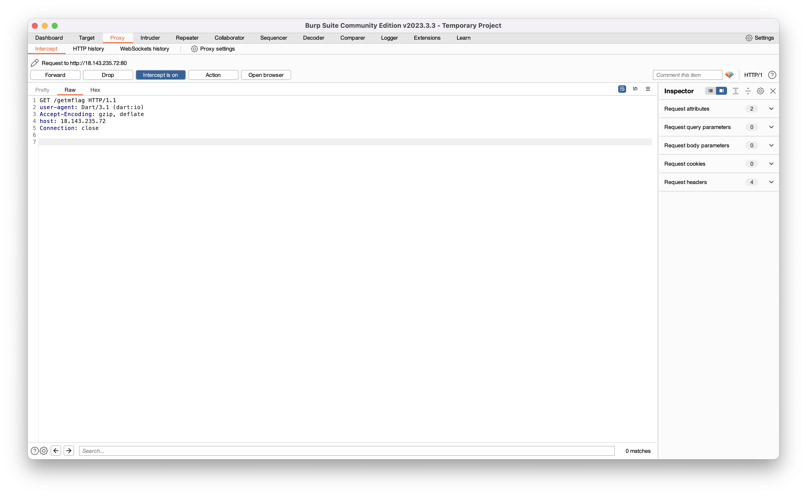
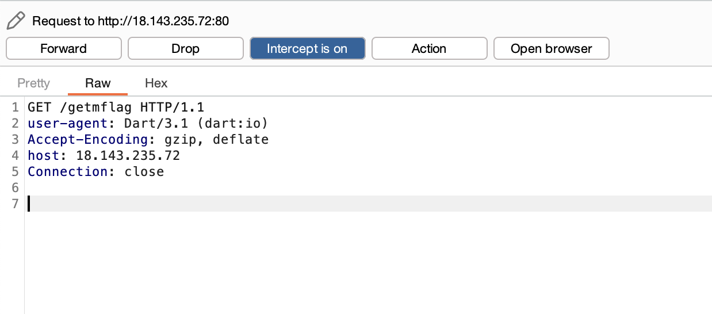
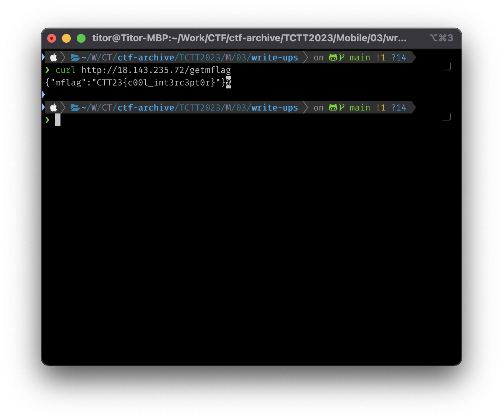

# Write-ups for TCTT2023/Mobile/03

## Flag pattern

`CTT23{xxxxxxxxxxxxxxxxxxxxxxxxxxxxxxxx}`

## Challenge Files

[mflag.zip](./mflag.zip)

## Solution

1. Start by opening [AVD](https://developer.android.com/studio/run/managing-avds) in Android Studio.

2. Install the [app](./write-ups/mflag.apk) in AVD.

3. After launching the app, we can see that it is a simple app with button. But after we press the button, nothing happens. Only the text is shown `The flag was returned but cannot be displayed. Can you help find the flag ???`.

This make me think that the flag is hidden outside the app, the app should be using some kind of API to get the flag. So I use [burpsuite](https://portswigger.net/burp/communitydownload) to intercept the traffic.

4. To intercept the traffic, we need to set the proxy in AVD. Go to `Settings > Proxy` and set the proxy to your burpsuite proxy. Also we need to start the intercept in burpsuite.

5. After pressing the button, we can see that there is a request to `http://18.143.235.72/getmflag`

6. I use `curl` to send the request to the server again.

7. The result is `CTT23{c00l_int3rc3pt0r}`
