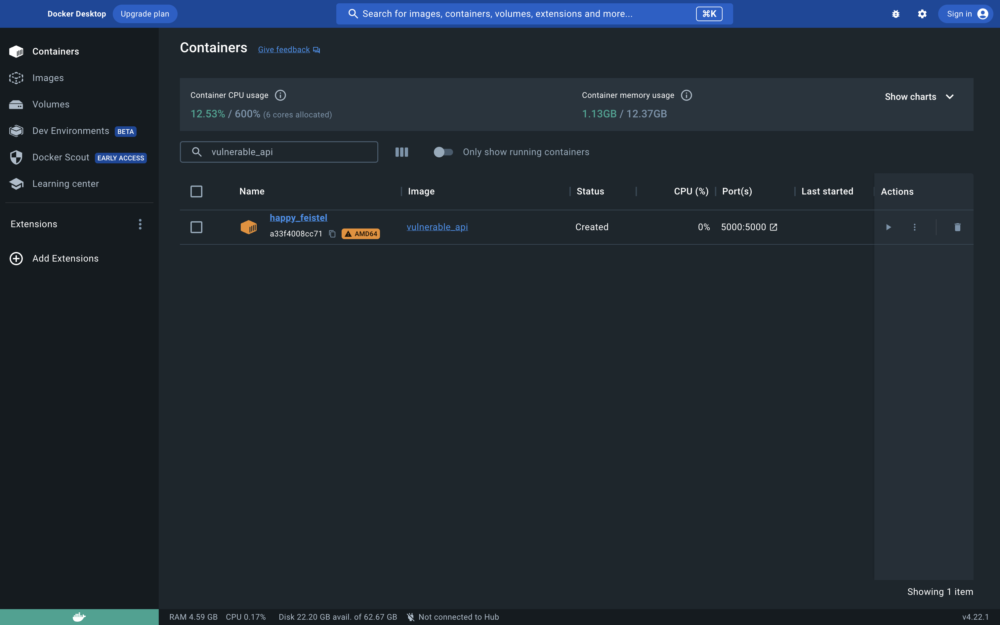

# Write-ups for TCTT2023/Mobile/05

## Flag pattern

`CTT23{xxxxxxxxxxxxxxxxxxxxxxxxxxxxxxxx}`

## Challenge Files

~~[WidgProx.zip](./WidgProx.zip)~~ File is too big

## Solution

1. From all the files we received, We can see that there is a docker image that we can load.


2. Let start the docker image using `docker run -p 5000:5000 vulnerable_api`, then we can inspect the docker image using `Docker Desktop`.




3. We can see `index.js` in `app` folder.


```js
const express = require('express');
const jwt = require('jsonwebtoken');
const fs = require('fs');
const https = require('https');
const app = express();
const port = process.env.PORT || 5000;

const secretKey = '7FcwXPubCICmRR19A418DDsnmPgvzOoF';

const bypassAlgorithmCheck = (req, res, next) => {
  const authHeader = req.header('Authorization');

  if (!authHeader || !authHeader.startsWith('Bearer ')) {
    return res.status(401).json({ message: 'Invalid token format' });
  }

  const token = authHeader.replace('Bearer ', '');

  try {
    const decoded = jwt.decode(token, { complete: true });
    if (decoded.header.alg !== 'none') {
      jwt.verify(token, secretKey);
    }
    req.user = decoded.payload;
    next();
  } catch (err) {
    res.status(401).json({ message: 'Invalid token' });
  }
};

app.use(express.json());

app.post('/gettoken', (req, res) => {
  const { username } = req.body;

  if (!username) {
    return res.status(400).json({ message: 'Username is required' });
  }

  const payload = {
    name: username,
    role: 'user',
    iat: Math.floor(Date.now() / 1000),
  };

  const token = jwt.sign(payload, secretKey, { algorithm: 'HS256' });

  res.json({ token });
});

app.get('/', bypassAlgorithmCheck, (req, res) => {
  if (req.user.role === 'user') {
    res.json({ message: `Hello ${req.user.name}` });
  } else if (req.user.role === 'admin') {
    res.json({ message: 'Q1RUMjN7Y2F0Y2hfbWVfaWZfeW91X2Nhbn0=' });
  } else {
    res.status(403).json({ message: 'Forbidden' });
  }
});

const privateKeyPath = 'key.pem';
const certificatePath = 'cert.pem';

// Read SSL certificate and key files
const privateKey = fs.readFileSync(privateKeyPath, 'utf8');
const certificate = fs.readFileSync(certificatePath, 'utf8');

// HTTPS options
const httpsOptions = {
  key: privateKey,
  cert: certificate,
  //secureProtocol: 'TLSv1_2_method'
};

const server = https.createServer(httpsOptions, app);

server.listen(port, () => {
  console.log(`Server is running on port ${port}`);
});
```

4. The interesting part is

```js
app.get('/', bypassAlgorithmCheck, (req, res) => {
  if (req.user.role === 'user') {
    res.json({ message: `Hello ${req.user.name}` });
  } else if (req.user.role === 'admin') {
    res.json({ message: 'Q1RUMjN7Y2F0Y2hfbWVfaWZfeW91X2Nhbn0=' });
  } else {
    res.status(403).json({ message: 'Forbidden' });
  }
});
```

5. We decode the response `Q1RUMjN7Y2F0Y2hfbWVfaWZfeW91X2Nhbn0=` using `BASE64`, we get `CTT23{catch_me_if_you_can}`.
