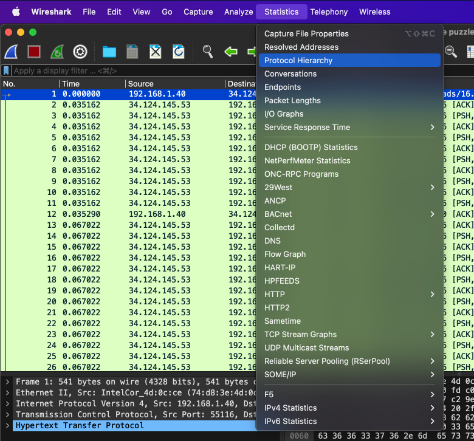

# Write-ups for TCTT2023/Network/01

## Flag pattern

`CTT23{xxxxxxxxxxxxxxxxxxxxxxxxxxxxxxxx}`

## Challenge Files

[Thepuzzle.zip](./Thepuzzle.zip)

## Solution

1. First, Let open the pcap file with wireshark and analyze it with `Statistics > Protocol Hierarchy`.




2. It look like there is a lot of HTTP request, so export the HTTP data/files with `File > Export Objects > HTTP`.


3. We found [16.9b8bb247b8364bfb9a03ed9768c66376.message](./write-ups/16.9b8bb247b8364bfb9a03ed9768c66376.message), so let save it.


4. We don't know what kind of file this is. So use the file command to see what file it is.

```bash
file 16.9b8bb247b8364bfb9a03ed9768c66376.message
```


And we know that it is a `PNG` image file.

5. We changed the file extension to png.

```bash
mv 16.9b8bb247b8364bfb9a03ed9768c66376.message > message.png
```

6. And we got [message.png](./write-ups/message.png).


But really hard to scan, because the finder pattern is missing.


7. So we add a clear finder pattern to the [image](./write-ups/message_fix.png).


8. After we scan the QR code, we got the website `http://bit.ly/ctt23`.

9. When we visit the website, we got `CTT23{Th3_g00d_inv3st1g@t0r}`.
