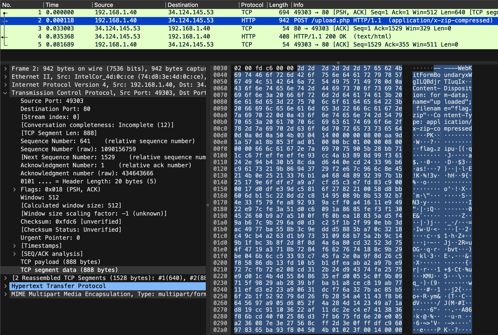
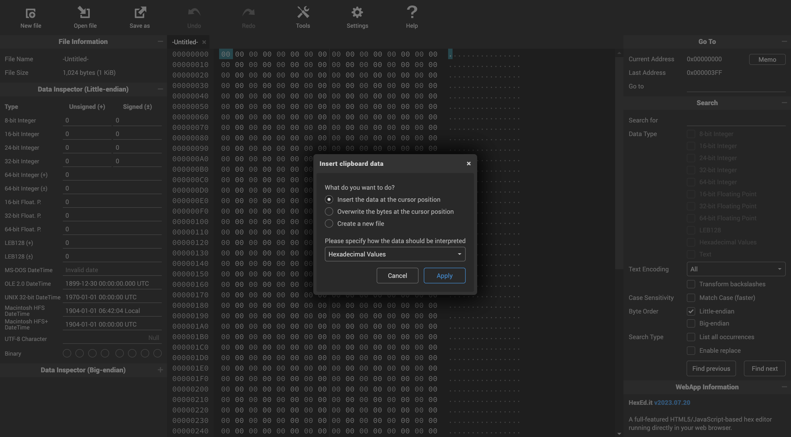
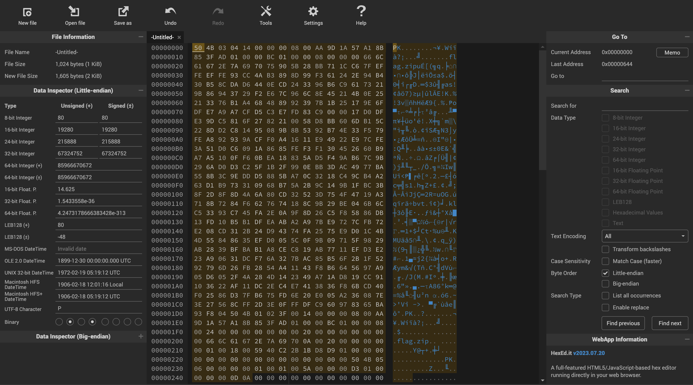
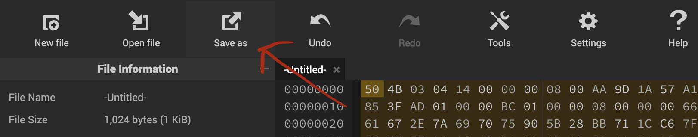
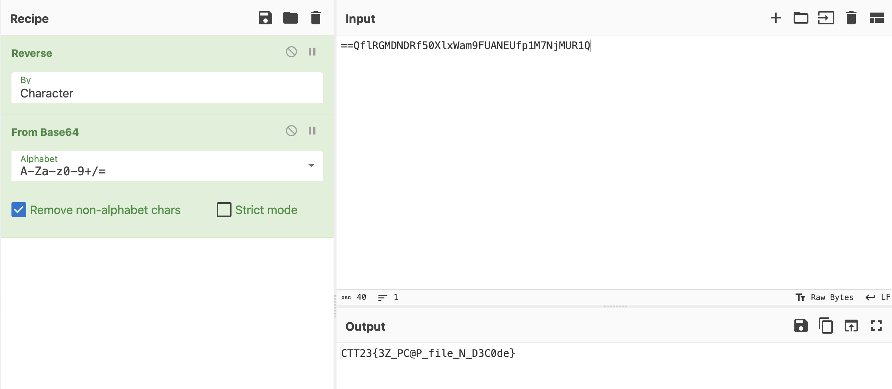

# Write-ups for TCTT2023/Network/02

## Flag pattern

`CTT23{xxxxxxxxxxxxxxxxxxxxxxxxxxxxxxxx}`

## Challenge Files

[TheSecretMessage.zip](./TheSecretMessage.zip)

## Solution

1. In this [PCAP file](./write-ups/TheSecretMessage.pcap) there are very few packets, we just lookin into packet no.2 .



We can see the PK in the content which is the header of the zip file.

2. We copy the zip content of the packet in `hex`.

```
50 4b 03 04 14 00 00 00 08 00 aa 9d 1a 57 a1 8b
85 3f ad 01 00 00 bc 01 00 00 08 00 00 00 66 6c
61 67 2e 7a 69 70 75 90 5b 28 bb 71 1c c6 7f ef
fe ef fe 93 cc 4a b3 89 8d 99 f3 61 24 2e 94 b4
30 b5 8c da d6 44 0e cd 24 33 96 b6 c9 61 73 21
9b 86 94 37 29 f2 e6 7c 96 6c 8e 45 21 4b 0e 25
21 33 76 b1 a4 68 48 89 92 39 7b 1b 25 17 9e 6f
df e7 a9 a7 cf d5 c3 e7 fd 83 c9 00 00 17 d0 df
e3 9d c5 81 6f 27 82 21 00 58 d8 bb 60 6d b1 5c
22 8d d2 c8 14 95 08 9b 8b 53 92 b7 4e 33 f5 79
fe a8 92 93 9a cf f0 a4 16 11 e9 49 22 e9 7c fe
3a 51 d0 c6 09 1a 86 85 fe f3 f1 30 45 26 60 b9
a7 a5 10 0f f6 0b ea 18 83 5a d5 f4 9a b6 7c 9b
29 6a d0 d3 c2 5f 1b 2f 99 0e bb 3d ac 49 77 ba
55 8b 3c 9e dd d5 88 5b a7 0c 32 18 c4 9c b4 a2
63 d1 b9 73 31 09 68 b7 5a 2b 9c 14 9b 1f bc 3b
8f 2d 8f 8d 4a 6a 80 cd 32 52 3d 75 4f 47 19 a3
71 8b 72 84 f6 62 76 74 18 8c 9b 29 be 04 6b 6c
c5 33 93 c7 45 fa 2e 0a 9f 8d 26 c5 f8 58 86 db
13 fd 10 b5 b1 df ea ab a2 a9 7b e9 72 7c fb 72
e2 08 cd 31 2b 24 d9 43 74 fa 25 75 e9 d0 1c 4b
4d 55 84 86 35 ef d0 05 5c 0f 9b 09 71 5f 98 29
ab 28 39 bf ba b1 a8 ce c8 19 ab 77 11 ef d3 e2
23 a9 06 31 dc f7 6a 32 7b ac 85 b5 6f 2b 1f 52
92 79 6d 26 fb 28 54 a4 11 43 f8 b6 64 56 97 a9
05 d6 05 2f 4a 28 4d 14 23 49 a7 1a d8 19 cc 91
10 36 22 af 11 dc 2e c4 e7 41 38 36 f8 6b cd 40
f0 25 86 d3 7f b6 75 fd 6e 20 e0 05 a2 36 08 7e
3e 27 56 8c ff 2d 3e 0f ff df c9 60 97 83 65 ba
93 f8 04 50 4b 01 02 3f 00 14 00 00 00 08 00 aa
9d 1a 57 a1 8b 85 3f ad 01 00 00 bc 01 00 00 08
00 24 00 00 00 00 00 00 00 20 00 00 00 00 00 00
00 66 6c 61 67 2e 7a 69 70 0a 00 20 00 00 00 00
00 01 00 18 00 59 40 c2 2b 1b d8 d9 01 00 00 00
00 00 00 00 00 00 00 00 00 00 00 00 00 50 4b 05
06 00 00 00 00 01 00 01 00 5a 00 00 00 d3 01 00
00 00 00 0d 0a
```

- Or you can only remove hex before `50 4b 03` and after `00 0d 0a`

- Or you can save all the content and remove it with hex editor.

3. I use [online hex editor](https://hexed.it/) to paste the hex and save it into [secret.zip](./write-ups/secret.zip)







4. Unzip the file and we got [flag.txt](./write-ups/flag.txt)


5. `cat` the flag file and we got `==QflRGMDNDRf50XlxWam9FUANEUfp1M7NjMUR1Q`

6. Reverse it, and decode with `BASE64`



7. The result is `CTT23{3Z_PC@P_file_N_D3C0de}`
