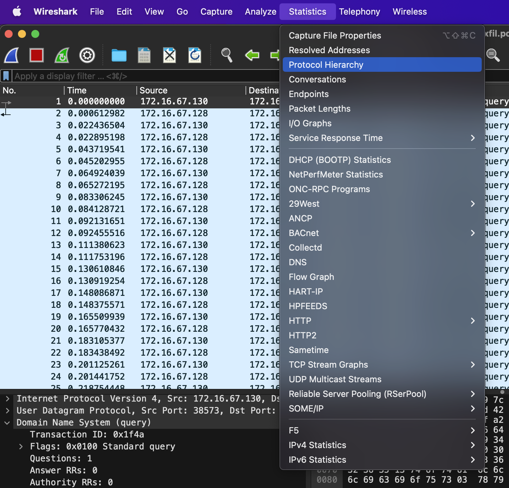
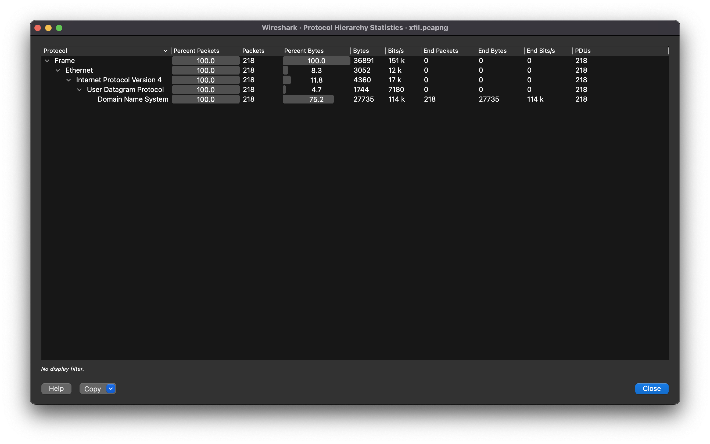
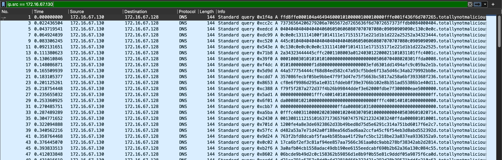
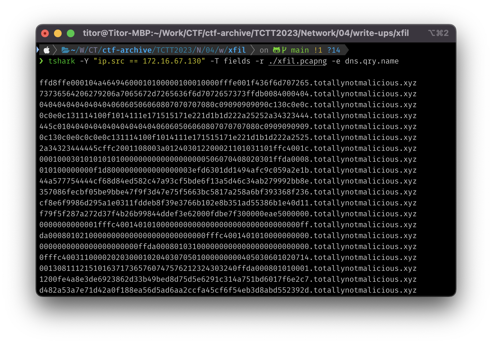
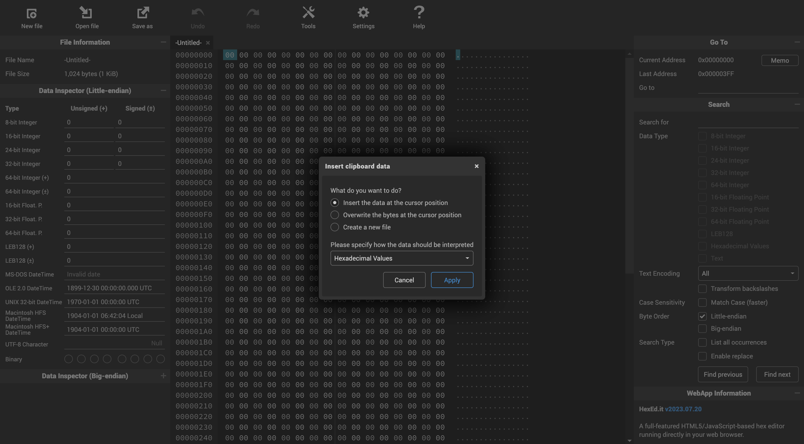
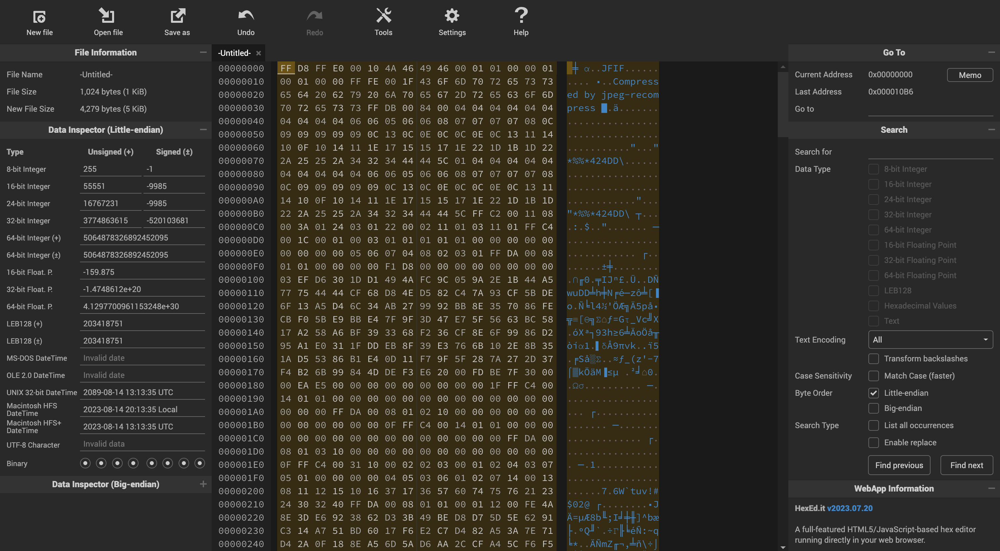
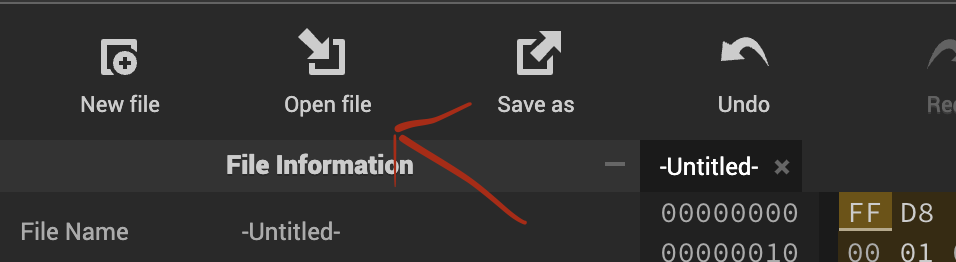

# Write-ups for TCTT2023/Network/04

## Flag pattern

`CTT23{xxxxxxxxxxxxxxxxxxxxxxxxxxxxxxxx}`

## Challenge Files

[xfil.zip](./xfil.zip)

## Solution

1. First, Let open the pcap file with wireshark and analyze it with `Statistics > Protocol Hierarchy`.





2. All packets are DNS Protocol. And the packets that look the same in pairs because of they are query and response, so we can filter to just any side. I filtered with source ip that is equal 172.16.67.130.



3. The different between each packet is query name. So let's show only query name in each packet using `tshark`

```bash
tshark -Y "ip.src == 172.16.67.130" -T fields -r ./xfil.pcapng -e dns.qry.name
```



```
ffd8ffe000104a46494600010100000100010000fffe001f436f6d707265.totallynotmalicious.xyz
73736564206279206a7065672d7265636f6d7072657373ffdb0084000404.totallynotmalicious.xyz
040404040404040406060506060807070707080c09090909090c130c0e0c.totallynotmalicious.xyz
0c0e0c131114100f1014111e171515171e221d1b1d222a25252a34323444.totallynotmalicious.xyz
445c010404040404040404040406060506060807070707080c0909090909.totallynotmalicious.xyz
0c130c0e0c0c0e0c131114100f1014111e171515171e221d1b1d222a2525.totallynotmalicious.xyz
2a34323444445cffc2001108003a012403012200021101031101ffc4001c.totallynotmalicious.xyz
0001000301010101010000000000000000000506070408020301ffda0008.totallynotmalicious.xyz
010100000000f1d8000000000000000003efd6301dd1494afc9c059a2e1b.totallynotmalicious.xyz
44a577754444cf68d84ed582c47a93cf5bde6f13a5d46c34ab279992bb8e.totallynotmalicious.xyz
357086fecbf05be9bbe47f9f3d47e75f5663bc5817a258a6bf393368f236.totallynotmalicious.xyz
cf8e6f9986d295a1e0311fddeb8f39e3766b102e8b351ad55386b1e40d11.totallynotmalicious.xyz
f79f5f287a272d37f4b26b99844ddef3e62000fdbe7f300000eae5000000.totallynotmalicious.xyz
0000000000001fffc40014010100000000000000000000000000000000ff.totallynotmalicious.xyz
da00080102100000000000000000000000000fffc4001401010000000000.totallynotmalicious.xyz
0000000000000000000000ffda0008010310000000000000000000000000.totallynotmalicious.xyz
0fffc4003110000202030001020403070501000000000405030601020714.totallynotmalicious.xyz
00130811121510163717365760747576212324303240ffda000801010001.totallynotmalicious.xyz
1200fe4a8e3de6923862d33b49bed8d75d5e6291c314a751bd6017f6e2c7.totallynotmalicious.xyz
d482a53a7e71d42a0f188ea56d5ad6aa2ccfa45cf6f54eb3d8abd552392d.totallynotmalicious.xyz
763f2bfd8dcabf5faa4b585baa41f29afc5bc1218be23a837ea9336352a9.totallynotmalicious.xyz
17ca6bf2ef3c81af94ee857aa7566c361aa0dc9abb278bf38342ab2d2814.totallynotmalicious.xyz
3a0afb04cb1558adac49db190ee6155eedcabf690b2b62a36a130c084c55.totallynotmalicious.xyz
06bcde9b49d2c0c158362b59856d1e8b9f0b55e81c9dddf05a9875f6ca0d.totallynotmalicious.xyz
d21ce791e5757a8dd0afd22810f66b323421e292d28b39571bddfe210c63.totallynotmalicious.xyz
89333829aac553fb1adb52a2e82b119402fc92330e3da53ed6137e776456.totallynotmalicious.xyz
144c0fd37915b5e7dcaf450eec6fba30ba428aafbef89f4e418aede3a959.totallynotmalicious.xyz
8c36acaf559ba9227196fed8e9ff00c15acfaa4aee785e1f5eaf04e90003.totallynotmalicious.xyz
9fbf8887bad7518b7aaaad46bc35229eb05ced85158e4d0553a1a340340f.totallynotmalicious.xyz
1aa64844e537a8f44af56d346ad8f364aea7d65937c99ab4a734e5167b9b.totallynotmalicious.xyz
4e6a8546b269302ab35fe4f7ab42a01ca351a901173ef0c721f45b12fb7e.totallynotmalicious.xyz
b46946d2475b4d04388ac34ca122e677146b960263cafaf830632a5df90d.totallynotmalicious.xyz
5954ebda73d4ef66dcade7c155f774b7943b75cdc72eafab0008f3009bf2.totallynotmalicious.xyz
d41cdc30d2d86e66618b164c7010097a7d5839bb2cf544618e040594b058.totallynotmalicious.xyz
62b45bf9f7317c2d157d056320438e1d1a9572a221aff58a2c6a608e5af3.totallynotmalicious.xyz
e3569510fde7972d021dadf50087844176d056a1d392a82f8cf496c52c16.totallynotmalicious.xyz
5602923e072836a35ff8d5b72e12af8d856220b408cfc1113086ed31847c.totallynotmalicious.xyz
bd980e1e593d7c4a2e320bd8cce4d77d83356c3ec4a96a961b08ad0d4cae.totallynotmalicious.xyz
42465b17bc64bc5bf542a1fd4cbeba67ea1ddbfbd1beb997ea1d2bfbc87e.totallynotmalicious.xyz
bb47ea85bffaa8fd73ae7ccfa039f0e0cf8eb46c624607755bda73035fcf.totallynotmalicious.xyz
a91a622ab27dbe5ee57f4654b9155c1bd3a064a0cd258c6d4f740f5fe516.totallynotmalicious.xyz
4dc3037432d5f1e5e423c7400f036d9a04da9b09338597f2a452e21823b8.totallynotmalicious.xyz
c68327a65674192b6a15d5575309ef3a86bb1d63250324f89e854f7763bb.totallynotmalicious.xyz
828d4cfbc048a57bb319d7e4d3a5531ec34c6d9264ae31ce5887f0c99c62.totallynotmalicious.xyz
f8e339c7cfe55f27d67a8f32fe09aff59ff5cfaf892fde9abff8e0deb88f.totallynotmalicious.xyz
eeb766ff001cdfd562be6da9faaafafc7fc8367d62c6ddd1f8519c9f9d21.totallynotmalicious.xyz
cfd29ab30690ed89dcb34df0dc872b0c906dcc7928b2efc1aa87e1058fa0.totallynotmalicious.xyz
810467d8338940551567985ec5a274b52ef582472ff7d258b68eaede5b47.totallynotmalicious.xyz
e4fd20c6cd70c765d98fb6b5090035ce4e8a4f982920d263b6a67ef8553f.totallynotmalicious.xyz
bc03ead84c227c4d0134f8c674cb2531faece114274eb5e93e9bfce62b59.totallynotmalicious.xyz
a2cdef5d82b37c39a5274ce0e07557823d35bfc351edb744ef3e52d65ce4.totallynotmalicious.xyz
419844e689b50b9875a5f049eeac2c818a5f2f06d20251f480ac1ac3a552.totallynotmalicious.xyz
4061cb221f44a2174d62404493a9d0a9750e5cfe08bb48db5704ab5faa63.totallynotmalicious.xyz
d8810f1aea2cb69ec5a1f5c9ea14eab8b5d4c4673e5629765fc9f685164c.totallynotmalicious.xyz
05e5f832ed27b16673f98ac2edf78de3fdc0d9caf66b2eb35cb1247de379.totallynotmalicious.xyz
1f6f3612bd9ba593f37da1c593c3f13ce97593d8a876b5358a6454e9e810.totallynotmalicious.xyz
9d06d893cc92cbd0e90e919eb157285ea4c9f1a6223a9fd6708ebb9a7d9e.totallynotmalicious.xyz
b2258506b2e64820b375f8ceadcf50a7d545ae282739c978e48ba6b4f35e.totallynotmalicious.xyz
9b4f5724596e4e449e082a17979cb4f7f5d689873c19e4d8766ab7ed8a92.totallynotmalicious.xyz
807c1cfa82157ce323fa253aabd3b6a7551fa54c97e876d739c4ae79e5f9.totallynotmalicious.xyz
973c7fa3a0a2f260de3cc450957ea0bea5797f6e5553c682321268345bf8.totallynotmalicious.xyz
748bf67a13456cf2a700786b6207dba45fb34d577359855e67dfd6e41faf.totallynotmalicious.xyz
9c5fa1e787356b1a2d0f6338791849892272c89cb2a5da59e693696590db.totallynotmalicious.xyz
e64be6ea79efdabe8f059ec7f9b192445afd114f269afcfe7f2af746290d.totallynotmalicious.xyz
3edb55d82908d9d623c6a5f39bb8d437f2d8a74786a56079221b0c9898dd.totallynotmalicious.xyz
89cd4f9b32965cf24f36e998fda1c296b887ddf08c809f6ef57296e56f3a.totallynotmalicious.xyz
db08795d2cf91f3a45a774afb3c296770e782b5b0aed35d6139b7466af6f.totallynotmalicious.xyz
abaf4da0d259023459e112f569fce96a6d67c83e1f9bb459f1e3ec6cf7e6.totallynotmalicious.xyz
8673b62bbcbfae3d611cf475d654ae277d3ac7a462fdfa307c08bfed8082.totallynotmalicious.xyz
059759c59e4865d7ff003bcb2cb3c9bcd3c9b492efb676df7ffe520d34bd.totallynotmalicious.xyz
61d0a2e79b58b5c6b1ebfc99ffc400371000020103030007040709000000.totallynotmalicious.xyz
00000001020300111204132131324142516183051014712223526081a1c2.totallynotmalicious.xyz
303340434492d2d3e3ffda0008010100133f00fb94392589b002b5aa1d21.totallynotmalicious.xyz
1e23206cb704281514b1410eb4589c541c0396c7e60d6cc4ef74889cec62.totallynotmalicious.xyz
e49b52451a4a8c2f1899408f8614f146f2b9368cccc0c7cb1ada891eef18.totallynotmalicious.xyz
398022e08bd6a9d261a28d0b58b2738f02b48024338660a6c0000f5c1ad5.totallynotmalicious.xyz
0ca3d244a480ccaca4765eb4604706a7278c1e14006e1eb571e691990dbf.totallynotmalicious.xyz
55005229e69892c42723104802bd9e8b108adc2872aa2b613e252502e631.totallynotmalicious.xyz
274f16c9454ab945ab9c0ba800f5d2c41f3b81474b1182111cd0a2592d6c.totallynotmalicious.xyz
edd26b08bfd35a5ebceeff005811402098d6f6a8214863569b50e9b8e12b.totallynotmalicious.xyz
510a4a37cc325b618df1c0a772b58886521cf0a6f1b702a0d3c4d2cd3ba9.totallynotmalicious.xyz
8c3a1c16d8bd6fc6b631df22e188c5463513e6994e82453978056b934da7.totallynotmalicious.xyz
4337c54e733690f22b5aa864556555118c91f816a8b4f13bea35056d8ade.totallynotmalicious.xyz
35b72ca01a550e0319445bb32df95e7bd615044238a33a88a30582a799b9.totallynotmalicious.xyz
ad544926a5da4009b165393006f4e338b09750aaf1d9ba508ad2205481ec.totallynotmalicious.xyz
0a4a11385e18675244ad344094b8473cad69e1c2529c0191f121483ef3f6.totallynotmalicious.xyz
12404d772f1121901a52aa90a58b5d8b11d8a6bd17af54d7a82bd14a61f4.totallynotmalicious.xyz
208bfccf60a53ceb275e97f3504fe26bda3087d2cc48b5c5c1e45691c0d0.totallynotmalicious.xyz
cca14c9ca80bd8a6a791c4f0cd78ee88850701aa58f3d33323ab6d4be4d7.totallynotmalicious.xyz
00d7b1718a32148521d428a8bfa64d3bf3303e23bbe26a2fe788979b78e1.totallynotmalicious.xyz
c95ec3635ebc35f1dff1f77ad2d7a33d5ae117a5dcf922824d0efeab1b12.totallynotmalicious.xyz
7c4a0fcc9a898a3988bcce56e3c4a54ef6547c46523b351d407dc92f772e.totallynotmalicious.xyz
d4a725132bed9e477411c9a1c6eeae417197f7173e6d5ebad79cb04680d1.totallynotmalicious.xyz
1d6495015b5370f732c0963f8a1a93944cf491a896df93d5f2260778f83e.totallynotmalicious.xyz
694f232491101f131e20e552821de00c7066b853723c87bddf09a3082ca0.totallynotmalicious.xyz
920dc81c642c6a16124d3a9ec242adafdb5b9b59e4852d959add359e7b7b.totallynotmalicious.xyz
ae5b1cac2f6acf0dcda60d8e5636bd6e6ee1640b6cacb7e8af8ed91aa323.totallynotmalicious.xyz
5c991765aa2d507784ab8624010a54edb6f03312c706c5aa17dd9671e05b.totallynotmalicious.xyz
15a91c266a8c0fe8ad5152a648ae86ce331e47a41a136fc8a3c1060b4753.totallynotmalicious.xyz
791233c6291e1c1009b1cba4d34982cf19f3b1b10790686b2c20333a48c4.totallynotmalicious.xyz
49b7c8ba70b8fbf7f7f3c1d9f3be296be55bfb5b17474ced8b67d7a79f6d.totallynotmalicious.xyz
74c5b92f8e0d9d31bb3bb9bb31f326b7ef9e5b9f436f1e3f79d37a57205e.totallynotmalicious.xyz
8ea4a1d3e1e0989caff314fa8d910c927064ea3dcdae28f79e4391acb1cf.totallynotmalicious.xyz
65c3e37e6d7b52cdba63682354043e29f66f4b308c3943704a94348c5116.totallynotmalicious.xyz
1d2c82458558835bbbb86dc4b1f5ecb7be3467c5a2811d5d50a6273c6d61.totallynotmalicious.xyz
c8a32ab3c8a7906cbe21bf6d1b1461f2229c966627a4927a4ff0d248ce11.totallynotmalicious.xyz
47165b9e07dcdfffc40014110100000000000000000000000000000060ff.totallynotmalicious.xyz
da0008010201013f0019ffc4001411010000000000000000000000000000.totallynotmalicious.xyz
0060ffda0008010301013f0019ffd9.totallynotmalicious.xyz
```

4. We remove `.totallynotmalicious.xyz` from each line.

```
ffd8ffe000104a46494600010100000100010000fffe001f436f6d707265
73736564206279206a7065672d7265636f6d7072657373ffdb0084000404
040404040404040406060506060807070707080c09090909090c130c0e0c
0c0e0c131114100f1014111e171515171e221d1b1d222a25252a34323444
445c010404040404040404040406060506060807070707080c0909090909
0c130c0e0c0c0e0c131114100f1014111e171515171e221d1b1d222a2525
2a34323444445cffc2001108003a012403012200021101031101ffc4001c
0001000301010101010000000000000000000506070408020301ffda0008
010100000000f1d8000000000000000003efd6301dd1494afc9c059a2e1b
44a577754444cf68d84ed582c47a93cf5bde6f13a5d46c34ab279992bb8e
357086fecbf05be9bbe47f9f3d47e75f5663bc5817a258a6bf393368f236
cf8e6f9986d295a1e0311fddeb8f39e3766b102e8b351ad55386b1e40d11
f79f5f287a272d37f4b26b99844ddef3e62000fdbe7f300000eae5000000
0000000000001fffc40014010100000000000000000000000000000000ff
da00080102100000000000000000000000000fffc4001401010000000000
0000000000000000000000ffda0008010310000000000000000000000000
0fffc4003110000202030001020403070501000000000405030601020714
00130811121510163717365760747576212324303240ffda000801010001
1200fe4a8e3de6923862d33b49bed8d75d5e6291c314a751bd6017f6e2c7
d482a53a7e71d42a0f188ea56d5ad6aa2ccfa45cf6f54eb3d8abd552392d
763f2bfd8dcabf5faa4b585baa41f29afc5bc1218be23a837ea9336352a9
17ca6bf2ef3c81af94ee857aa7566c361aa0dc9abb278bf38342ab2d2814
3a0afb04cb1558adac49db190ee6155eedcabf690b2b62a36a130c084c55
06bcde9b49d2c0c158362b59856d1e8b9f0b55e81c9dddf05a9875f6ca0d
d21ce791e5757a8dd0afd22810f66b323421e292d28b39571bddfe210c63
89333829aac553fb1adb52a2e82b119402fc92330e3da53ed6137e776456
144c0fd37915b5e7dcaf450eec6fba30ba428aafbef89f4e418aede3a959
8c36acaf559ba9227196fed8e9ff00c15acfaa4aee785e1f5eaf04e90003
9fbf8887bad7518b7aaaad46bc35229eb05ced85158e4d0553a1a340340f
1aa64844e537a8f44af56d346ad8f364aea7d65937c99ab4a734e5167b9b
4e6a8546b269302ab35fe4f7ab42a01ca351a901173ef0c721f45b12fb7e
b46946d2475b4d04388ac34ca122e677146b960263cafaf830632a5df90d
5954ebda73d4ef66dcade7c155f774b7943b75cdc72eafab0008f3009bf2
d41cdc30d2d86e66618b164c7010097a7d5839bb2cf544618e040594b058
62b45bf9f7317c2d157d056320438e1d1a9572a221aff58a2c6a608e5af3
e3569510fde7972d021dadf50087844176d056a1d392a82f8cf496c52c16
5602923e072836a35ff8d5b72e12af8d856220b408cfc1113086ed31847c
bd980e1e593d7c4a2e320bd8cce4d77d83356c3ec4a96a961b08ad0d4cae
42465b17bc64bc5bf542a1fd4cbeba67ea1ddbfbd1beb997ea1d2bfbc87e
bb47ea85bffaa8fd73ae7ccfa039f0e0cf8eb46c624607755bda73035fcf
a91a622ab27dbe5ee57f4654b9155c1bd3a064a0cd258c6d4f740f5fe516
4dc3037432d5f1e5e423c7400f036d9a04da9b09338597f2a452e21823b8
c68327a65674192b6a15d5575309ef3a86bb1d63250324f89e854f7763bb
828d4cfbc048a57bb319d7e4d3a5531ec34c6d9264ae31ce5887f0c99c62
f8e339c7cfe55f27d67a8f32fe09aff59ff5cfaf892fde9abff8e0deb88f
eeb766ff001cdfd562be6da9faaafafc7fc8367d62c6ddd1f8519c9f9d21
cfd29ab30690ed89dcb34df0dc872b0c906dcc7928b2efc1aa87e1058fa0
810467d8338940551567985ec5a274b52ef582472ff7d258b68eaede5b47
e4fd20c6cd70c765d98fb6b5090035ce4e8a4f982920d263b6a67ef8553f
bc03ead84c227c4d0134f8c674cb2531faece114274eb5e93e9bfce62b59
a2cdef5d82b37c39a5274ce0e07557823d35bfc351edb744ef3e52d65ce4
419844e689b50b9875a5f049eeac2c818a5f2f06d20251f480ac1ac3a552
4061cb221f44a2174d62404493a9d0a9750e5cfe08bb48db5704ab5faa63
d8810f1aea2cb69ec5a1f5c9ea14eab8b5d4c4673e5629765fc9f685164c
05e5f832ed27b16673f98ac2edf78de3fdc0d9caf66b2eb35cb1247de379
1f6f3612bd9ba593f37da1c593c3f13ce97593d8a876b5358a6454e9e810
9d06d893cc92cbd0e90e919eb157285ea4c9f1a6223a9fd6708ebb9a7d9e
b2258506b2e64820b375f8ceadcf50a7d545ae282739c978e48ba6b4f35e
9b4f5724596e4e449e082a17979cb4f7f5d689873c19e4d8766ab7ed8a92
807c1cfa82157ce323fa253aabd3b6a7551fa54c97e876d739c4ae79e5f9
973c7fa3a0a2f260de3cc450957ea0bea5797f6e5553c682321268345bf8
748bf67a13456cf2a700786b6207dba45fb34d577359855e67dfd6e41faf
9c5fa1e787356b1a2d0f6338791849892272c89cb2a5da59e693696590db
e64be6ea79efdabe8f059ec7f9b192445afd114f269afcfe7f2af746290d
3edb55d82908d9d623c6a5f39bb8d437f2d8a74786a56079221b0c9898dd
89cd4f9b32965cf24f36e998fda1c296b887ddf08c809f6ef57296e56f3a
db08795d2cf91f3a45a774afb3c296770e782b5b0aed35d6139b7466af6f
abaf4da0d259023459e112f569fce96a6d67c83e1f9bb459f1e3ec6cf7e6
8673b62bbcbfae3d611cf475d654ae277d3ac7a462fdfa307c08bfed8082
059759c59e4865d7ff003bcb2cb3c9bcd3c9b492efb676df7ffe520d34bd
61d0a2e79b58b5c6b1ebfc99ffc400371000020103030007040709000000
00000001020300111204132131324142516183051014712223526081a1c2
303340434492d2d3e3ffda0008010100133f00fb94392589b002b5aa1d21
1e23206cb704281514b1410eb4589c541c0396c7e60d6cc4ef74889cec62
e49b52451a4a8c2f1899408f8614f146f2b9368cccc0c7cb1ada891eef18
398022e08bd6a9d261a28d0b58b2738f02b48024338660a6c0000f5c1ad5
0ca3d244a480ccaca4765eb4604706a7278c1e14006e1eb571e691990dbf
55005229e69892c42723104802bd9e8b108adc2872aa2b613e252502e631
274f16c9454ab945ab9c0ba800f5d2c41f3b81474b1182111cd0a2592d6c
edd26b08bfd35a5ebceeff005811402098d6f6a8214863569b50e9b8e12b
510a4a37cc325b618df1c0a772b58886521cf0a6f1b702a0d3c4d2cd3ba9
8c3a1c16d8bd6fc6b631df22e188c5463513e6994e82453978056b934da7
4337c54e733690f22b5aa864556555118c91f816a8b4f13bea35056d8ade
35b72ca01a550e0319445bb32df95e7bd615044238a33a88a30582a799b9
ad544926a5da4009b165393006f4e338b09750aaf1d9ba508ad2205481ec
0a4a11385e18675244ad344094b8473cad69e1c2529c0191f121483ef3f6
12404d772f1121901a52aa90a58b5d8b11d8a6bd17af54d7a82bd14a61f4
208bfccf60a53ceb275e97f3504fe26bda3087d2cc48b5c5c1e45691c0d0
cca14c9ca80bd8a6a791c4f0cd78ee88850701aa58f3d33323ab6d4be4d7
00d7b1718a32148521d428a8bfa64d3bf3303e23bbe26a2fe788979b78e1
c95ec3635ebc35f1dff1f77ad2d7a33d5ae117a5dcf922824d0efeab1b12
7c4a0fcc9a898a3988bcce56e3c4a54ef6547c46523b351d407dc92f772e
d4a725132bed9e477411c9a1c6eeae417197f7173e6d5ebad79cb04680d1
1d6495015b5370f732c0963f8a1a93944cf491a896df93d5f2260778f83e
694f232491101f131e20e552821de00c7066b853723c87bddf09a3082ca0
920dc81c642c6a16124d3a9ec242adafdb5b9b59e4852d959add359e7b7b
ae5b1cac2f6acf0dcda60d8e5636bd6e6ee1640b6cacb7e8af8ed91aa323
5c991765aa2d507784ab8624010a54edb6f03312c706c5aa17dd9671e05b
15a91c266a8c0fe8ad5152a648ae86ce331e47a41a136fc8a3c1060b4753
791233c6291e1c1009b1cba4d34982cf19f3b1b10790686b2c20333a48c4
49b7c8ba70b8fbf7f7f3c1d9f3be296be55bfb5b17474ced8b67d7a79f6d
74c5b92f8e0d9d31bb3bb9bb31f326b7ef9e5b9f436f1e3f79d37a57205e
8ea4a1d3e1e0989caff314fa8d910c927064ea3dcdae28f79e4391acb1cf
65c3e37e6d7b52cdba63682354043e29f66f4b308c3943704a94348c5116
1d2c82458558835bbbb86dc4b1f5ecb7be3467c5a2811d5d50a6273c6d61
c8a32ab3c8a7906cbe21bf6d1b1461f2229c966627a4927a4ff0d248ce11
47165b9e07dcdfffc40014110100000000000000000000000000000060ff
da0008010201013f0019ffc4001411010000000000000000000000000000
0060ffda0008010301013f0019ffd9
```

And you can see `FF D8 FF E0` which is `JPEG` files (compressed images) header.

5. I use [online hex editor](https://hexed.it/) to paste the hex string and save it as [secret.jpg](./write-ups/secret.jpg).








6. The result in [secret.jpg](./write-ups/secret.jpg) is: `CTT23{3XF117r4710N}`
