# Write-ups for TCTT2023/Network/05

## Flag pattern

`CTT23{xxxxxxxxxxxxxxxxxxxxxxxxxxxxxxxx}`

## Challenge Files

[SOMEWHERE.zip](./SOMEWHERE.zip)

## Solution

1. First, Let open the pcap file with wireshark and analyze it with `Statistics > Protocol Hierarchy`.

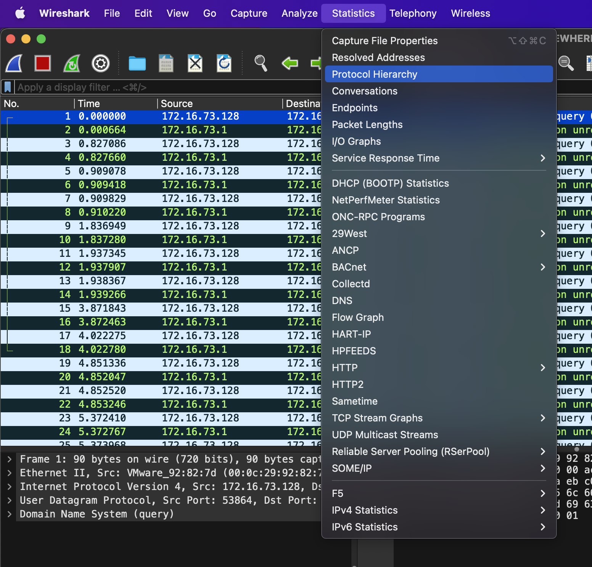

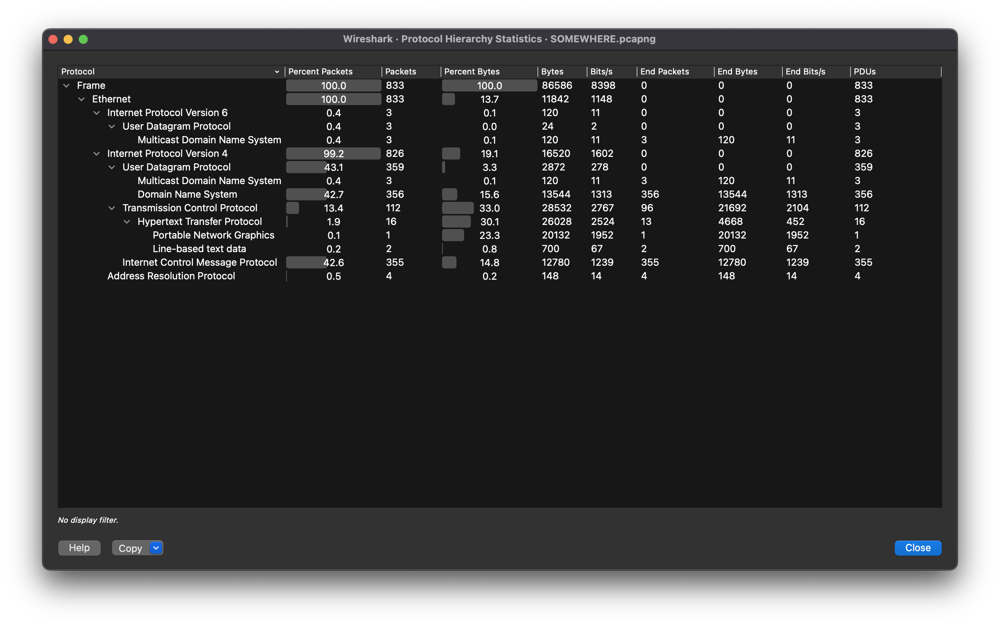

2. It look like there is a lot of UDP request, but most them are ICMP and DNS. So we need to filter them out with `!icmp && !dns`.

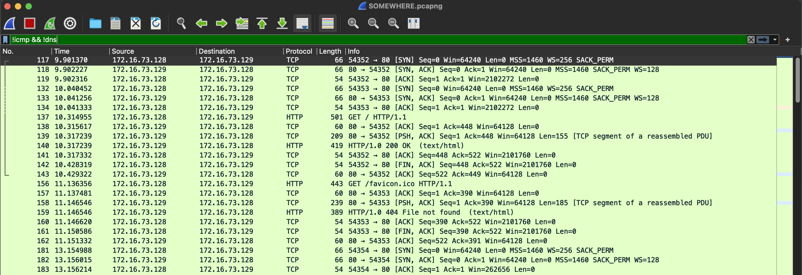

3. Let follow the TCP stream of the first packet.

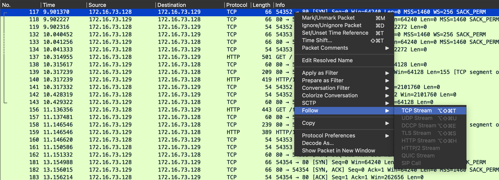

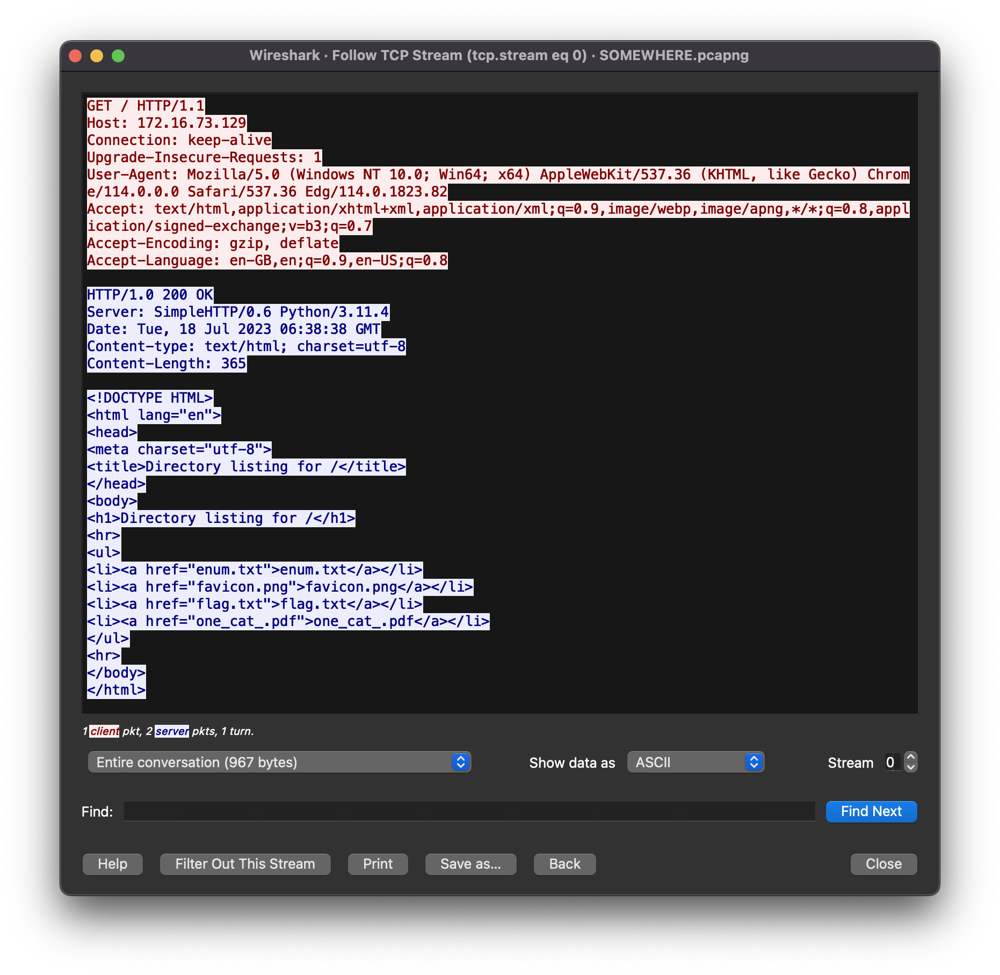

4. Let look at the stream number `3`, you can find the png file is sent over this stream.

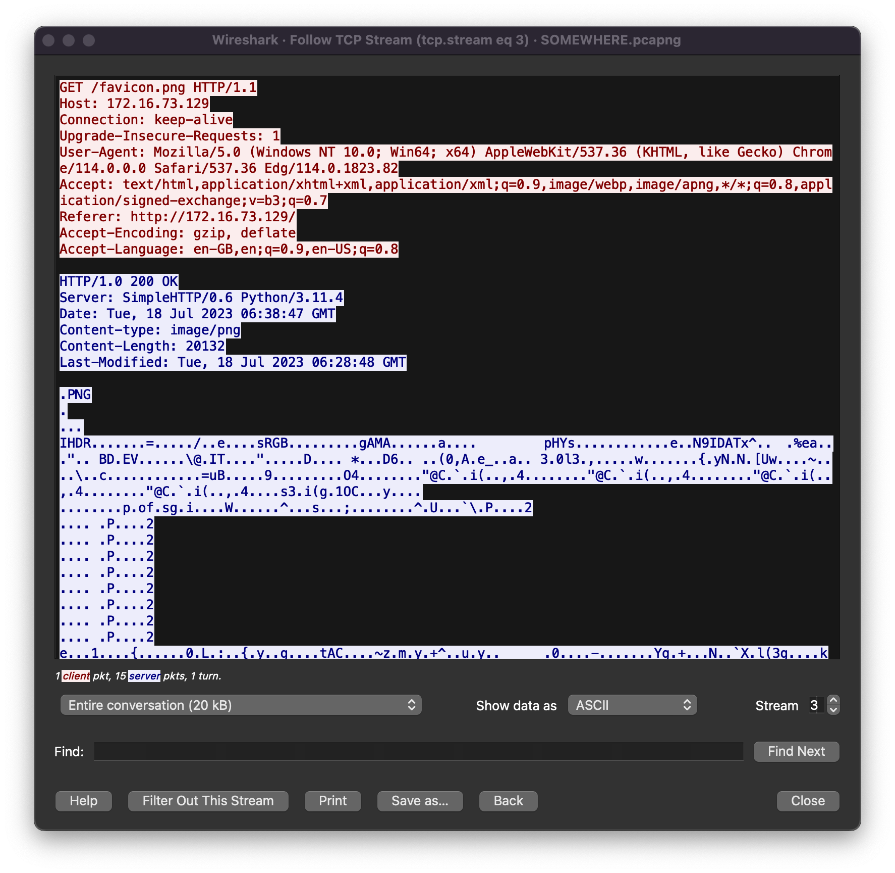

5. Let switch to `server` conversion mode, change show data as to `RAW` and save the data as [raw file](./write-ups/raw).

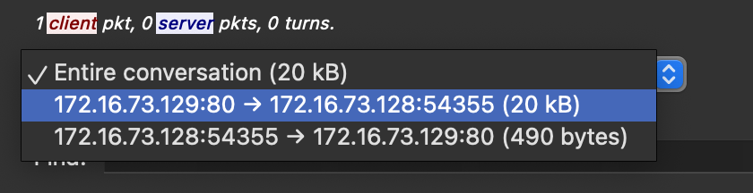

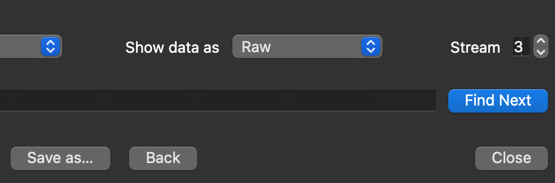

6. Upload [raw file](./write-ups/raw) to [online hex editor](https://hexed.it/).

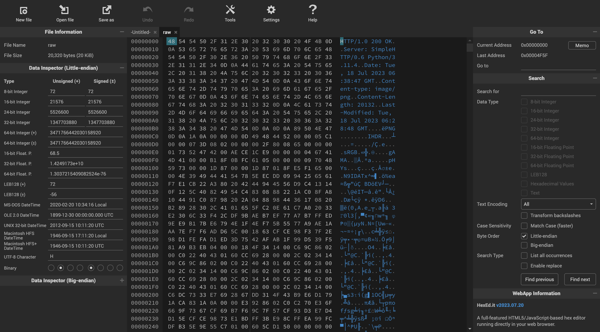

Remove the content before `89 50 4E 47`.

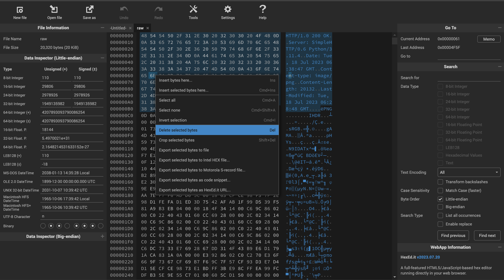

And save it to [secret.png](./write-ups/secret.png)

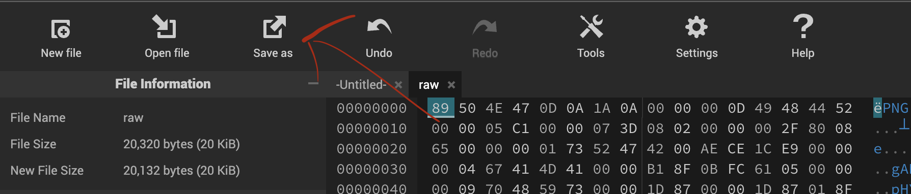

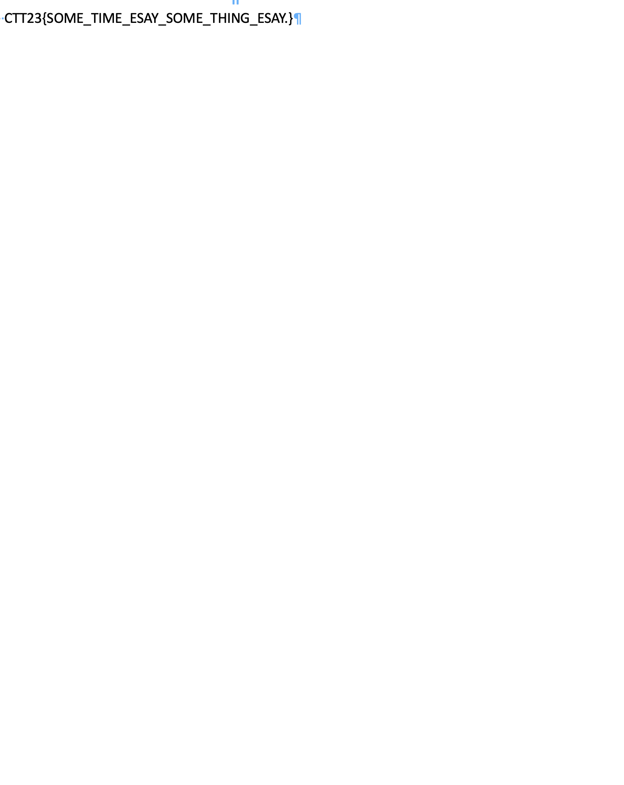

7. The result is `CTT23{SOME_TIME_ESAY_SOME_THING_ESAY.}`
