# Write-ups for TCTT2023/PWN/02

## Flag pattern

`CTT23{xxxxxxxxxxxxxxxxxxxxxxxxxxxxxxxx}`

## Challenge Files

[ReverseCTF.zip](./ReverseCTF.zip)

## Solution

1. First, let try the [program](./write-ups/Reverse%20CTF.exe).

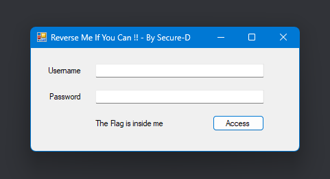

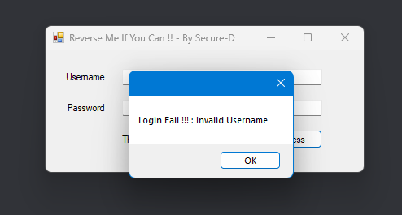

2. I use [dnspy](https://github.com/dnSpy/dnSpy) to edit [Reverse CTF.exe](./write-ups/Reverse%20CTF.exe).

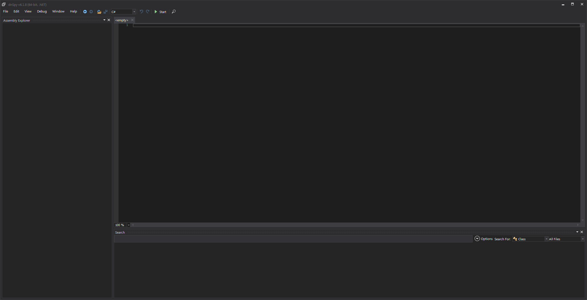

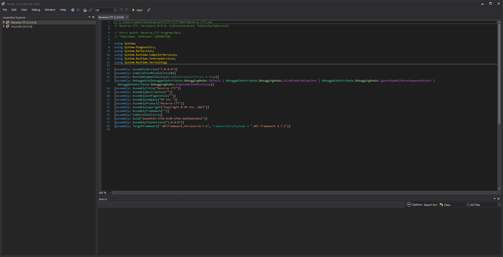

3. Let see `Form1` in `Reverse_CTF`.

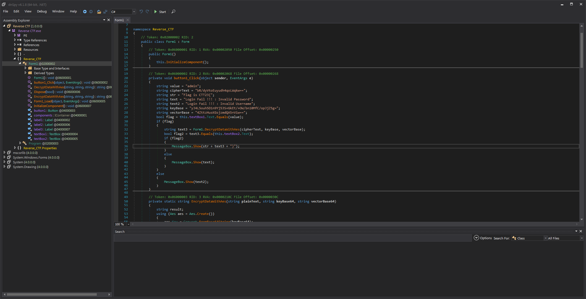

The interesting function is `button1_Click`, it will run after we click the button.

```c#
private void button1_Click(object sender, EventArgs e)
{
    string value = "admin";
    string cipherText = "bR/dyVtoEuyudh4qoLWqkw==";
    string str = "Flag is CTT23{";
    string text = "Login Fail !!! : Invalid Password";
    string text2 = "Login Fail !!! : Invalid Username";
    string keyBase = "yJ4L5ouh5D1n9Yj53S+GkEt/+OW/bn10MfC/opJjZ5g=";
    string vectorBase = "4ZttzHusKGsjzmdQA5+Viw==";
    bool flag = this.textBox1.Text.Equals(value);
    if (flag)
    {
        string text3 = Form1.DecryptDataWithAes(cipherText, keyBase, vectorBase);
        bool flag2 = text3.Equals(this.textBox2.Text);
        if (flag2)
        {
            MessageBox.Show(str + text3 + "}");
        }
        else
        {
            MessageBox.Show(text);
        }
    }
    else
    {
        MessageBox.Show(text2);
    }
}
```

This code will check input from `textBox1` equal to `"admin"` and `textBox2` equal to the decrypted aes cipher (which is really hard to get).

So I decided to edit this function to make it only show `str + text3 + "}"` in MessageBox.

4. Let edit this function(Method).

```c#
using System;
using System.ComponentModel;
using System.Windows.Forms;

namespace Reverse_CTF
{
    // Token: 0x02000002 RID: 2
    public partial class Form1 : Form
    {
        // Token: 0x06000002 RID: 2 RVA: 0x00002068 File Offset: 0x00000268
        private void button1_Click(object sender, EventArgs e)
        {
            string value = "admin";
            string cipherText = "bR/dyVtoEuyudh4qoLWqkw==";
            string str = "Flag is CTT23{";
            string text = "Login Fail !!! : Invalid Password";
            string text2 = "Login Fail !!! : Invalid Username";
            string keyBase = "yJ4L5ouh5D1n9Yj53S+GkEt/+OW/bn10MfC/opJjZ5g=";
            string vectorBase = "4ZttzHusKGsjzmdQA5+Viw==";
            string text3 = Form1.DecryptDataWithAes(cipherText, keyBase, vectorBase);
            MessageBox.Show(str + text3 + "}");
        }
    }
}
```

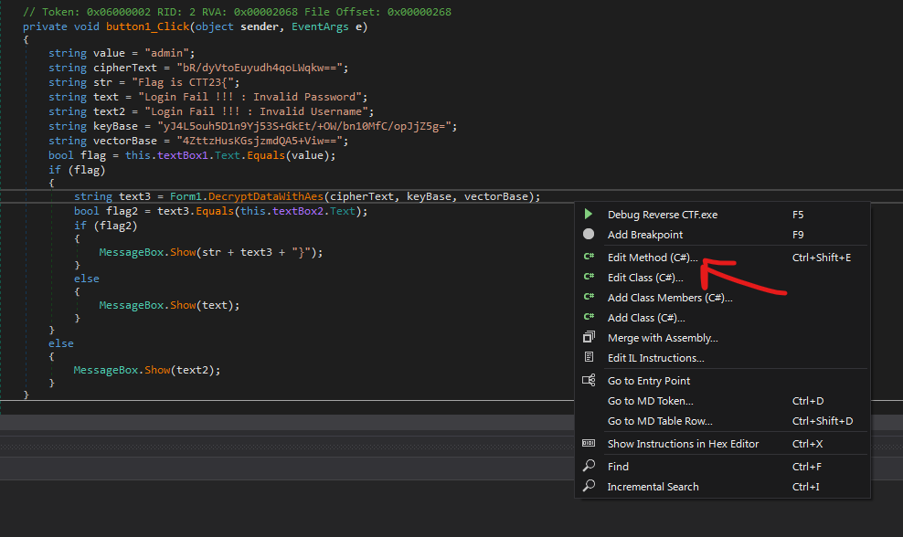

Then compile the function.

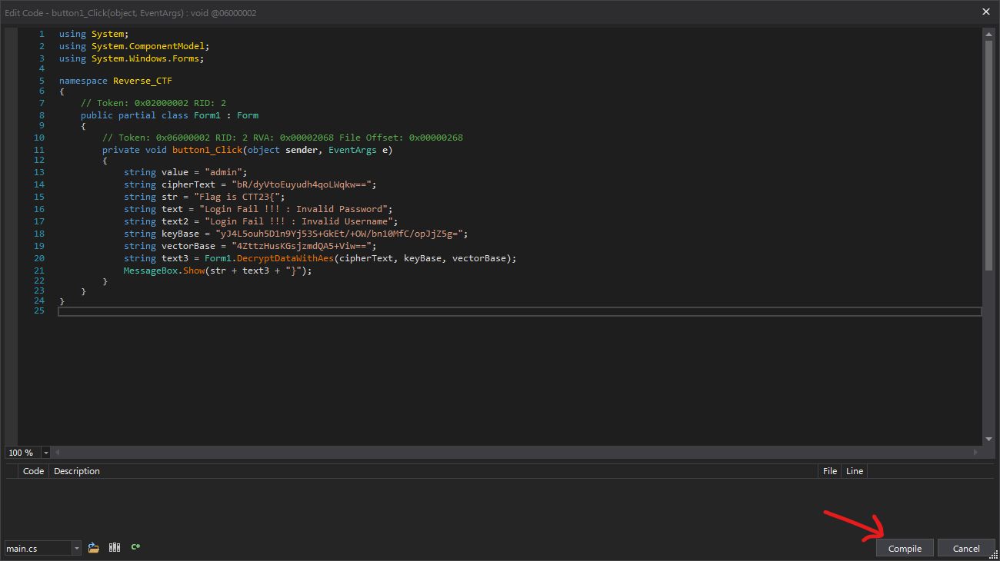

And save the patched version.

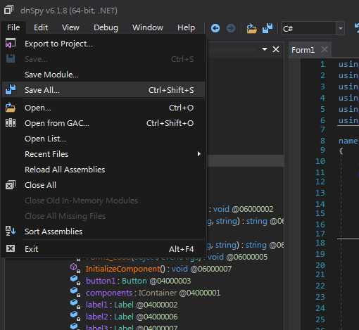

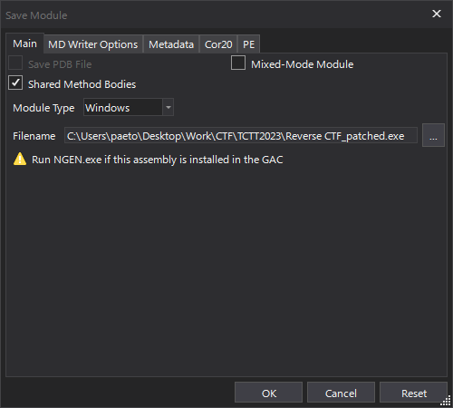

5. Then run the patched version.

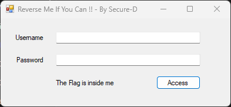

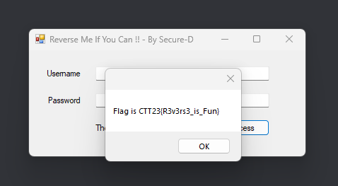

6. The result is `CTT23{R3v3rs3_is_Fun}`
