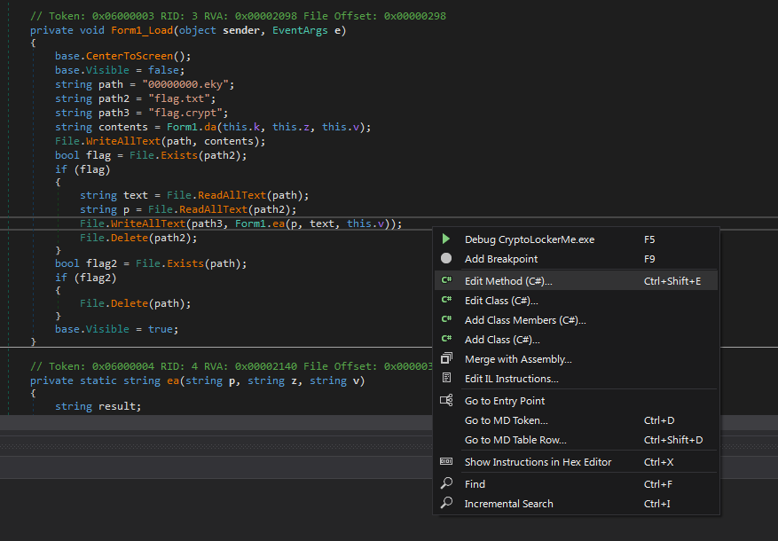

# Write-ups for TCTT2023/PWN/03

## Flag pattern

`CTT23{xxxxxxxxxxxxxxxxxxxxxxxxxxxxxxxx}`

## Challenge Files

[CryptoLockerMe.zip](./CryptoLockerMe.zip)

## Solution

1. First, let try the [program](./write-ups/CryptoLockerMe.exe).


2. Then, we open it with [dnSpy](https://github.com/dnSpy/dnSpy) to edit.


3. Let see `Form1` in `CryptoLockerMe`.


This method is very interesting.

```c#
private void Form1_Load(object sender, EventArgs e)
{
    base.CenterToScreen();
    base.Visible = false;
    string path = "00000000.eky";
    string path2 = "flag.txt";
    string path3 = "flag.crypt";
    string contents = Form1.da(this.k, this.z, this.v);
    File.WriteAllText(path, contents);
    bool flag = File.Exists(path2);
    if (flag)
    {
        string text = File.ReadAllText(path);
        string p = File.ReadAllText(path2);
        File.WriteAllText(path3, Form1.ea(p, text, this.v));
        File.Delete(path2);
    }
    bool flag2 = File.Exists(path);
    if (flag2)
    {
        File.Delete(path);
    }
    base.Visible = true;
}
```

`Form1.da`(some decryption function) will use `this.z` and `this.v` to decrypt `this.k` and write the decrypted value to `00000000.eky`.

Then it will check if `flag.txt` exist. If it does, it will encrypt the flag content with the content from `00000000.eky` and `this.v` then write the output to `flag.crypt`, also delete `flag.txt`.

Finally, it will delete `00000000.eky`.

4. To decrypt the encrypted flag, we need to find the value of `00000000.eky` (decrypted value from `this.k`, `this.z`, and `this.v`) and `this.v`.

Fortunately, we can find the value of `this.k`, `this.z`, and `this.v` in the `CryptoLockerMe.exe` file.

```c#
// Token: 0x04000001 RID: 1
private string k = "5zpQuV1qz/iYvKp2wMW1481zkdzxcCaAeBI+gzlrnVEzje4UqBeErIt8lRnr3oU0";

// Token: 0x04000002 RID: 2
private string z = "yJ4L5ouh5D1n9Yj53S+GkEt/+OW/bn10MfC/opJjZ5g=";

// Token: 0x04000003 RID: 3
private string v = "4ZttzHusKGsjzmdQA5+Viw==";
```

5. So, we can edit `Form1_Load` method, to make it write the decrypted flag.




```c#
using System;
using System.ComponentModel;
using System.IO;
using System.Windows.Forms;

namespace CryptoLockerMe
{
    // Token: 0x02000002 RID: 2
    public partial class Form1 : Form
    {
        // Token: 0x06000003 RID: 3
        private void Form1_Load(object sender, EventArgs e)
        {
            base.CenterToScreen();
            base.Visible = false;
            string path = "flag.txt";
            string path2 = "flag.crypt";
            string key = Form1.da(this.k, this.z, this.v);
            string cipher = File.ReadAllText(path2);
            File.WriteAllText(path, Form1.da(cipher, key, this.v));
            base.Visible = true;
        }
    }
}
```

This code will generate key from `this.k`, `this.z`, and `this.v`. Then decrypt the flag with the key and `this.v`.

6. Compile the edited method, and save the file to [patched version](./write-ups/CryptoLockerMe_patched.exe).


7. Then, run the program and BOOM! we got [flag.txt](./write-ups/flag.txt).


8. After open the text file, we got `CTT23{D3c0mpli3_4_L0g1c}`
