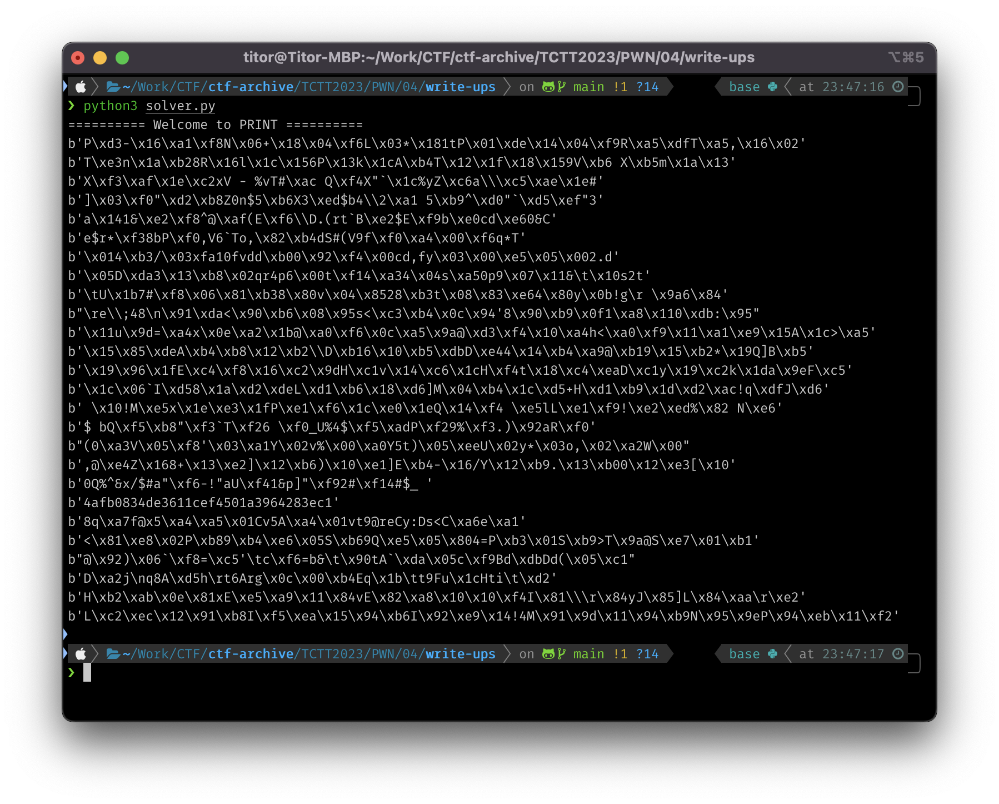

# Write-ups for TCTT2023/PWN/04

## Flag pattern

`CTT23{xxxxxxxxxxxxxxxxxxxxxxxxxxxxxxxx}`

## Challenge Files

[PRINT.zip](./PRINT.zip)

## Solution

1. First let look at the [orginal file](./write-ups/PRINT.py).

```python
def sixfour(aha):
    #aha.insert(7, '4')
    #aha.insert(15, '2')
    #aha.insert(23, '0')
    #aha.insert('31', '5')
    #aha = ' '.join(aha)

    aha_sixfour = aha.encode('asci')
    naja_boy = base64.b32decode(aha_sixfour)
    naja = naja_b.decode('asci')

    printf("flag{"+str(naja)+"}")

def rolling(realText, step):
	out = []
	cryptText = []

	uppercase = ['A', 'B', 'C', 'D', 'E', 'F', 'G', 'H', 'I', 'J', 'K', 'L', 'M', 'N', 'O', 'P', 'Q', 'R', 'S', 'T', 'U', 'V', 'W', 'X', 'Y', 'Z']
	lowercase = ['a', 'b', 'c', 'd', 'e', 'f', 'g', 'h', 'i', 'j', 'k', 'l', 'm', 'n', 'o', 'p', 'q', 'r', 's', 't', 'u', 'v', 'w', 'x', 'y', 'z']

	for eachLetter in realText:
		if eachLetter in uppercase:
			index = uppercase.index(eachLetter)
			crypting = (index + step) % 25
			cryptText.append(crypting)
			newLetter = uppercase[crypting]
			out.append(newLetter)
		elif eachLetter in lowercase:
			index = lowercase.index(eachLetter)
			crypting = (index + step) % 26
			 cryptText.append(crypting)
			newLetter = lowercase[crypting]
			out.append(newLetter)
	out.append("=")
	sixfour(out)

print("========== Welcome to PRINT ==========")
msg = "UNMtFqHTgY"
       +"rGATTAMqGDFUAH"
       +"eFATUqXfVKUsFgL"
n = '0'
rolling(msg, num)
```

We can fix the syntax error first

```python
import base64

def sixfour(aha):
    #aha.insert(7, '4')
    #aha.insert(15, '2')
    #aha.insert(23, '0')
    #aha.insert('31', '5')
    #aha = ' '.join(aha)

    aha_sixfour = aha.encode('ascii')
    naja_boy = base64.b32decode(aha_sixfour)
    naja = naja_boy.decode('ascii')

    printf("flag{"+str(naja)+"}")

def rolling(realText, step):
	out = []
	cryptText = []

	uppercase = ['A', 'B', 'C', 'D', 'E', 'F', 'G', 'H', 'I', 'J', 'K', 'L', 'M', 'N', 'O', 'P', 'Q', 'R', 'S', 'T', 'U', 'V', 'W', 'X', 'Y', 'Z']
	lowercase = ['a', 'b', 'c', 'd', 'e', 'f', 'g', 'h', 'i', 'j', 'k', 'l', 'm', 'n', 'o', 'p', 'q', 'r', 's', 't', 'u', 'v', 'w', 'x', 'y', 'z']

	for eachLetter in realText:
		if eachLetter in uppercase:
			index = uppercase.index(eachLetter)
			crypting = (index + step) % 25
			cryptText.append(crypting)
			newLetter = uppercase[crypting]
			out.append(newLetter)
		elif eachLetter in lowercase:
			index = lowercase.index(eachLetter)
			crypting = (index + step) % 26
			 cryptText.append(crypting)
			newLetter = lowercase[crypting]
			out.append(newLetter)
	out.append("=")
	sixfour(out)

print("========== Welcome to PRINT ==========")
msg = "UNMtFqHTgY" +"rGATTAMqGDFUAH" +"eFATUqXfVKUsFgL"
n = 0
rolling(msg, num)
```

2. I want to split the code into 3 parts.

- ```python
  def sixfour(aha):
    #aha.insert(7, '4')
    #aha.insert(15, '2')
    #aha.insert(23, '0')
    #aha.insert('31', '5')
    #aha = ' '.join(aha)

    aha_sixfour = aha.encode('ascii')
    naja_boy = base64.b32decode(aha_sixfour)
    naja = naja_boy.decode('ascii')

    printf("flag{"+str(naja)+"}")
  ```

- ```python
  def rolling(realText, step):
    out = []
    cryptText = []

    uppercase = ['A', 'B', 'C', 'D', 'E', 'F', 'G', 'H', 'I', 'J', 'K', 'L', 'M', 'N', 'O', 'P', 'Q', 'R', 'S', 'T', 'U', 'V', 'W', 'X', 'Y', 'Z']
    lowercase = ['a', 'b', 'c', 'd', 'e', 'f', 'g', 'h', 'i', 'j', 'k', 'l', 'm', 'n', 'o', 'p', 'q', 'r', 's', 't', 'u', 'v', 'w', 'x', 'y', 'z']

    for eachLetter in realText:
      if eachLetter in uppercase:
        index = uppercase.index(eachLetter)
        crypting = (index + step) % 25
        cryptText.append(crypting)
        newLetter = uppercase[crypting]
        out.append(newLetter)
      elif eachLetter in lowercase:
        index = lowercase.index(eachLetter)
        crypting = (index + step) % 26
        cryptText.append(crypting)
        newLetter = lowercase[crypting]
        out.append(newLetter)
    out.append("=")
    sixfour(out)
  ```

- ```python
  print("========== Welcome to PRINT ==========")
  msg = "UNMtFqHTgY" +"rGATTAMqGDFUAH" +"eFATUqXfVKUsFgL"
  n = 0
  rolling(msg, num)
  ```

3. Let fix the first part.

From the function name, we can think that the first part is the base64 decode function with other string adding.

```python
def sixfour(aha):
    aha.insert(7, '4')
    aha.insert(15, '2')
    aha.insert(23, '0')
    aha.insert(31, '5')
    aha = ''.join(aha)

    aha_sixfour = aha.encode('ascii')

    naja_boy = base64.b64decode(aha_sixfour)
    print(naja_boy)
```

4. For the second part. Number `25` is a bit too suspicious. Let change it to `26`.

```python
def rolling(realText, step):
  out = []
  cryptText = []

  uppercase = ['A', 'B', 'C', 'D', 'E', 'F', 'G', 'H', 'I', 'J', 'K', 'L', 'M', 'N', 'O', 'P', 'Q', 'R', 'S', 'T', 'U', 'V', 'W', 'X', 'Y', 'Z']
  lowercase = ['a', 'b', 'c', 'd', 'e', 'f', 'g', 'h', 'i', 'j', 'k', 'l', 'm', 'n', 'o', 'p', 'q', 'r', 's', 't', 'u', 'v', 'w', 'x', 'y', 'z']

  for eachLetter in realText:
    if eachLetter in uppercase:
      index = uppercase.index(eachLetter)
      crypting = (index + step) % 26
      cryptText.append(crypting)
      newLetter = uppercase[crypting]
      out.append(newLetter)
    elif eachLetter in lowercase:
      index = lowercase.index(eachLetter)
      crypting = (index + step) % 26
      cryptText.append(crypting)
      newLetter = lowercase[crypting]
      out.append(newLetter)
  out.append("=")
  sixfour(out)
```

5. The last part, we need to guess the `n`, so let brute force it.

```python
print("========== Welcome to PRINT ==========")
msg = "UNMtFqHTgY" + "rGATTAMqGDFUAH" + "eFATUqXfVKUsFgL"

for num in range(26):
    try:
        rolling(msg, num)
    except:
        pass
```

_We only need 0-26 because step will be mod by 26_

6. Combine all parts together and make [solver](./write-ups/solver.py) script.

```python
import base64


def sixfour(aha):
    aha.insert(7, '4')
    aha.insert(15, '2')
    aha.insert(23, '0')
    aha.insert(31, '5')
    aha = ''.join(aha)

    aha_sixfour = aha.encode('ascii')

    naja_boy = base64.b64decode(aha_sixfour)
    print(naja_boy)


def rolling(realText, step):
    out = []
    cryptText = []

    uppercase = ['A', 'B', 'C', 'D', 'E', 'F', 'G', 'H', 'I', 'J', 'K', 'L',
                 'M', 'N', 'O', 'P', 'Q', 'R', 'S', 'T', 'U', 'V', 'W', 'X', 'Y', 'Z']
    lowercase = ['a', 'b', 'c', 'd', 'e', 'f', 'g', 'h', 'i', 'j', 'k', 'l',
                 'm', 'n', 'o', 'p', 'q', 'r', 's', 't', 'u', 'v', 'w', 'x', 'y', 'z']

    for eachLetter in realText:
        if eachLetter in uppercase:
            index = uppercase.index(eachLetter)
            crypting = (index + step) % 26
            cryptText.append(crypting)
            newLetter = uppercase[crypting]
            out.append(newLetter)
        elif eachLetter in lowercase:
            index = lowercase.index(eachLetter)
            crypting = (index + step) % 26
            cryptText.append(crypting)
            newLetter = lowercase[crypting]
            out.append(newLetter)
    out.append("=")
    sixfour(out)


print("========== Welcome to PRINT ==========")
msg = "UNMtFqHTgY" + "rGATTAMqGDFUAH" + "eFATUqXfVKUsFgL"

for num in range(26):
    try:
        rolling(msg, num)
    except:
        pass
```

7. Let run the script.

```bash
python3 solver.py
```



8. Put the output that contain only readable ASCII with flag pattern, the result is `CTT23{4afb0834de3611cef4501a3964283ec1}`
