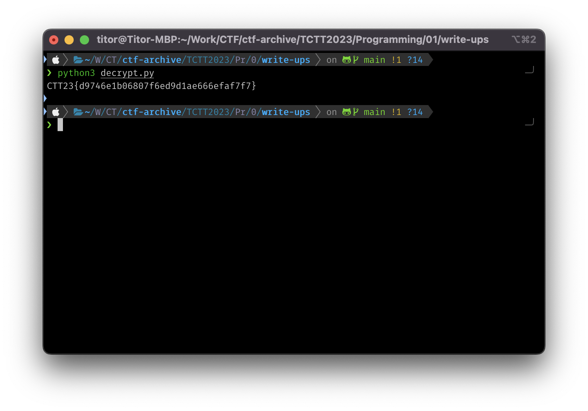

# Write-ups for TCTT2023/Programming/01

## Flag pattern

`CTT23{xxxxxxxxxxxxxxxxxxxxxxxxxxxxxxxx}`

## Challenge Files

[Decryptmessage.zip](./Decryptmessage.zip)

## Solution

1. After reading the [encrypt.py](./write-ups/encrypt.py) file, we can see the flag is encrypted with Fernet and the key will be stored in the [key.txt](./write-ups/key.txt) file, which we can see that there are many keys stored.

```python
from cryptography.fernet import Fernet

fm = open("flag.txt", "r")
fs = open("secret.txt", "wb")
fk = open("key.txt", "wb")

message = fm.read()

# สร้างคีย์สำหรับการเข้ารหัส
key = Fernet.generate_key()
fk.write(key)

cipher_suite = Fernet(key)

# เข้ารหัสข้อความ
encrypted_message = cipher_suite.encrypt(message.encode())
fs.write(encrypted_message)

fm.close()
fs.close()
fk.close()
```

2. Therefore, we write a python script and read the key.txt file and take the keys one by one and decrypt them with secret in [secret.txt](./write-ups/secret.txt) by using Fernet algorithm.

```python
from cryptography.fernet import Fernet

fs = open("secret.txt", "r")
fk = open("key.txt", "r")

keys = fk.read().split()
encrypted_data = fs.read()

for key in keys:
    try:
        cipher = Fernet(key)
        decrypted_data = cipher.decrypt(encrypted_data)
        print(decrypted_data.decode('utf-8'))
    except:
        pass

fs.close()
fk.close()
```

3. Run the python script.

```bash
python3 decrypt.py
```



4. After run the script, the result is `CTT23{d9746e1b06807f6ed9d1ae666efaf7f7}`
