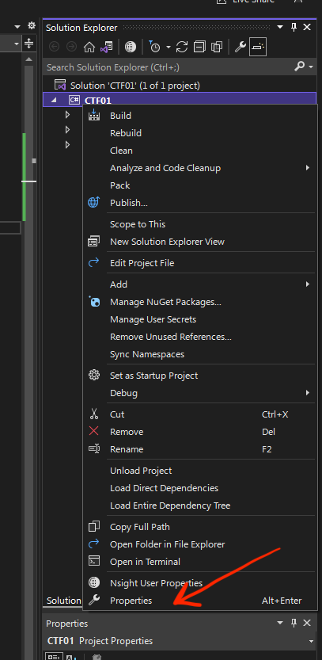
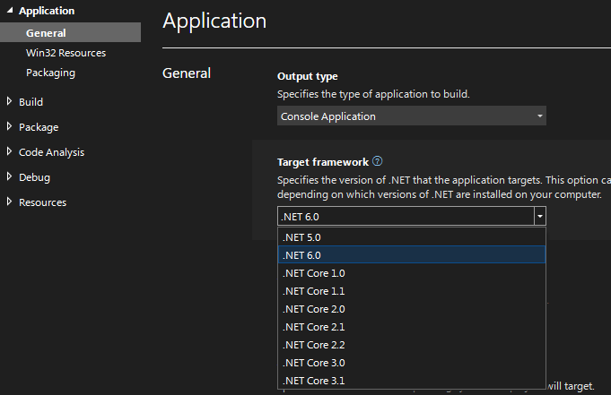
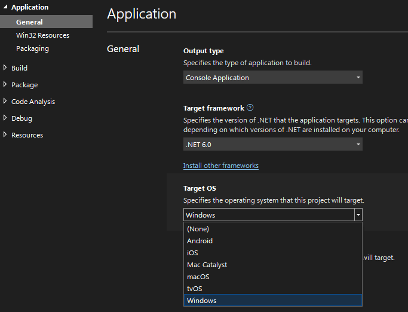
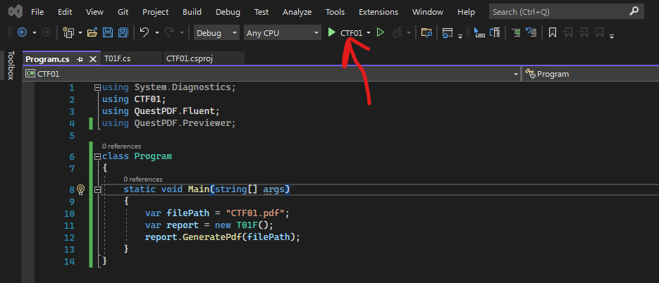
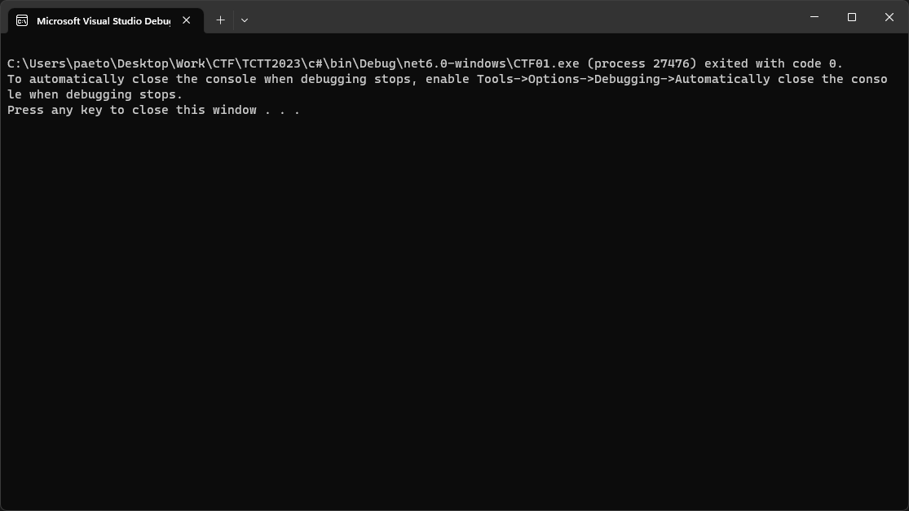
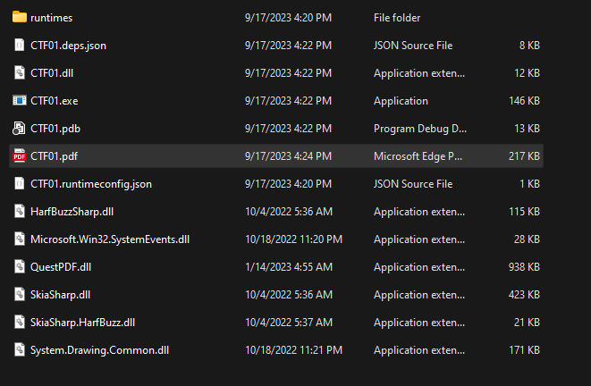
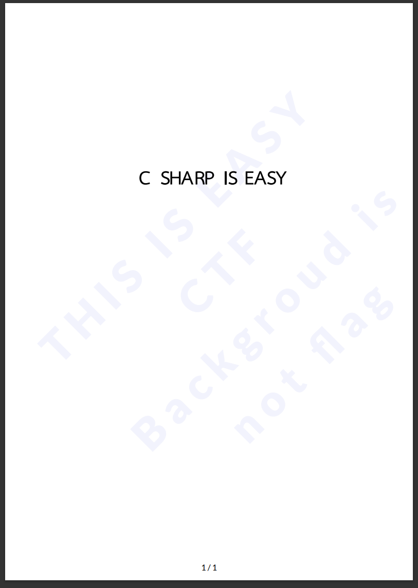

# Write-ups for TCTT2023/Web/02

## Flag pattern

`CTT23{xxxxxxxxxxxxxxxxxxxxxxxxxxxxxxxx}`

## Challenge Files

[c.zip](./c.zip)

## Solution

1. First, look at [CTF01.csproj](./write-ups/CTF01.csproj), you can open wth [Visual Studio](https://visualstudio.microsoft.com/)

```xml
<Project Sdk="Microsoft.NET.Sdk">

  <PropertyGroup>
    <OutputType>Exe</OutputType>
    <TargetFramework>net7.0</TargetFramework>
    <ImplicitUsings>enable</ImplicitUsings>
    <Nullable>enable</Nullable>
    <Platforms>AnyCPU;x64</Platforms>
  </PropertyGroup>
  <ItemGroup>
   <PackageReference Include="QuestPDF" Version="2022.12.1" />
    <PackageReference Include="System.Drawing.Common" Version="7.0.0" />
  </ItemGroup>

</Project>
```

We can see that it is a C# project that uses 2 packages: QuestPDF and System.Drawing, and will be built as an exe with framework .net 7.0.

3. Let add the main function to [Program.cs](./write-ups/Program.cs).

```c#
using System.Diagnostics;
using CTF01;
using QuestPDF.Fluent;
using QuestPDF.Previewer;


class Program
{
    static void Main(string[] args)
    {
      var filePath = "CTF01.pdf";
    }
}
```

4. To generate output, we need to edit [Program.cs](./write-ups/Program.cs) follow this [document](https://www.questpdf.com/concepts/generating-output.html)

```c#
using System.Diagnostics;
using CTF01;
using QuestPDF.Fluent;
using QuestPDF.Previewer;


class Program
{
    static void Main(string[] args)
    {
      var filePath = "CTF01.pdf";
      var report = new T01F();
      report.GeneratePdf(filePath);
    }
}
```

The warning will appear.

![]

4. We follow this [document](https://www.questpdf.com/getting-started.html#template-layer). We can see that we need to edit [T10F.cs](./write-ups/T01F.cs) to implements `IDocument` interface.

```c#
// Before

using QuestPDF.Drawing;
using QuestPDF.Fluent;
using QuestPDF.Helpers;
using QuestPDF.Infrastructure;
using SysDwg = System.Drawing;
using System.Drawing.Printing;
using System.Drawing;

namespace CTF01;

public class T01F
{
    //private ServConfigulation SvConfig = Utilities.GetSvConfig();

    protected string fontTH = "TH Sarabun New";
    protected float lineHeight = 0.925f;
    public T01F()
    {
    }
    public DocumentMetadata GetMetadata() => DocumentMetadata.Default;
    public void Compose(IDocumentContainer container)
    {
        var genStyle = TextStyle.Default.FontSize(14).FontFamily(fontTH);
        string waterMarkColor = "#f2f3fd";
        var waterMarkStyle = TextStyle.Default.ExtraBold().LetterSpacing(0.2f).FontSize(64).FontColor(waterMarkColor);

        container
    .Page(page =>
    {
        page.Margin(10);

        page.Header().Element(ComposeHeader);
        page.Content().Element(ComposeContent);

        page.Footer().AlignCenter().Text(text =>
        {
            text.CurrentPageNumber();
            text.Span(" / ");
            text.TotalPages();
        });
        page.Background().Rotate(-45)
                    .TranslateX(-355)
                    .TranslateY(360)
                    .Column(column =>
                    {
                        column.Item().AlignCenter().Text("THIS IS EASY CTF").Style(waterMarkStyle);
                        column.Item().AlignCenter().Text("Backgroud is not flag").Style(waterMarkStyle);
                    });
        });
    }
    void ComposeHeader(IContainer container)
    {
        var titleStyle = TextStyle.Default.FontSize(20).Bold().FontFamily("Times New Roman");
        //var smStyle1 = TextStyle.Default.FontFamily("Times New Roman").FontSize(10).FontColor(Colors.Blue.Darken4);
        //var smStyle3 = TextStyle.Default.FontFamily("Times New Roman").FontSize(9).FontColor(Colors.Blue.Darken4);

        //var titleStyle = TextStyle.Default.FontSize(24).Bold().FontFamily(fontTH);
        var smStyle1 = TextStyle.Default.FontFamily("Times New Roman").FontSize(10).FontColor(Colors.Blue.Darken4);
        var smStyle3 = TextStyle.Default.FontFamily("Times New Roman").FontSize(9).FontColor(Colors.Blue.Darken4);
        var genStyle = TextStyle.Default.FontSize(15).FontFamily(fontTH);


        container.PaddingVertical(25).PaddingHorizontal(25).Layers(layers =>
        {
            layers.PrimaryLayer().Column(column =>
            {
                column.Item().Height(7);
                column.Item().PaddingLeft(75).Text(text =>
                {

                });
                column.Item().PaddingLeft(75).Text(text =>
                {

                });
                column.Item().Height(14);

            });
            layers.Layer().Column(column =>
            {
                column.Item().Height(7);
                column.Item().PaddingLeft(75).Text(text =>
                {

                });

            });
            layers.Layer().Column(column =>
            {
                column.Item().Height(7);
                column.Item().PaddingLeft(75).Text(text =>
                {

                });

            });
            layers.Layer().Column(column =>
            {
                column.Item().Height(7);
                column.Item().PaddingLeft(75).Text(text =>
                {

                });

            });

        });
    }
    void ComposeContent(IContainer container)
    {
        var gen0Style = TextStyle.Default.FontSize(40).FontFamily(fontTH).SemiBold();
        string flag = "";
        string s3 = "  C   H  R   IS";
        container.PaddingVertical(90).PaddingHorizontal(120).Layers(layers =>
        {
            layers.PrimaryLayer().Column(column =>
            {
                column.Item().Height(7);
                column.Item().PaddingLeft(67).Text(text =>
                {
                    text.Span(flag + "\n").Style(gen0Style).LineHeight(1.01f).LetterSpacing(0f);
                    text.Span("    S").Style(gen0Style).LineHeight(1.01f).LetterSpacing(0.93f);
                });
                column.Item().PaddingLeft(75).Text(text =>
                {
                    //text.Span($"{SvConfig.AClinicAddressEn}    ").Style(smStyle3).LineHeight(1.01f).LetterSpacing(0.05f);
                    //text.Span(SvConfig.AClinicAddressEnL2).Style(smStyle3).LineHeight(1.01f).LetterSpacing(0.08f);
                });
                column.Item().Height(14);

            });
            layers.Layer().Column(column =>
            {
                column.Item().Height(7);
                column.Item().PaddingLeft(72).Text(text =>
                {
                    text.Span("\n").Style(gen0Style).LineHeight(1.01f).LetterSpacing(0f);
                    text.Span(" SAP").Style(gen0Style).LineHeight(1.01f).LetterSpacing(.39f);
                });

            });
            layers.Layer().Column(column =>
            {
                column.Item().Height(7);
                column.Item().PaddingLeft(219).Text(text =>
                {
                    text.Span( "\n").Style(gen0Style).LineHeight(1.01f).LetterSpacing(0f);
                    text.Span("EA").Style(gen0Style).LineHeight(1.01f).LetterSpacing(0.00f);
                });

            });
            layers.Layer().Column(column =>
            {
                column.Item().Height(7);
                column.Item().PaddingLeft(211).Text(text =>
                {
                    text.Span("\n").Style(gen0Style).LineHeight(1.01f).LetterSpacing(0f);
                    text.Span("      Y     ").Style(gen0Style).LineHeight(1.01f).LetterSpacing(0.00f);
                });

            });
            layers.Layer().Column(column =>
            {
                column.Item().Height(7);
                column.Item().PaddingLeft(47).Text(text =>
                {
                    text.Span("\n").Style(gen0Style).LineHeight(1.01f).LetterSpacing(0f);
                    text.Span(s3).Style(gen0Style).LineHeight(1.01f).LetterSpacing(0.00f);
                });

            });
            //layers.Layer().PaddingTop(5).Width(20, Unit.Millimetre).Image(imageData);
        });
    }
    private int SectionCount()
    {
        int i = 0;

        return i;
    }

    private int MeasureStringSizeFFormat(string st1,string fontst1,int font1size)
    {

        // Set up string.
        string measureString = st1;
        SysDwg.Font stringFont = new SysDwg.Font(fontst1, font1size);

        // Set maximum width of string.
        int stringWidth = 1000;

        // Measure string.
        SysDwg.SizeF stringSize = new SysDwg.SizeF();
        //stringSize = e.Graphics.MeasureString(measureString, stringFont, layoutSize, newStringFormat);
        //stringSize = e.Graphics.MeasureString(measureString, stringFont, stringWidth);
        //https://learn.microsoft.com/en-us/dotnet/api/system.drawing.graphics.measurestring?view=windowsdesktop-8.0#system-drawing-graphics-measurestring(system-string-system-drawing-font-system-int32)
        PrintDocument pd = new();
        Graphics g = pd.PrinterSettings.CreateMeasurementGraphics();
        stringSize = g.MeasureString(measureString, stringFont, stringWidth);

        return (int)stringSize.Width;
    }

}
```

```c#
// After

using QuestPDF.Drawing;
using QuestPDF.Fluent;
using QuestPDF.Helpers;
using QuestPDF.Infrastructure;
using SysDwg = System.Drawing;
using System.Drawing.Printing;
using System.Drawing;

namespace CTF01;

public class T01F : IDocument
{
    //private ServConfigulation SvConfig = Utilities.GetSvConfig();

    protected string fontTH = "TH Sarabun New";
    protected float lineHeight = 0.925f;
    public T01F()
    {
    }
    public DocumentMetadata GetMetadata() => DocumentMetadata.Default;
    public void Compose(IDocumentContainer container)
    {
        var genStyle = TextStyle.Default.FontSize(14).FontFamily(fontTH);
        string waterMarkColor = "#f2f3fd";
        var waterMarkStyle = TextStyle.Default.ExtraBold().LetterSpacing(0.2f).FontSize(64).FontColor(waterMarkColor);

        container
    .Page(page =>
    {
        page.Margin(10);

        page.Header().Element(ComposeHeader);
        page.Content().Element(ComposeContent);

        page.Footer().AlignCenter().Text(text =>
        {
            text.CurrentPageNumber();
            text.Span(" / ");
            text.TotalPages();
        });
        page.Background().Rotate(-45)
                    .TranslateX(-355)
                    .TranslateY(360)
                    .Column(column =>
                    {
                        column.Item().AlignCenter().Text("THIS IS EASY CTF").Style(waterMarkStyle);
                        column.Item().AlignCenter().Text("Backgroud is not flag").Style(waterMarkStyle);
                    });
        });
    }
    void ComposeHeader(IContainer container)
    {
        var titleStyle = TextStyle.Default.FontSize(20).Bold().FontFamily("Times New Roman");
        //var smStyle1 = TextStyle.Default.FontFamily("Times New Roman").FontSize(10).FontColor(Colors.Blue.Darken4);
        //var smStyle3 = TextStyle.Default.FontFamily("Times New Roman").FontSize(9).FontColor(Colors.Blue.Darken4);

        //var titleStyle = TextStyle.Default.FontSize(24).Bold().FontFamily(fontTH);
        var smStyle1 = TextStyle.Default.FontFamily("Times New Roman").FontSize(10).FontColor(Colors.Blue.Darken4);
        var smStyle3 = TextStyle.Default.FontFamily("Times New Roman").FontSize(9).FontColor(Colors.Blue.Darken4);
        var genStyle = TextStyle.Default.FontSize(15).FontFamily(fontTH);


        container.PaddingVertical(25).PaddingHorizontal(25).Layers(layers =>
        {
            layers.PrimaryLayer().Column(column =>
            {
                column.Item().Height(7);
                column.Item().PaddingLeft(75).Text(text =>
                {

                });
                column.Item().PaddingLeft(75).Text(text =>
                {

                });
                column.Item().Height(14);

            });
            layers.Layer().Column(column =>
            {
                column.Item().Height(7);
                column.Item().PaddingLeft(75).Text(text =>
                {

                });

            });
            layers.Layer().Column(column =>
            {
                column.Item().Height(7);
                column.Item().PaddingLeft(75).Text(text =>
                {

                });

            });
            layers.Layer().Column(column =>
            {
                column.Item().Height(7);
                column.Item().PaddingLeft(75).Text(text =>
                {

                });

            });

        });
    }
    void ComposeContent(IContainer container)
    {
        var gen0Style = TextStyle.Default.FontSize(40).FontFamily(fontTH).SemiBold();
        string flag = "";
        string s3 = "  C   H  R   IS";
        container.PaddingVertical(90).PaddingHorizontal(120).Layers(layers =>
        {
            layers.PrimaryLayer().Column(column =>
            {
                column.Item().Height(7);
                column.Item().PaddingLeft(67).Text(text =>
                {
                    text.Span(flag + "\n").Style(gen0Style).LineHeight(1.01f).LetterSpacing(0f);
                    text.Span("    S").Style(gen0Style).LineHeight(1.01f).LetterSpacing(0.93f);
                });
                column.Item().PaddingLeft(75).Text(text =>
                {
                    //text.Span($"{SvConfig.AClinicAddressEn}    ").Style(smStyle3).LineHeight(1.01f).LetterSpacing(0.05f);
                    //text.Span(SvConfig.AClinicAddressEnL2).Style(smStyle3).LineHeight(1.01f).LetterSpacing(0.08f);
                });
                column.Item().Height(14);

            });
            layers.Layer().Column(column =>
            {
                column.Item().Height(7);
                column.Item().PaddingLeft(72).Text(text =>
                {
                    text.Span("\n").Style(gen0Style).LineHeight(1.01f).LetterSpacing(0f);
                    text.Span(" SAP").Style(gen0Style).LineHeight(1.01f).LetterSpacing(.39f);
                });

            });
            layers.Layer().Column(column =>
            {
                column.Item().Height(7);
                column.Item().PaddingLeft(219).Text(text =>
                {
                    text.Span( "\n").Style(gen0Style).LineHeight(1.01f).LetterSpacing(0f);
                    text.Span("EA").Style(gen0Style).LineHeight(1.01f).LetterSpacing(0.00f);
                });

            });
            layers.Layer().Column(column =>
            {
                column.Item().Height(7);
                column.Item().PaddingLeft(211).Text(text =>
                {
                    text.Span("\n").Style(gen0Style).LineHeight(1.01f).LetterSpacing(0f);
                    text.Span("      Y     ").Style(gen0Style).LineHeight(1.01f).LetterSpacing(0.00f);
                });

            });
            layers.Layer().Column(column =>
            {
                column.Item().Height(7);
                column.Item().PaddingLeft(47).Text(text =>
                {
                    text.Span("\n").Style(gen0Style).LineHeight(1.01f).LetterSpacing(0f);
                    text.Span(s3).Style(gen0Style).LineHeight(1.01f).LetterSpacing(0.00f);
                });

            });
            //layers.Layer().PaddingTop(5).Width(20, Unit.Millimetre).Image(imageData);
        });
    }
    private int SectionCount()
    {
        int i = 0;

        return i;
    }

    private int MeasureStringSizeFFormat(string st1,string fontst1,int font1size)
    {

        // Set up string.
        string measureString = st1;
        SysDwg.Font stringFont = new SysDwg.Font(fontst1, font1size);

        // Set maximum width of string.
        int stringWidth = 1000;

        // Measure string.
        SysDwg.SizeF stringSize = new SysDwg.SizeF();
        //stringSize = e.Graphics.MeasureString(measureString, stringFont, layoutSize, newStringFormat);
        //stringSize = e.Graphics.MeasureString(measureString, stringFont, stringWidth);
        //https://learn.microsoft.com/en-us/dotnet/api/system.drawing.graphics.measurestring?view=windowsdesktop-8.0#system-drawing-graphics-measurestring(system-string-system-drawing-font-system-int32)
        PrintDocument pd = new();
        Graphics g = pd.PrinterSettings.CreateMeasurementGraphics();
        stringSize = g.MeasureString(measureString, stringFont, stringWidth);

        return (int)stringSize.Width;
    }

}
```

6. To run this program, we need to edit the project properties (for someone, it's not necessary).







7. Now, we can run the program.



And this is the result.



But, what we want is the PDF file.

8. TO find the [PDF file](./write-ups/bin/Debug/net6.0-windows/CTF01.pdf), we need to go to `/bin/Debug/net6.0-windows` (it depends on frameworks version, and target os)





9. The flag is `CTT23{C SHARP IS EASY}`
